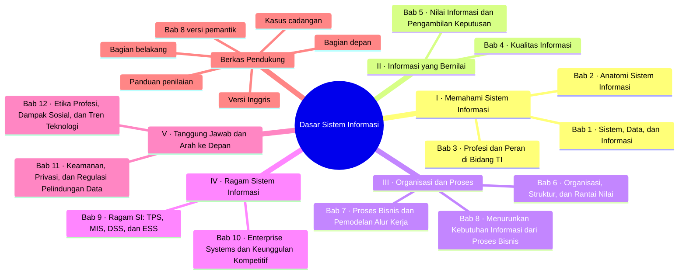
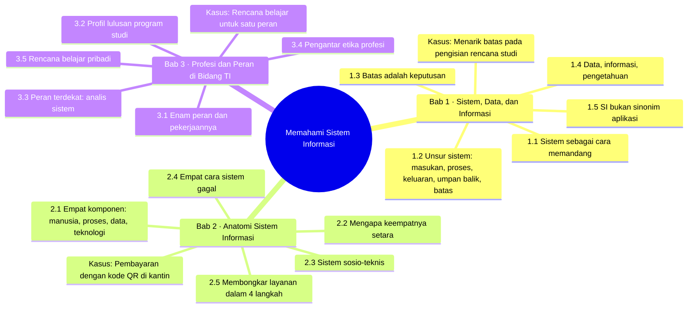
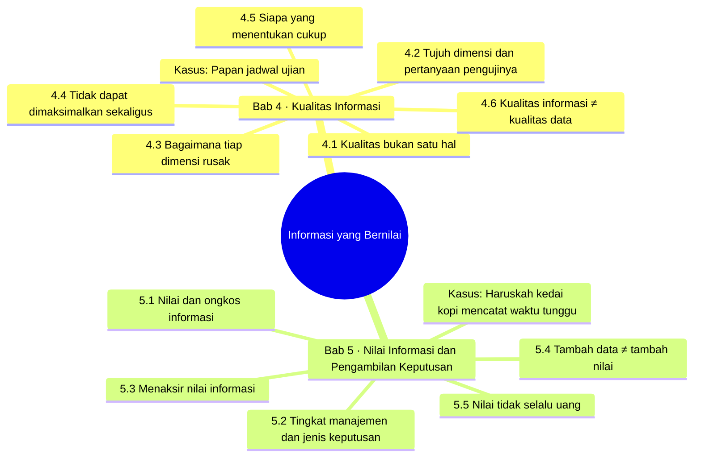
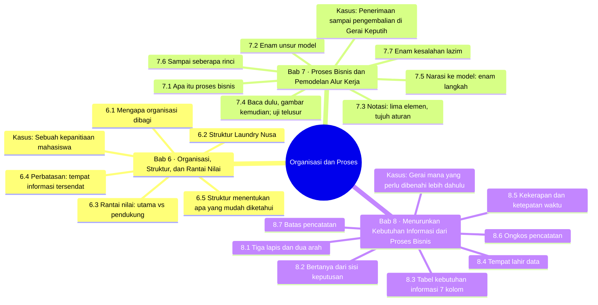
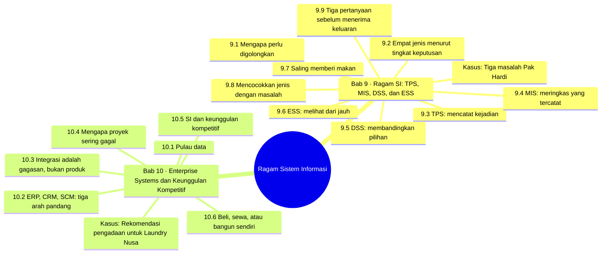
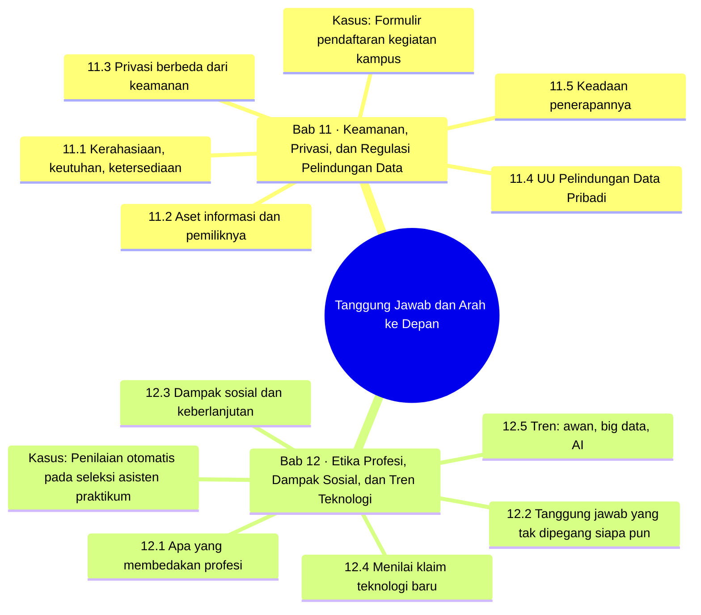

# Peta Pikiran — Dasar Sistem Informasi

Peta pikiran buku ajar **Dasar Sistem Informasi** (TI 26 04 1 1 03, D4 Teknik Informatika PENS). Diagram di bawah ditulis dalam Mermaid sehingga tampil langsung di GitHub. Versi interaktif (klik untuk membuka cabang dan melihat ringkasan bab) ada di [`peta-pikiran.html`](peta-pikiran.html).

> Label subbab diringkas dari heading tiap bab. Poin kunci adalah parafrase ringkas dari bagian **Rangkuman**, bukan kutipan lengkap. Kolom Sub-CPMK, Minggu, dan Level mengikuti README (berasal dari blueprint; finalkan terhadap RPS).

## Gambaran umum

## Bagian I · Memahami Sistem Informasi

### Bab 1 — Sistem, Data, dan Informasi

Sub-1 · Minggu 1 · Level K1–K2 · Berkas: [`bab-01.md`](bab-01.md)

**Studi kasus terpandu:** Menarik batas pada pengisian rencana studi

**Poin kunci:**

- Sistem bukan jenis benda, melainkan cara memandang benda.
- Umpan balik adalah unsur yang paling sering hilang.
- Batas ditetapkan menurut pertanyaan yang hendak dijawab: cukup lebar untuk memuat masalah, cukup sempit untuk diselesaikan.
- Data berlaku untuk satu kejadian, informasi untuk satu pertanyaan, pengetahuan untuk kejadian yang belum terjadi.
- Sistem informasi tidak menuntut perangkat lunak.

### Bab 2 — Anatomi Sistem Informasi

Sub-1 · Minggu 1–2 · Level K2 · Berkas: [`bab-02.md`](bab-02.md)

**Studi kasus terpandu:** Pembayaran dengan kode QR di kantin

**Poin kunci:**

- Keempat komponen setara: masing-masing dapat membatalkan kerja ketiga lainnya.
- Teknologi terasa paling penting karena kegagalannya paling mudah terlihat.
- Titik lemah adalah komponen yang kegagalannya tidak ditahan oleh apa pun (penahan).
- Data yang tersedia tetapi tidak dipakai sama saja dengan data yang tidak ada.

### Bab 3 — Profesi dan Peran di Bidang TI

Sub-1 · Minggu 2 · Level K1–K2 · Berkas: [`bab-03.md`](bab-03.md)

**Studi kasus terpandu:** Rencana belajar untuk satu peran

**Poin kunci:**

- Sebagian peran hampir tidak menulis kode, dan itu bukan berarti kurang teknis.
- Kesalahan analis berbentuk sistem lancar yang menyelesaikan masalah yang salah.
- Rencana belajar yang berguna berukuran kecil, dapat diperiksa, dan boleh berubah.

## Bagian II · Informasi yang Bernilai

### Bab 4 — Kualitas Informasi

Sub-2 · Minggu 3 · Level K2 · Berkas: [`bab-04.md`](bab-04.md)

**Studi kasus terpandu:** Papan jadwal ujian

**Poin kunci:**

- Benar dan berguna adalah dua sifat yang berbeda.
- Ketepatan waktu berarti tiba sebelum keputusan diambil, bukan sekadar cepat.
- Kualitas adalah kompromi yang dipilih sadar oleh pengambil keputusan.
- Kualitas data dapat dinilai tanpa tahu keputusannya; kualitas informasi tidak.

### Bab 5 — Nilai Informasi dan Pengambilan Keputusan

Sub-2 · Minggu 4 · Level K2 · Berkas: [`bab-05.md`](bab-05.md)

**Studi kasus terpandu:** Haruskah kedai kopi mencatat waktu tunggu

**Poin kunci:**

- Nilai = selisih hasil keputusan dengan dan tanpa informasi, dikurangi ongkosnya.
- Perhatian pembaca adalah ongkos yang paling sering dilupakan.
- Informasi tidak mungkin bernilai lebih besar daripada kerugian yang dicegahnya.
- Permintaan data tambahan sering merupakan cara sopan menunda keputusan.

## Bagian III · Organisasi dan Proses

### Bab 6 — Organisasi, Struktur, dan Rantai Nilai

Sub-3 · Minggu 5 · Level K2 · Berkas: [`bab-06.md`](bab-06.md)

**Studi kasus terpandu:** Sebuah kepanitiaan mahasiswa

**Poin kunci:**

- Bagan struktur menyatakan siapa bertanggung jawab kepada siapa, bukan alur kerja.
- Aktivitas pendukung sering dilupakan ketika sistem dibangun.
- Informasi paling mungkin tersendat di perbatasan, tempat pekerjaan berpindah tangan.

### Bab 7 — Proses Bisnis dan Pemodelan Alur Kerja

Sub-3 · Minggu 6 · Level K3 · Berkas: [`bab-07.md`](bab-07.md)

**Studi kasus terpandu:** Penerimaan sampai pengembalian di Gerai Keputih

**Poin kunci:**

- Proses bisnis: aktivitas dengan pelaku, pemicu, dan hasil bernilai bagi pihak tertentu.
- Setiap aktivitas harus berada di lajur seorang aktor.
- Uji telusur: satu kasus biasa, satu jarang, satu gagal.
- Kesalahan paling berbahaya: memodelkan proses yang diinginkan, bukan yang berjalan.

### Bab 8 — Menurunkan Kebutuhan Informasi dari Proses Bisnis

Sub-3 · Minggu 7 · Level K3 · Berkas: [`bab-08.md`](bab-08.md)

**Studi kasus terpandu:** Gerai mana yang perlu dibenahi lebih dahulu

**Poin kunci:**

- Data mengalir ke atas, tetapi perancangan berjalan dari keputusan ke bawah.
- Keputusan yang tak pernah diambil ditemukan lewat keluhan yang berulang.
- Data yang tidak terjadi menuntut perubahan proses, bukan tambahan kolom.
- Pencatatan tidak dapat menjawab soal peristiwa yang tidak terjadi dan soal sebab.

## Bagian IV · Ragam Sistem Informasi

### Bab 9 — Ragam SI: TPS, MIS, DSS, dan ESS

Sub-4 · Minggu 8–9 · Level K3–K4 · Berkas: [`bab-09.md`](bab-09.md)

**Studi kasus terpandu:** Tiga masalah Pak Hardi

**Poin kunci:**

- Penggolongan berguna sebagai alat untuk menolak, bukan hafalan istilah.
- TPS: catatan bertambah, tidak berkurang. Mencoret ≠ membatalkan.
- DSS tidak mengambil keputusan; yang memutuskan adalah penanggung akibatnya.
- Mutu susunan ditentukan lapis paling bawah; keyakinan justru bertambah ke atas.
- Anak tangga pertama sering kali perbaikan proses, bukan sistem.

### Bab 10 — Enterprise Systems dan Keunggulan Kompetitif

Sub-4 · Minggu 10 · Level K3–K4 · Berkas: [`bab-10.md`](bab-10.md)

**Studi kasus terpandu:** Rekomendasi pengadaan untuk Laundry Nusa

**Poin kunci:**

- Integrasi: satu kejadian dicatat sekali, dipakai semua bagian.
- Yang mahal adalah kesepakatan istilah, kode, waktu, dan kewenangan.
- Keunggulan dari perangkat lunak mudah ditiru; dari proses dan kebiasaan sulit ditiru.
- Bangun sendiri hanya untuk bagian pembeda; beli atau sewa untuk selebihnya.

## Bagian V · Tanggung Jawab dan Arah ke Depan

### Bab 11 — Keamanan, Privasi, dan Regulasi Pelindungan Data

Sub-5 · Minggu 11 · Level K2 · Berkas: [`bab-11.md`](bab-11.md)

**Studi kasus terpandu:** Formulir pendaftaran kegiatan kampus

**Poin kunci:**

- Ketersediaan paling sering dilupakan.
- Keamanan: apakah data terlindungi. Privasi: bolehkah data dikumpulkan.
- UU No. 27/2022 berlaku penuh sejak 17 Oktober 2024 (per naskah).
- Data yang tidak dikumpulkan adalah data yang tidak dapat bocor.

### Bab 12 — Etika Profesi, Dampak Sosial, dan Tren Teknologi

Sub-5 · Minggu 12–13 · Level K2–K3 · Berkas: [`bab-12.md`](bab-12.md)

**Studi kasus terpandu:** Penilaian otomatis pada seleksi asisten praktikum

**Poin kunci:**

- Etika di bidang ini: jarak antara pembuat dan penanggung akibat.
- Sistem keliru yang tak dapat dibantah menimbulkan ketidakadilan.
- Empat pertanyaan: masalah apa, siapa menanggung ongkos, apa yang memburuk, apa yang terjadi bila berhenti.
- AI mempelajari pola masa lalu, termasuk ketidakadilannya.

## Berkas pendukung

| Berkas | Isi |
| --- | --- |
| Bagian depan | Kata pengantar, anatomi bab, peta buku, pengenalan Laundry Nusa (kasus Bab 6–10) |
| Bagian belakang | Glosarium dan kunci jawaban latihan tingkat A |
| Bab 8 versi pemantik | Pembuka berbasis kasus: buku catatan Gerai Keputih |
| Panduan penilaian | Khusus dosen: kunci latihan B, rubrik latihan C |
| Kasus cadangan | Unit Layanan Peralatan Laboratorium |
| Versi Inggris | chapter-01, chapter-02 + PPT Bab 1–2 |
