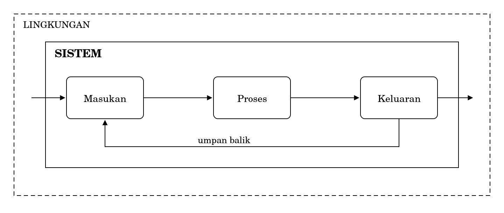
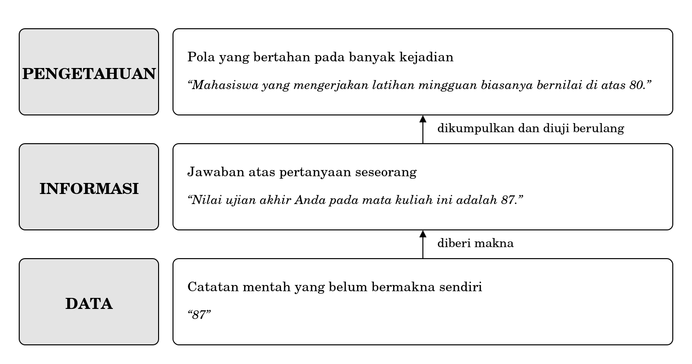

**BAGIAN I MEMAHAMI SISTEM INFORMASI**

**Bab 1**

**Sistem, Data, dan Informasi**

# **Peta bab**

**Sub-CPMK yang diampu.** Mampu menjelaskan konsep sistem, data, informasi, komponen sistem informasi, serta peran dan profesi bidang sistem informasi.

Ini bab pertama buku ini dan bab pertama yang Anda baca dalam mata kuliah ini. Ia tidak menuntut pengetahuan apa pun sebelumnya. Yang dilatih di sini adalah satu keterampilan tunggal: melihat sesuatu sebagai sistem, dan mengetahui apa akibatnya bagi cara Anda bekerja kelak.

Setelah membaca bab ini Anda akan mampu:

1.  menjelaskan apa yang dimaksud dengan sistem, beserta unsur-unsurnya;

2.  menarik batas sebuah sistem dan mempertahankan letak batas itu;

3.  membedakan data, informasi, dan pengetahuan dengan contoh sendiri;

4.  menjelaskan mengapa sistem informasi bukan sinonim dari aplikasi;

5.  mengenali bahwa batas sistem adalah keputusan, bukan sesuatu yang ditemukan.

**Bab prasyarat.** Tidak ada.

**Kata kunci.** Sistem, unsur, batas, lingkungan, masukan, proses, keluaran, umpan balik, data, informasi, pengetahuan.

**Yang akan Anda hasilkan.** Satu pernyataan tertulis mengenai batas sebuah sistem yang Anda pilih, beserta alasan mengapa satu unsur dimasukkan dan unsur lain tidak.

# **Delapan puluh tujuh**

Angka delapan puluh tujuh.

Sampai di sini, angka itu tidak berarti apa pun. Ia bisa berarti nilai ujian, berat badan, jumlah kursi di ruang kuliah, harga sesuatu dalam ribuan rupiah, atau nomor rumah. Anda tidak dapat berbuat apa pun dengannya.

Sekarang tambahkan satu keterangan: delapan puluh tujuh adalah nilai ujian akhir Anda pada mata kuliah ini. Angka yang sama, tetapi sekarang Anda dapat melakukan sesuatu. Anda tahu apakah harus mengulang, apakah perlu menemui dosen, atau apakah Anda bisa menerima nilai ujian tersebut.

Yang berubah bukan angkanya. Yang berubah adalah adanya keterangan mengenai apa yang diukur, siapa yang diukur, dan kaitannya dengan apa. Keterangan itulah yang mengubah data menjadi informasi, dan perbedaan antara keduanya adalah salah satu dari dua hal yang dibahas dalam bab ini.

Hal kedua lebih besar. Sebelum Anda dapat berbicara mengenai data dan informasi, Anda perlu satu cara memandang yang menampung keduanya. Cara memandang itu bernama **sistem**.

# **1.1 Sistem**

Kata sistem digunakan sehari-hari untuk hampir apa pun. Ada sistem pencernaan, sistem tata surya, sistem antrean, sistem operasi, dan sistem informasi akademik. Karena dipakai untuk begitu banyak hal, kata itu terasa kurang jelas.

Ketidakjelasan tersebut hilang begitu Anda menyadari satu hal: sistem bukan jenis benda, melainkan cara memandang benda.

|                                                                                                                                  |
|----------------------------------------------------------------------------------------------------------------------------------|
| *Sistem adalah sekumpulan unsur yang saling berhubungan, bekerja menuju satu tujuan, dan dipisahkan dari sekitarnya oleh batas.* |

Perhatikan bahwa definisi itu dapat dikenakan pada segala hal, dan itu bukan kelemahan melainkan kegunaannya. Ketika Anda memandang sesuatu sebagai sistem, Anda sedang memutuskan untuk memperhatikan hubungan antarbagiannya, bukan bagian-bagiannya satu per satu.

Perbedaan cara pandang ini berdampak nyata. Seseorang yang memandang kemacetan lalu lintas sebagai kumpulan pengemudi yang tidak tertib akan mengusulkan penertiban. Seseorang yang memandangnya sebagai sistem akan bertanya tentang lampu lalu lintas, jam masuk sekolah, dan lokasi pasar. Keduanya melihat kejadian yang sama dan mengusulkan hal yang berbeda.

# **1.2 Unsur sebuah sistem**

Sebuah sistem yang digambarkan secara lengkap memuat lima unsur.

**Gambar 1.1 Unsur sebuah sistem dan batasnya**

**Masukan** adalah segala sesuatu yang datang dari luar dan diolah oleh sistem. **Proses** adalah pengolahannya. **Keluaran** adalah hasil yang dikembalikan ke luar.

**Umpan balik** adalah keterangan mengenai keluaran yang digunakan untuk memperbaiki masukan atau proses berikutnya. Unsur inilah yang membedakan sistem yang dapat memperbaiki diri dari sistem yang terus mengulang kekeliruan yang sama tanpa henti.

**Batas** memisahkan sistem dari **lingkungannya.** Lingkungan memengaruhi sistem tetapi tidak dapat dikendalikan olehnya. Bagi sistem informasi akademik, misalnya, kebijakan kementerian berada di lingkungan: ia memengaruhi tetapi tidak dapat diubah oleh sistem tersebut.

Dari kelima unsur itu, umpan balik paling sering hilang pada rancangan pemula. Sebuah sistem tanpa umpan balik dapat berjalan bertahun-tahun sambil menghasilkan keluaran yang keliru, sebab tidak ada jalur bagi kekeliruan itu untuk kembali.

# **1.3 Batas adalah keputusan, bukan menemukan masalah**

Bagian ini memuat gagasan yang paling penting dalam bab ini, dan gagasan itu bertentangan dengan cara berpikir yang biasa.

Ketika seseorang diminta menggambarkan sebuah sistem, ia biasanya mencari batas yang sudah ada di sana, seolah-olah batas itu tinggal ditemukan. Kenyataannya tidak demikian. Batas ditetapkan oleh orang yang menggambarkan, dan penetapan itu bergantung pada pertanyaan yang hendak dijawabnya.

Ambil layanan pengisian rencana studi sebagai contoh. Kalau pertanyaannya adalah mengapa halaman itu lambat pada hari pertama, batas yang berguna mencakup perangkat lunak, jaringan kampus, dan jumlah mahasiswa yang mengakses secara bersamaan. Kalau pertanyaannya adalah mengapa banyak mahasiswa salah memilih kelas, batas yang berguna mencakup mahasiswa, dosen wali, dan cara jadwal disusun, sedangkan kecepatan jaringan tidak relevan sama sekali.

|                                                                                                                                                                                         |
|-----------------------------------------------------------------------------------------------------------------------------------------------------------------------------------------|
| *Batas yang benar bukan batas yang sesuai dengan kenyataan, melainkan batas yang cukup lebar untuk memuat masalah yang sedang Anda selidiki dan cukup sempit untuk dapat diselesaikan.* |

Karena batas adalah keputusan, batas itu harus dinyatakan. Model yang tidak menyebutkan batasnya akan dibaca orang lain sebagai gambaran seluruh keadaan, dan itu dapat menyesatkan. Kebiasaan menyatakan batas ini akan Anda gunakan kembali pada Bab 7 ketika menggambar model proses.

# **1.4 Data, informasi, dan pengetahuan**

Sekarang kembali ke angka 87.

**Gambar 1.2 Data, informasi, dan pengetahuan**

**Data** adalah catatan mentah tentang sesuatu yang terjadi. Ia belum bermakna dengan sendirinya, dan justru karena itu ia dapat disimpan dalam jumlah yang sangat besar.

**Informasi** adalah data yang sudah diberi keterangan sehingga dapat menjawab pertanyaan seseorang. Perhatikan kata terakhir. Tanpa seseorang yang bertanya, tidak ada informasi, hanya ada data yang tersusun rapi.

**Pengetahuan** adalah pola yang bertahan pada banyak kejadian, sehingga dapat digunakan untuk memperkirakan kejadian berikutnya. Ia terbentuk dari banyak informasi yang dikumpulkan dan diuji berulang kali.

Perbedaan ketiganya bukan perbedaan tingkat kecanggihan, melainkan perbedaan jangkauan. Data berlaku untuk satu kejadian, informasi untuk satu pertanyaan, dan pengetahuan untuk banyak kejadian yang belum terjadi.

## **1.4.1 Perbedaan istilah**

Perbedaan ini bukan sekadar soal istilah. Ia menentukan letak persoalan apabila sesuatu tidak berjalan.

| **Keluhan yang terdengar**                               | **Letak persoalannya** | **Yang harus diperiksa**                   |
|----------------------------------------------------------|------------------------|--------------------------------------------|
| “Datanya tidak ada.”                                     | Lapis data             | Apakah kejadiannya memang dicatat?         |
| “Datanya ada tapi tidak menjawab pertanyaan saya.”       | Lapis informasi        | Apakah pertanyaannya pernah dirumuskan?    |
| “Sudah ada laporannya tapi kami tetap salah memutuskan.” | Lapis pengetahuan      | Apakah polanya memang ada, atau kebetulan? |

Ketiga keluhan itu terdengar mirip dan menuntut perbaikan yang sama sekali berbeda. Kemampuan membedakannya sudah menjadikan Anda lebih berguna daripada orang yang langsung menawarkan aplikasi untuk ketiganya.

# **1.5 Sistem informasi bukan sinonim aplikasi**

Sampai di sini Anda sudah punya dua bahan: cara memandang sesuatu sebagai sistem, dan pembedaan antara data, informasi, dan pengetahuan. Keduanya dapat disatukan.

|                                                                                                                                                                       |
|-----------------------------------------------------------------------------------------------------------------------------------------------------------------------|
| *Sistem informasi adalah sistem yang mengumpulkan, mengolah, menyimpan, dan menyebarkan informasi untuk membantu orang membuat keputusan di dalam sebuah organisasi.* |

Perhatikan bahwa definisi tersebut tidak menyebut perangkat lunak sama sekali.

Sebuah gerai laundry yang memakai buku tulis, nota bernomor, dan kesepakatan bahwa nota selalu dijepit pada kantong cucian sudah menjalankan sistem informasi. Ia mengumpulkan, mengolah, menyimpan, dan menyebarkan informasi. Ia menolong orang mengambil keputusan. Bahwa alatnya berupa kertas dan bukan basis data tidak mengubah statusnya sebagai sistem informasi.

Sebaliknya, sebuah aplikasi yang tidak dipakai siapa pun, atau yang dipakai tetapi tidak menolong dalam pengambilan keputusan apa pun, bukan sistem informasi yang berhasil meskipun perangkat lunaknya sempurna. Anda akan menemui contoh semacam itu pada Bab 5 dan Bab 9.

Bagi mahasiswa Teknik Informatika, pembedaan ini akan terasa mengganggu pada awalnya, dan memang seharusnya begitu. Selama delapan semester ke depan, Anda akan belajar membuat perangkat lunak. Mata kuliah ini mengingatkan bahwa perangkat lunak hanyalah salah satu bagian dari sesuatu yang lebih besar, dan bahwa bagian-bagian lainnya jauh lebih sering menjadi sebab kegagalan.

# **1.6 Yang tidak dibahas di sini**

Bab ini memperkenalkan cara memandang, bukan cara membangun. Beberapa hal yang mungkin Anda harapkan ada di sini sengaja ditunda atau ditiadakan.

- Teori sistem umum sebagai bidang kajian tersendiri tidak dibahas. Yang diambil hanya bagian yang berguna untuk melihat organisasi.

- Empat komponen sistem informasi dibahas pada Bab 2, sehingga bab ini sengaja berhenti sebelum sampai ke sana.

- Cara menyimpan data dan merancang tempat penyimpanannya merupakan bagian dari lingkup mata kuliah Basis Data.

- Cara membangun perangkat lunak merupakan lingkup mata kuliah pemrograman dan rekayasa perangkat lunak.

<table>
<colgroup>
<col style="width: 100%" />
</colgroup>
<tbody>
<tr class="odd">
<td>
<strong>Di balik layar: satu ketukan dan beberapa sistem</strong>

Ketika Anda menekan tombol simpan pada pengisian rencana studi, yang terjadi berikutnya adalah melintasi beberapa sistem dengan batas yang berbeda-beda, dan masing-masing dipelihara oleh orang yang berbeda.

Ada sistem yang memastikan bahwa Anda memang Anda. Ada sistem yang menyimpan daftar mata kuliah beserta kuotanya. Ada sistem yang memeriksa apakah Anda sudah membayar UKT. Ada pula sistem yang mencatat bahwa permintaan Anda pernah terjadi, agar dapat ditelusuri kalau kelak ada sengketa.

Bagi Anda, semuanya tampak seperti satu tombol. Bagi orang yang memeliharanya, itu beberapa sistem terpisah yang kebetulan bekerja bersama, dan sebagian besar persoalan justru muncul di perbatasan antara sistem-sistem tersebut.

Perhatikan bahwa keempat sistem tersebut tidak dipisahkan oleh batas alami. Seseorang, pada suatu waktu, memutuskan bahwa pemeriksaan pembayaran adalah sistem tersendiri dan bukan bagian dari pengisian rencana studi. Keputusan itu mungkin tepat, mungkin pula sekadar warisan dari susunan organisasi yang sudah tidak ada lagi.
</td>
</tr>
</tbody>
</table>

<table>
<colgroup>
<col style="width: 100%" />
</colgroup>
<tbody>
<tr class="odd">
<td>
<strong>Salah kaprah</strong>

<strong>“Sistem itu sesuatu yang berhubungan dengan komputer.”</strong> Sistem adalah cara memandang. Antrean di kantin, kepanitiaan, dan tubuh manusia semuanya dapat dipandang sebagai sistem tanpa satu pun komputer yang terlibat.

<strong>“Batas sistem sudah ada di sana, tinggal digambar.”</strong> Batas ditetapkan oleh yang menggambar, dan letaknya bergantung pada pertanyaan yang hendak dijawab. Dua orang yang menyelidiki masalah yang berbeda pada layanan yang sama akan menggambar batas yang berbeda, dan keduanya dapat dibenarkan.

<strong>“Data dan informasi itu sama saja, hanya beda istilah.”</strong> Perbedaannya menentukan letak persoalan ketika sesuatu tidak berjalan dan, karena itu, menentukan pula perbaikan mana yang masuk akal.
</td>
</tr>
</tbody>
</table>

# **Studi kasus terpandu: menarik batas pada pengisian rencana studi**

Bagian ini mengerjakan satu penarikan batas dari awal sampai akhir, dan menunjukkan bahwa pertanyaan yang berbeda menghasilkan batas yang berbeda.

## **Pertanyaan pertama: mengapa halaman itu lambat pada hari pertama**

| **Di dalam batas**        | **Di lingkungan**               | **Di luar sama sekali**    |
|---------------------------|---------------------------------|----------------------------|
| Perangkat lunak pengisian | Jumlah mahasiswa yang mengakses | Cara jadwal kuliah disusun |
| Pusat data kampus         | Kebijakan pembukaan serentak    | Isi mata kuliah            |
| Jaringan kampus           | Jaringan seluler mahasiswa      | Kualitas pengajaran        |

Perhatikan kolom kedua. Jumlah mahasiswa yang mengakses secara bersamaan memengaruhi kelambatan, tetapi tidak dapat dikendalikan oleh sistem tersebut, sehingga hal itu berada di lingkungan, bukan di dalam batas. Membedakan keduanya penting, sebab yang di lingkungan hanya dapat diantisipasi, tidak dapat diperbaiki.

## **Pertanyaan kedua: mengapa banyak mahasiswa salah memilih kelas**

| **Di dalam batas**                | **Di lingkungan**                   | **Di luar sama sekali** |
|-----------------------------------|-------------------------------------|-------------------------|
| Mahasiswa dan cara ia memilih     | Jadwal kerja mahasiswa yang bekerja | Kecepatan jaringan      |
| Tampilan daftar kelas             | Kebiasaan meminta saran teman       | Kapasitas pusat data    |
| Dosen wali dan cara ia menyetujui | Kalender akademik                   | Perangkat keras         |

Bandingkan kedua tabel. Kecepatan jaringan berpindah dari dalam batas menjadi di luar sama sekali. Mahasiswa berpindah dari tidak disebut menjadi unsur utama. Layanannya sama, orangnya sama, dan harinya sama. Yang berubah hanya pertanyaannya.

## **Apa yang ditunjukkan perbandingan ini**

Kalau Anda kelak diminta memperbaiki sesuatu dan langsung mulai menggambar, Anda sedang mengambil keputusan mengenai batas tanpa menyadarinya. Keputusan yang diambil tanpa disadari tidak dapat diperiksa, diperdebatkan, atau diperbaiki.

Kebiasaan yang benar adalah menuliskan pertanyaannya terlebih dahulu, dalam satu kalimat, sebelum menggambar apa pun. Kebiasaan itu terdengar berlebihan untuk masalah kecil, dan justru pada masalah besar ia menghematnya berminggu-minggu.

## **Kritik atas hasil sendiri**

1.  Kedua tabel di atas disusun berdasarkan pengetahuan umum mengenai layanan akademik, bukan berdasarkan pengamatan terhadap layanan tertentu. Pada layanan yang sesungguhnya, beberapa unsur mungkin berpindah kolom. Menyusun tabel semacam ini tanpa memeriksa lapangan berguna sebagai latihan, tetapi berbahaya sebagai dasar keputusan.

2.  Pembagian menjadi tiga kolom membuat segalanya tampak jelas, padahal banyak unsur berada di perbatasan antarkolom. Jumlah mahasiswa yang mengakses secara bersamaan, misalnya, sebagian dapat dikendalikan dengan membagi jadwal pembukaan. Ketika sebuah unsur dapat dipindahkan ke dalam batas dengan mengubah kebijakan, penempatannya di lingkungan sebenarnya merupakan pilihan, bukan kenyataan.

# **Rangkuman**

- Sistem bukan jenis benda, melainkan cara memandang benda.

- Sebuah sistem memuat masukan, proses, keluaran, umpan balik, dan batas yang memisahkannya dari lingkungannya.

- Umpan balik adalah unsur yang paling sering hilang, dan tanpa umpan balik, kekeliruan dapat terulang terus menerus.

- Batas ditetapkan oleh orang yang menggambarkan, bergantung pada pertanyaan yang hendak dijawab.

- Batas yang benar cukup lebar untuk memuat masalahnya dan cukup sempit untuk diselesaikan.

- Data berlaku untuk satu kejadian, informasi untuk satu pertanyaan, dan pengetahuan untuk banyak kejadian yang belum terjadi.

- Tanpa seseorang yang bertanya, tidak ada informasi, hanya ada data yang tersusun rapi.

- Sistem informasi tidak menuntut perangkat lunak. Buku tulis, nota bernomor, dan kesepakatan sudah cukup.

# **Latihan**

Setiap soal ditandai dengan Sub-CPMK yang diukurnya.

## **Tingkat A Memastikan Anda ingat**

1.  Sebutkan lima unsur sebuah sistem dan jelaskan peran masing-masing. \[Sub-CPMK-1\]

2.  Mengapa umpan balik disebut unsur yang paling sering hilang, dan apa akibatnya? \[Sub-CPMK-1\]

3.  Jelaskan perbedaan antara batas dan lingkungan, disertai satu contoh. \[Sub-CPMK-1\]

4.  Bedakan data, informasi, dan pengetahuan dengan contoh Anda sendiri, bukan contoh dari buku ini. \[Sub-CPMK-1\]

5.  Mengapa sebuah gerai laundry yang memakai buku tulis tetap disebut menjalankan sistem informasi? \[Sub-CPMK-1\]

## **Tingkat B Menerapkan**

1.  Pilih satu layanan yang Anda gunakan di kampus. Gambarlah unsur-unsurnya seperti pada Gambar 1.1, lengkap dengan umpan balik. Kalau menurut Anda umpan baliknya tidak ada, katakan saja demikian. \[Sub-CPMK-1\]

2.  Untuk layanan pada soal nomor 1, susun tabel tiga kolom seperti pada studi kasus untuk satu pertanyaan yang Anda pilih sendiri. Tuliskan pertanyaannya terlebih dahulu dalam satu kalimat. \[Sub-CPMK-1\]

3.  Ambil satu keluhan yang pernah Anda dengar mengenai layanan kampus. Tentukan apakah letak persoalannya pada lapis data, lapis informasi, atau lapis pengetahuan, dan jelaskan alasannya. \[Sub-CPMK-1\]

## **Tingkat C Menganalisis dan menilai**

1.  Kerjakan kembali soal nomor 2 pada tingkat B untuk layanan yang sama, tetapi dengan pertanyaan yang berbeda. Bandingkan kedua tabel dan tunjukkan unsur mana yang berpindah kolom. Tuliskan satu paragraf mengenai apa arti perpindahan itu bagi orang yang hendak memperbaiki layanan tersebut. \[Sub-CPMK-1\]

2.  Seorang teman menyatakan bahwa mata kuliah ini tidak berguna bagi mahasiswa Teknik Informatika karena tidak mengajarkan cara membuat apa pun. Susun tanggapan tertulis sepanjang satu halaman. Tanggapan yang baik tidak membela mata kuliah ini secara membabi-buta, melainkan mengakui bagian mana dari keberatan teman Anda yang masuk akal. \[Sub-CPMK-1\]

# **Rujukan bab**

1.  Laudon, K. C. dan Laudon, J. P. Management Information Systems: Managing the Digital Firm. Pearson, edisi terbaru. Bab pembuka mengenai sistem informasi dan organisasi.

2.  Bourgeois, D. Information Systems for Business and Beyond. Buku teks terbuka. Bab mengenai apa itu sistem informasi.

3.  Alter, S. (2013). “Work System Theory: Overview of Core Concepts, Extensions, and Challenges for the Future.” Journal of the Association for Information Systems, 14(2). Untuk pembaca yang ingin menelusuri gagasan sistem lebih jauh.
