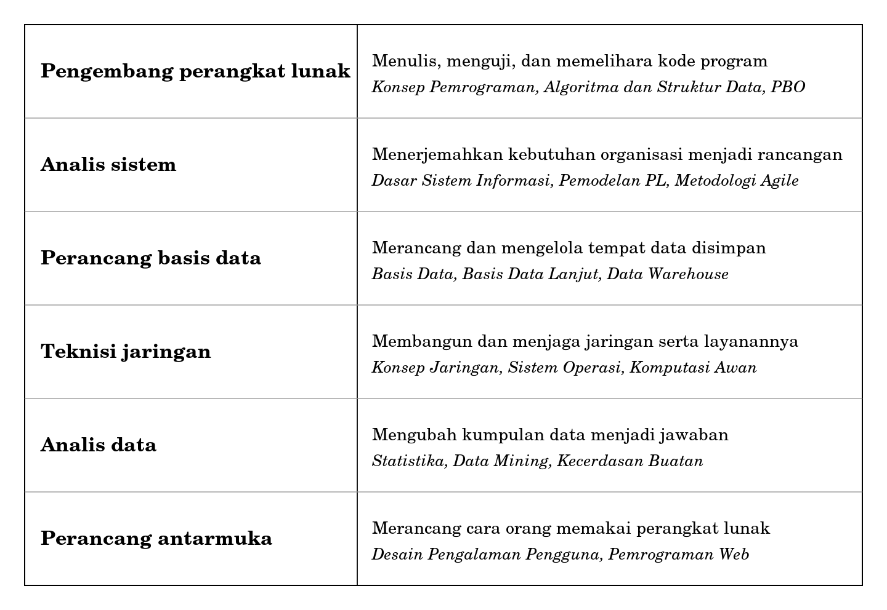

**BAGIAN I MEMAHAMI SISTEM INFORMASI**

**Bab 3**

**Profesi dan Peran di Bidang Teknologi Informasi**

# **Peta bab**

**Sub-CPMK yang diampu.** Mampu menjelaskan konsep sistem, data, informasi, komponen sistem informasi, serta peran dan profesi di bidang sistem informasi.

Bab ini mengampu bagian terakhir dari Sub-CPMK tersebut. Ia berbeda dari bab-bab lain dalam buku ini karena tidak mengajarkan cara mengerjakan sesuatu. Ia menjawab pertanyaan yang hampir pasti sedang Anda simpan sejak hari pertama kuliah: saya sedang belajar untuk menjadi apa.

Setelah membaca bab ini Anda akan mampu:

1.  menyebutkan enam peran utama di bidang teknologi informasi beserta pekerjaan sehari-harinya;

2.  menghubungkan setiap peran dengan mata kuliah yang menopangnya;

3.  menjelaskan profil lulusan program studi ini dan hubungannya dengan keenam peran tersebut;

4.  menjelaskan mengapa peran analis sistem paling dekat dengan mata kuliah ini;

5.  menyusun rencana belajar pribadi untuk satu peran yang Anda pilih.

**Bab prasyarat.** Bab 1 dan Bab 2.

**Kata kunci.** Peran, profesi, analis sistem, profil lulusan, rencana belajar, etika profesi.

**Yang akan Anda hasilkan.** Satu rencana belajar pribadi sepanjang satu halaman, memuat peran yang dipilih, mata kuliah penopangnya, dan satu hal yang akan Anda kerjakan di luar kuliah.

# **Pertanyaan yang belum Anda tanyakan**

Pada pekan pertama kuliah, hampir semua mahasiswa baru mendapat pertanyaan yang sama dari keluarga atau tetangga: nanti kerjanya apa.

Jawaban yang tersedia biasanya pendek dan tidak memuaskan siapa pun, termasuk yang menjawab. Jadi programmer. Kerja di IT. Bikin aplikasi.

Ketiganya tidak salah, dan ketiganya jauh lebih sempit daripada kenyataannya. Bidang yang sedang Anda masuki memuat sekurang-kurangnya enam peran yang berbeda, dengan pekerjaan sehari-hari yang berbeda, kemampuan yang berbeda, dan bahkan kepribadian yang cocok yang berbeda-beda. Sebagian di antaranya hampir tidak menulis kode program sama sekali.

Mengetahui hal itu sejak semester pertama memiliki nilai yang nyata. Mahasiswa yang tahu ke mana ia menuju membaca mata kuliahnya dengan cara yang berbeda. Ia tidak sekadar mengejar nilai, melainkan mengumpulkan bekal.

Bab ini singkat dan tidak menuntut apa-apa selain kesediaan Anda untuk memikirkan pertanyaan yang mungkin sengaja Anda tunda.

# **3.1 Enam peran dan apa yang dikerjakan**

Daftar berikut bukan daftar lengkap dan bukan pula pembagian yang berlaku di semua tempat. Nama jabatan berbeda-beda antarorganisasi, dan satu orang sering memegang lebih dari satu peran, terutama di organisasi kecil. Yang tetap adalah jenis pekerjaannya.

**Gambar 3.1 Enam peran dan mata kuliah yang menopangnya**

Perhatikan kolom ketiga. Mata kuliah yang disebut di sana adalah yang paling menopang, bukan satu-satunya yang dibutuhkan. Hampir semua peran menuntut kemampuan memprogram pada tingkat tertentu, dan hampir semua peran menuntut kemampuan menjelaskan pekerjaan sendiri kepada orang yang tidak sebidang.

## **3.1.1 Yang tidak tampak pada tabel**

Sebuah tabel peran selalu menyembunyikan tiga hal yang justru paling menentukan kenyamanan Anda bekerja kelak.

**Berapa banyak waktu dihabiskan bersama orang lain.** Seorang analis sistem menghabiskan sebagian besar harinya berbicara dengan orang lain. Seorang pengembang dapat melewati satu hari penuh hampir tanpa percakapan panjang. Perbedaan ini besar dan jarang dibahas.

**Seberapa cepat hasil kerja terlihat.** Kode yang ditulis pagi ini dapat dilihat hasilnya sore ini. Rancangan sistem yang disusun bulan ini baru diketahui benar atau keliru setahun kemudian. Orang yang membutuhkan kepastian cepat akan tersiksa dalam peran yang kedua.

**Bagaimana bentuk kesalahannya.** Kesalahan seorang pengembang biasanya terlihat sebagai program yang berhenti. Kesalahan seorang analis terlihat sebagai sistem yang berjalan lancar dan menyelesaikan masalah yang keliru. Yang kedua jauh lebih mahal dan jauh lebih sulit untuk disadari.

# **3.2 Profil lulusan program studi ini**

Program Studi Sarjana Terapan Teknik Informatika menetapkan tiga profil lulusan. Ketiganya dapat dibaca sebagai gabungan peran-peran pada Gambar 3.1.

| **Profil lulusan** | **Peran yang tercakup**                         | **Ciri pokoknya**                                                 |
|--------------------|-------------------------------------------------|-------------------------------------------------------------------|
| Software Engineer  | Pengembang perangkat lunak, perancang antarmuka | Membangun perangkat lunak yang berkualitas pada berbagai platform |
| System Analyst     | Analis sistem, perancang basis data             | Menganalisis kebutuhan dan merancang solusi yang sesuai           |
| Network Engineer   | Teknisi jaringan                                | Membangun dan mengelola jaringan serta layanan berbasis awan      |

Perhatikan bahwa peran analis data tidak muncul sebagai profil tersendiri. Ia tersebar pada ketiganya, dan ditopang oleh mata kuliah seperti Statistika, Data Mining, dan Kecerdasan Buatan. Ketiadaannya sebagai profil bukan berarti ia tidak tersedia sebagai jalur karier, melainkan bahwa program studi ini tidak menjadikannya sebagai penekanan utama.

Perhatikan pula bahwa ketiga profil tersebut bersifat terapan. Program studi ini adalah program sarjana terapan, yang berarti penekanannya pada kemampuan mengerjakan, bukan pada kemampuan meneliti. Perbedaan tersebut akan terasa pada jumlah praktikum dan proyek yang akan Anda jalani.

# **3.3 Peran yang paling dekat dengan mata kuliah ini**

Di antara keenam peran, satu yang paling dekat dengan Dasar Sistem Informasi adalah analis sistem. Kedekatan itu bukan kebetulan, dan menyadarinya akan menolong Anda memahami mengapa mata kuliah ini disusun seperti sekarang.

Pekerjaan seorang analis sistem, kalau diringkas menjadi satu kalimat, adalah menerjemahkan kebutuhan sebuah organisasi menjadi sesuatu yang dapat dibangun. Kalimat itu memuat dua pekerjaan yang berbeda sifatnya.

- Memahami organisasi: proses yang berjalan, orang yang mengerjakan, keputusan yang diambil, dan keterangan yang dibutuhkan. Inilah yang dilatih Bagian III buku ini, terutama Bab 6, 7, dan 8.

- Menilai kesesuaian: jenis sistem apa yang menjawab kebutuhan tersebut, dan kapan jawabannya adalah tidak perlu sistem apa pun. Inilah yang dilatih Bagian IV, terutama Bab 9 dan 10.

Kalau kelak Anda memilih peran lain, isi mata kuliah ini tetap berguna. Seorang pengembang yang memahami organisasi akan menulis perangkat lunak yang lebih tepat sasaran. Seorang teknisi jaringan yang memahami keputusan yang ditopangnya akan membedakan mana layanan yang boleh mati semalam dan mana yang tidak. Yang berubah hanya seberapa sering isinya dipakai.

# **3.4 Etika profesi: pengantar**

Satu hal yang membedakan profesi dari pekerjaan adalah adanya tanggung jawab yang melampaui kepentingan orang yang membayar. Dokter bertanggung jawab kepada pasien, bukan hanya kepada rumah sakit yang menggajinya. Bidang teknologi informasi memiliki tanggung jawab serupa, meskipun batasnya jauh lebih kabur.

Kekaburan itu berasal dari jarak. Orang yang menulis kode program biasanya tidak pernah bertemu orang yang terkena akibatnya. Seorang pengembang yang menyusun aturan penilaian otomatis mungkin tidak pernah melihat wajah orang yang ditolak permohonannya oleh aturan itu.

Untuk sekarang, cukup Anda simpan dua pertanyaan yang akan dibahas tuntas pada Bab 12.

1.  Siapa yang terkena akibat pekerjaan saya, dan apakah saya pernah bertemu dengannya?

2.  Kalau pekerjaan saya keliru, siapa yang menanggungnya, dan apakah orang itu punya cara membantah?

Kedua pertanyaan itu terdengar berat untuk mahasiswa semester satu. Justru karena itu ia diperkenalkan sekarang, jauh sebelum Anda punya kemampuan teknis yang membuat jawabannya menjadi mendesak.

# **3.5 Menyusun rencana belajar pribadi**

Bagian ini memberi cara kerja untuk latihan tingkat C. Bentuknya empat langkah dan hasilnya satu halaman.

## **Langkah 1 Pilih satu peran**

Pilih satu, bukan tiga. Pilihan ini tidak mengikat dan boleh berubah setiap semester. Yang berbahaya bukan salah memilih, melainkan tidak memilih sama sekali, sebab mahasiswa yang tidak memilih akan menjalani delapan semester tanpa pernah tahu mana yang sedang ia bangun.

## **Langkah 2 Telusuri mata kuliah penopangnya**

Buka kurikulum program studi dan tandai mata kuliah yang menopang peran pilihan Anda. Tuliskan pada semester berapa masing-masing muncul. Anda akan melihat bahwa sebagian besar baru datang pada semester empat ke atas, dan itu wajar.

## **Langkah 3 Tentukan satu hal di luar kuliah**

Mata kuliah saja tidak cukup untuk peran mana pun. Tentukan satu hal yang akan Anda kerjakan di luar jam kuliah selama satu semester ini. Satu, bukan lima. Sesuatu yang kecil dan benar-benar dikerjakan jauh lebih berharga daripada daftar panjang yang tidak disentuh.

## **Langkah 4 Tetapkan cara memeriksanya**

Tuliskan bagaimana Anda akan tahu, pada akhir semester, bahwa langkah ketiga sudah dikerjakan. Kalau tidak dapat diperiksa, ia akan menguap. Ini penerapan pertama dari gagasan yang akan Anda pelajari sepanjang buku ini: sesuatu yang tidak dicatat tidak dapat dinilai.

<table>
<colgroup>
<col style="width: 100%" />
</colgroup>
<tbody>
<tr class="odd">
<td>
<strong>Di balik layar: sehari seorang analis sistem</strong>

Gambaran berikut disusun dari pola pekerjaan yang lazim, bukan dari satu orang tertentu.

Pagi hari biasanya dimulai bukan dengan komputer, melainkan dengan percakapan. Seorang analis mendengarkan keluhan dari bagian yang pekerjaannya sedang terganggu, dan tugas pertamanya adalah menahan diri untuk tidak langsung menawarkan solusi.

Menjelang siang, keluhan itu diterjemahkan menjadi pertanyaan yang lebih tajam. Apa yang sebenarnya diputuskan orang ini setiap hari? Keterangan apa yang ia butuhkan? Dari mana keterangan itu sekarang berasal? Pekerjaan pada tahap ini berupa menulis, bukan menggambar.

Sore hari sering habis untuk pekerjaan yang tidak terlihat menghasilkan apa-apa: memeriksa apakah keterangan dari dua orang yang berbeda benar-benar cocok. Bagian inilah yang paling sering dilewati oleh analis yang tidak berpengalaman, dan paling sering menjadi sebab rancangan yang keliru.

Perhatikan bahwa hampir tidak ada kode program dalam gambaran itu. Bukan berarti seorang analis tidak perlu bisa memprogram. Kemampuan memprogram justru dibutuhkan agar ia tahu apa yang mahal dan apa yang murah ketika membuat janji kepada organisasi.
</td>
</tr>
</tbody>
</table>

<table>
<colgroup>
<col style="width: 100%" />
</colgroup>
<tbody>
<tr class="odd">
<td>
<strong>Salah kaprah</strong>

<strong>“Lulusan Teknik Informatika pasti jadi programmer.”</strong> Pengembang perangkat lunak adalah satu dari sekurang-kurangnya enam peran. Sebagian peran hampir tidak menulis kode program, dan sebagian lulusan justru menemukan bahwa peran semacam itulah yang paling cocok bagi mereka.

<strong>“Peran yang tidak menulis kode berarti kurang teknis.”</strong> Seorang analis yang tidak memahami apa yang mahal dan apa yang murah dalam pembuatan perangkat lunak akan membuat janji yang tidak dapat ditepati. Kemampuan teknis tetap dibutuhkan, hanya dipakai untuk keperluan yang berbeda.

<strong>“Memilih peran sekarang berarti terkunci selamanya.”</strong> Pilihan pada semester satu hampir tidak pernah bertahan sampai lulus, dan itu tidak apa-apa. Gunanya bukan mengunci masa depan, melainkan memberi arah pada semester yang sedang berjalan.
</td>
</tr>
</tbody>
</table>

# **Studi kasus terpandu: rencana belajar untuk satu peran**

Bagian ini menjalankan keempat langkah pada Subbab 3.5 untuk peran analis sistem, sebagai contoh yang dapat Anda tiru bentuknya.

## **Langkah 1 Peran yang dipilih**

Analis sistem. Alasan yang dituliskan: lebih menyukai percakapan daripada bekerja sendirian, dan lebih tertarik pada pertanyaan mengapa daripada pertanyaan bagaimana.

Perhatikan bahwa alasannya berupa kecenderungan pribadi, bukan perkiraan gaji. Alasan berupa gaji tidak salah, tetapi ia tidak menolong Anda memilih apa yang dikerjakan pekan depan.

## **Langkah 2 Mata kuliah penopang menurut semester**

| **Semester** | **Mata kuliah**                                | **Yang diperoleh**                                         |
|--------------|------------------------------------------------|------------------------------------------------------------|
| 1            | Dasar Sistem Informasi                         | Cara melihat organisasi dan menurunkan kebutuhan informasi |
| 2 sampai 3   | Basis Data, Konsep Pemrograman                 | Dasar teknis agar janji yang dibuat masuk akal             |
| 4 sampai 5   | Workshop Pemodelan Perangkat Lunak             | Notasi pemodelan yang lebih lengkap                        |
| 5 sampai 6   | Metodologi Agile, Pengembangan Perangkat Lunak | Cara kerja bersama tim pengembang                          |
| 6 ke atas    | Sistem Pendukung Keputusan, Data Mining        | Kemampuan menilai kebutuhan yang lebih rumit               |

Perhatikan bahwa hanya satu mata kuliah berada di semester satu, dan mata kuliah itu adalah yang sedang Anda baca sekarang. Sepanjang semester ini, hampir seluruh bekal untuk peran ini datang dari satu tempat.

## **Langkah 3 Satu hal di luar kuliah**

Contoh yang dipilih: mewawancarai satu orang yang menjalankan usaha kecil, sekali dalam satu bulan, selama satu semester. Empat orang seluruhnya.

Perhatikan ukurannya. Sekali sebulan, satu orang, tanpa tuntutan menghasilkan apa pun selain catatan. Kegiatan sekecil ini terlihat tidak berarti dan justru karena itu ia mungkin benar-benar dikerjakan. Rencana yang menuntut dua jam setiap hari hampir selalu berhenti pada pekan ketiga.

## **Langkah 4 Cara memeriksanya**

Pada akhir semester, harus ada empat catatan wawancara. Ada atau tidak ada, tidak ada nilai tengah. Ukuran semacam ini sengaja dibuat kasar, sebab ukuran yang halus mudah dinegosiasikan dengan diri sendiri.

## **Kritik atas hasil sendiri**

1.  Rencana ini mengandaikan Anda dapat menemukan empat pemilik usaha kecil yang bersedia diwawancarai. Andaian itu tidak selalu benar, terutama bagi mahasiswa yang baru pindah ke kota ini. Rencana yang bergantung pada kesediaan orang lain sebaiknya disertai rencana cadangan yang tidak bergantung pada siapa pun.

2.  Daftar mata kuliah pada Langkah 2 disusun dari nama mata kuliah, bukan dari isinya. Nama dapat menyesatkan. Sebelum Anda menyusun rencana yang sungguh-sungguh, bacalah rencana pembelajaran semester dari mata kuliah yang bersangkutan, atau tanyakan kepada mahasiswa tingkat atas yang sudah menempuhnya.

# **Rangkuman**

- Bidang teknologi informasi memuat sekurang-kurangnya enam peran dengan pekerjaan sehari-hari yang berbeda-beda.

- Sebagian peran hampir tidak menulis kode program, dan itu bukan berarti kurang teknis.

- Tiga hal yang tidak tampak pada tabel peran: berapa banyak waktu bersama orang lain, seberapa cepat hasil kerja terlihat, dan bagaimana bentuk kesalahannya.

- Kesalahan seorang analis berbentuk sistem yang berjalan lancar dan menyelesaikan masalah yang salah.

- Program studi ini menetapkan tiga profil lulusan, dan ketiganya bersifat terapan.

- Peran yang paling dekat dengan mata kuliah ini adalah analis sistem, dan susunan buku ini mengikuti kedua bagian pekerjaannya.

- Rencana belajar pribadi yang berguna berukuran kecil, dapat diperiksa, dan boleh berubah setiap semester.

# **Latihan**

Setiap soal ditandai dengan Sub-CPMK yang diukurnya.

## **Tingkat A Memastikan Anda ingat**

1.  Sebutkan enam peran pada Gambar 3.1 beserta pekerjaan sehari-harinya. \[Sub-CPMK-1\]

2.  Sebutkan tiga hal yang tidak tampak pada tabel peran dan jelaskan mengapa ketiganya penting. \[Sub-CPMK-1\]

3.  Sebutkan tiga profil lulusan program studi ini dan peran yang tercakup pada masing-masing. \[Sub-CPMK-1\]

4.  Mengapa peran analis sistem disebut paling dekat dengan mata kuliah ini? \[Sub-CPMK-1\]

5.  Sebutkan dua pertanyaan etika yang diperkenalkan pada Subbab 3.4. \[Sub-CPMK-1\]

## **Tingkat B Menerapkan**

1.  Pilih satu peran selain analis sistem, lalu susun tabel mata kuliah penopang menurut semester seperti pada studi kasus. \[Sub-CPMK-1\]

2.  Untuk peran pada soal nomor 1, tuliskan bagaimana bentuk kesalahan yang khas pada peran tersebut, dan bandingkan dengan bentuk kesalahan seorang analis. \[Sub-CPMK-1\]

3.  Wawancarai satu mahasiswa tingkat atas mengenai peran yang ia bayangkan sejak semester satu dan peran yang sekarang ia tuju. Tuliskan apa yang berubah dan apa sebabnya. \[Sub-CPMK-1\]

## **Tingkat C Menganalisis dan menilai**

1.  Susun rencana belajar pribadi Anda sendiri sepanjang satu halaman, menggunakan keempat langkah pada Subbab 3.5. Rencana harus memuat peran yang dipilih beserta alasannya, tabel mata kuliah penopang, satu kegiatan di luar kuliah berukuran kecil, dan cara memeriksanya pada akhir semester. Sertakan pula satu paragraf mengenai apa yang akan Anda lakukan jika pada akhir semester pilihan Anda berubah. \[Sub-CPMK-1\]

2.  Seorang teman menyatakan bahwa memilih peran pada semester satu tidak ada gunanya karena semuanya akan terus berubah. Nilailah pernyataan itu. Bagian mana yang benar dan bagian mana yang keliru? Susun jawaban Anda dalam bentuk percakapan singkat, bukan esai, karena jawaban semacam ini pada kenyataannya memang disampaikan dalam percakapan. \[Sub-CPMK-1\]

# **Rujukan bab**

1.  The Joint ACM/AIS IS2020 Task Force. IS2020: A Competency Model for Undergraduate Programs in Information Systems. ACM dan AIS. Bagian mengenai profesi sistem informasi dan peran-perannya.

2.  ACM, IEEE-CS, dan AAAI. Computing Curricula 2020 (CC2020). Bagian mengenai pembedaan antara disiplin komputasi dan peran yang dihasilkannya.

3.  Program Studi Sarjana Terapan Teknik Informatika, Politeknik Elektronika Negeri Surabaya. Profil lulusan dan capaian pembelajaran lulusan. Dokumen resmi program studi.
