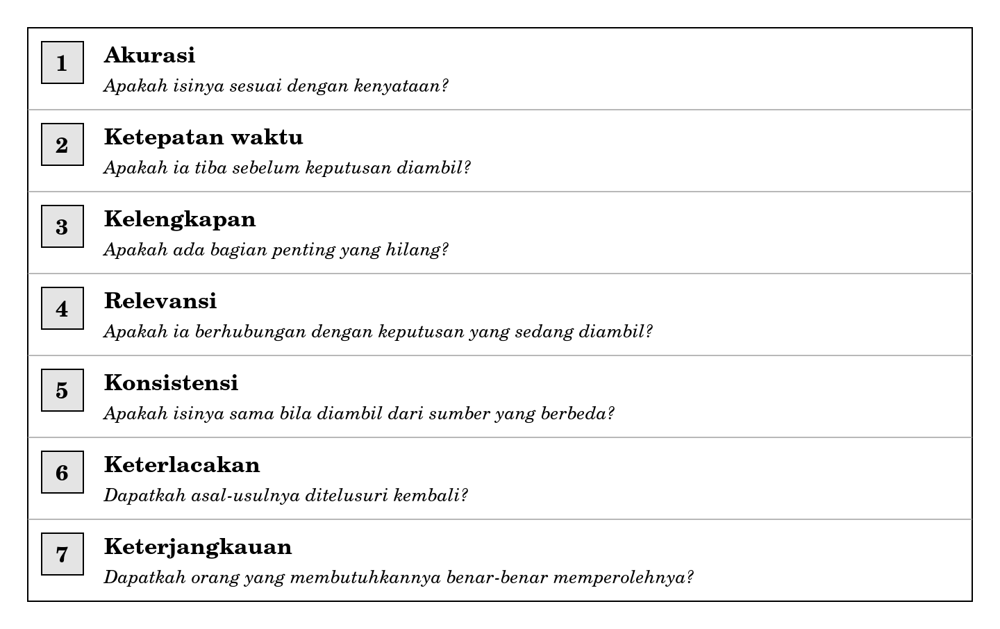
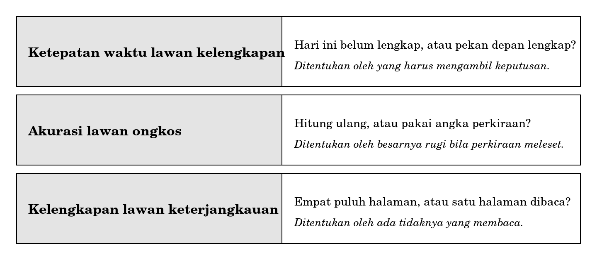

**BAGIAN II INFORMASI SEBAGAI SESUATU YANG BERNILAI**

**Bab 4**

**Kualitas Informasi**

**Peta bab**

**Sub-CPMK yang diampu.** Mampu menjelaskan dimensi kualitas dan nilai informasi serta kaitannya dengan pengambilan keputusan pada tiap tingkat manajemen.

Bab ini mengampu bagian pertama dari Sub-CPMK tersebut, yaitu dimensi kualitas. Bagian kedua, nilai informasi dan pengambilan keputusan, dikerjakan pada Bab 5.

Setelah membaca bab ini Anda akan mampu:

1.  menyebutkan tujuh dimensi kualitas informasi dan pertanyaan penguji masing-masing;

2.  menjelaskan bagaimana tiap dimensi rusak dan apa akibatnya bagi keputusan;

3.  menjelaskan mengapa ketujuh dimensi tidak dapat dimaksimalkan sekaligus;

4.  menilai kualitas sebuah keluaran nyata dengan memakai ketujuh dimensi tersebut;

5.  menentukan dimensi mana yang boleh dikorbankan untuk sebuah keputusan tertentu.

**Bab prasyarat.** Bab 1 untuk perbedaan data dan informasi, Bab 2 untuk empat komponen sistem informasi.

**Kata kunci.** Akurasi, ketepatan waktu, kelengkapan, relevansi, konsistensi, keterlacakan, keterjangkauan, pertukaran.

**Yang akan Anda hasilkan.** Satu penilaian tertulis atas kualitas sebuah keluaran nyata, disertai penetapan dimensi mana yang paling menentukan bagi keputusan yang dilayaninya.

**Angka yang benar dan sudah kedaluwarsa**

Hari pengisian rencana studi. Anda membuka sistem akademik pada pukul delapan lewat dua menit dan mencari satu kelas yang jadwalnya cocok. Sistem menampilkan sisa kuota kelas itu: tiga.

Anda memilih kelas tersebut, memeriksa sekali lagi jadwalnya agar tidak bentrok, lalu menekan tombol simpan. Yang muncul adalah pesan bahwa kuota kelas sudah penuh.

Angka tiga itu tidak salah. Ia benar pada saat halaman dimuat, empat menit sebelumnya. Selama empat menit itu, tiga orang lain menekan tombol simpan lebih dahulu.

Perhatikan bahwa tidak ada kesalahan hitung di mana pun. Sistem tidak keliru menjumlahkan, tidak keliru membaca basis data, dan tidak keliru menampilkan. Yang keliru adalah anggapan Anda bahwa angka yang benar akan tetap berguna beberapa menit kemudian.

Ini menunjukkan sesuatu yang akan menjadi pokok bab ini: benar dan berguna adalah dua sifat yang berbeda, dan sebuah informasi dapat memiliki yang satu tanpa memiliki yang lain.

**4.1 Kualitas informasi bukan satu hal**

Ketika orang menilai sebuah informasi, penilaiannya hampir selalu berhenti pada satu pertanyaan: benar atau tidak. Penilaian itu terlalu sempit, dan kesempitannya menimbulkan biaya nyata.

Cerita pembuka menunjukkan sebuah informasi yang benar tetapi terlambat. Ada pula informasi yang benar tetapi tidak lengkap, benar tetapi tidak berhubungan dengan keputusan yang sedang diambil, dan benar tetapi tidak dapat diperoleh orang yang membutuhkannya. Keempat keadaan itu berbeda-beda sebabnya dan berbeda-beda pula cara memperbaikinya.

|                                                                                                                                                                                            |
|--------------------------------------------------------------------------------------------------------------------------------------------------------------------------------------------|
| *Kualitas informasi adalah sekumpulan sifat yang harus dipenuhi bersama-sama, bukan satu sifat tunggal. Sebuah informasi dapat unggul pada beberapa sifat dan gagal total pada yang lain.* |

**4.2 Tujuh dimensi**

Buku ini memakai tujuh dimensi. Jumlahnya berbeda-beda pada kepustakaan yang berbeda, dan perbedaan itu tidak penting. Yang penting adalah bahwa masing-masing dimensi punya pertanyaan penguji sendiri, sehingga penilaian tidak berhenti pada kesan.

**Gambar 4.1 Tujuh dimensi kualitas informasi dan pertanyaan pengujinya**

Cara memakainya sederhana. Ambil satu keluaran nyata, ajukan ketujuh pertanyaan itu satu per satu, dan tuliskan jawabannya. Dimensi yang jawabannya tidak dapat Anda berikan adalah dimensi yang belum pernah diperiksa siapa pun.

**4.3 Bagaimana tiap dimensi rusak**

Mengetahui nama dimensi belum banyak menolong. Yang menolong adalah mengenali gejala kerusakannya, sebab gejala itulah yang akan Anda temui lebih dahulu di lapangan.

**Akurasi** rusak ketika isi catatan tidak sesuai dengan kenyataan. Sebabnya bisa kesalahan mengetik, bisa pula pengisian seadanya oleh orang yang menganggap kolomnya tidak masuk akal. Sebab kedua jauh lebih sering dan jauh lebih sulit ditemukan, sebab hasilnya tampak wajar.

**Ketepatan waktu** rusak ketika informasi tiba setelah keputusan diambil. Perhatikan bahwa dimensi ini tidak berarti cepat. Laporan bulanan yang terbit tanggal tiga sudah tepat waktu kalau keputusannya diambil tanggal lima, dan tidak berguna kalau keputusannya diambil tanggal satu.

**Kelengkapan** rusak ketika ada bagian yang hilang tanpa pemberitahuan. Kekurangan yang dinyatakan tidak merusak kelengkapan; yang merusak adalah kekurangan yang disembunyikan, sebab pembaca akan menganggap yang diterimanya sudah utuh.

**Relevansi** rusak ketika informasi yang disajikan tidak berhubungan dengan keputusan yang sedang diambil. Ini kerusakan yang paling sering luput dari perhatian, sebab informasi yang tidak relevan tetap benar dan tetap tampak berguna.

**Konsistensi** rusak ketika dua sumber memberi angka berbeda untuk hal yang sama. Akibatnya lebih besar daripada kelihatannya: begitu orang menemukan dua angka yang berbeda, kepercayaan terhadap keduanya hilang sekaligus, termasuk terhadap yang sebenarnya benar.

**Keterlacakan** rusak ketika tidak ada yang dapat menunjukkan dari mana sebuah angka berasal. Informasi yang tidak dapat ditelusuri tidak dapat diperbaiki, sebab tidak diketahui bagian mana yang harus diperbaiki.

**Keterjangkauan** rusak ketika informasi ada tetapi tidak sampai kepada orang yang membutuhkannya. Laporan yang tersimpan rapi di map yang tidak pernah dibuka memenuhi enam dimensi pertama dan gagal pada yang ketujuh, dan kegagalan itu sudah cukup untuk membuatnya tidak berguna.

**4.4 Ketujuhnya tidak dapat dimaksimalkan sekaligus**

Setelah membaca ketujuh dimensi, godaan yang muncul adalah menuntut semuanya sekaligus. Godaan itu harus ditolak, sebab beberapa dimensi saling bertentangan.

**Gambar 4.2 Tiga pertukaran yang paling sering muncul**

Pertukaran pertama adalah yang paling sering dihadapi. Menunggu sampai lengkap berarti terlambat, dan menyajikan lebih cepat berarti ada yang belum masuk. Tidak ada jalan tengah yang menyenangkan semua pihak, dan yang berhak memilih adalah orang yang harus mengambil keputusannya, bukan orang yang menyusun laporannya.

Pertukaran ketiga paling sering diabaikan karena tampak sepele. Laporan yang lebih lengkap selalu lebih panjang, dan laporan yang lebih panjang selalu lebih jarang dibaca sampai habis. Menambah halaman demi kelengkapan dapat menurunkan kualitas keseluruhan, meskipun setiap halaman tambahan itu benar.

|                                                                                                                     |
|---------------------------------------------------------------------------------------------------------------------|
| *Kualitas informasi bukan keadaan maksimum, melainkan kompromi yang dipilih dengan sadar untuk keputusan tertentu.* |

**4.5 Siapa yang menentukan cukup**

Kalau kualitas berupa kompromi, seseorang harus memilih kompromi itu. Pertanyaannya siapa.

Jawaban yang lazim diberikan adalah pembuat sistem, dan jawaban itu keliru. Pembuat sistem tidak menanggung akibat kalau kompromi itu salah. Yang menanggung akibat adalah orang yang mengambil keputusan berdasarkan informasi tersebut, dan karena itu dialah yang berhak menentukan cukup atau belum.

Bagi Anda sebagai calon perancang, ini berarti satu kebiasaan yang harus dibangun sejak sekarang. Ketika seseorang meminta sebuah laporan, jangan berhenti pada pertanyaan mengenai isinya. Tanyakan pula keputusan apa yang akan diambil berdasarkan laporan itu, dan seberapa cepat keputusan itu harus diambil. Tanpa kedua keterangan tersebut, Anda tidak punya dasar untuk memilih kompromi mana pun, dan yang biasanya terjadi adalah Anda memilih yang paling mudah dikerjakan.

**4.6 Kualitas informasi bukan kualitas data**

Kedua istilah ini terdengar mirip dan sering dipertukarkan, padahal cakupannya berbeda.

|                                              | **Kualitas data**       | **Kualitas informasi**                           |
|----------------------------------------------|-------------------------|--------------------------------------------------|
| Yang dinilai                                 | Isi catatan itu sendiri | Kegunaan catatan itu bagi sebuah keputusan       |
| Dapat dinilai tanpa mengetahui keputusannya? | Ya                      | Tidak                                            |
| Contoh kerusakan                             | Alamat salah ketik      | Alamat benar tetapi tidak dibutuhkan sama sekali |

Baris kedua adalah yang menentukan. Kualitas data dapat diperiksa oleh siapa saja yang melihat catatannya. Kualitas informasi tidak dapat diperiksa tanpa mengetahui keputusan apa yang hendak dilayaninya, sebab relevansi dan ketepatan waktu hanya berarti dalam hubungannya dengan keputusan tersebut.

Teknik memeriksa dan membersihkan data dibahas pada mata kuliah Basis Data. Yang dilatih di sini adalah lapis di atasnya, yaitu menilai apakah catatan yang sudah bersih itu benar-benar menolong seseorang mengambil keputusan.

<table>
<colgroup>
<col style="width: 100%" />
</colgroup>
<tbody>
<tr class="odd">
<td>
<strong>Di balik layar: mengapa sisa kuota yang Anda lihat sudah kedaluwarsa</strong>

Ketika halaman pemilihan kelas dimuat, sistem membaca jumlah sisa kuota satu kali, lalu mengirimkan angka itu ke telepon atau komputer Anda. Sejak saat itu, angka yang Anda lihat adalah salinan. Ia tidak berubah lagi meskipun keadaan di pusat data berubah setiap detik.

Menyegarkan angka itu terus-menerus bukan hal yang mustahil, tetapi ongkosnya nyata. Ribuan mahasiswa yang membuka halaman yang sama pada saat yang sama akan menghasilkan ribuan permintaan setiap detik, dan pada hari pengisian rencana studi justru saat itulah sistem paling terbebani.

Karena itu hampir semua sistem memilih kompromi: angka ditampilkan apa adanya pada saat dimuat, dan kebenarannya baru dipastikan pada saat tombol simpan ditekan. Pemeriksaan akhir itulah yang menolak permintaan Anda.

Kompromi tersebut mengorbankan ketepatan waktu demi keterjangkauan, sebab tanpa kompromi itu sistem mungkin tidak dapat diakses sama sekali pada jam sibuk. Ini contoh nyata dari Gambar 4.2, dan contoh nyata pula bahwa pilihan semacam ini diambil orang, bukan terjadi dengan sendirinya.
</td>
</tr>
</tbody>
</table>

<table>
<colgroup>
<col style="width: 100%" />
</colgroup>
<tbody>
<tr class="odd">
<td>
<strong>Salah kaprah</strong>

<strong>“Informasi yang benar pasti berguna.”</strong> Benar adalah satu dimensi dari tujuh. Informasi yang benar tetapi terlambat, tidak relevan, atau tidak sampai kepada orang yang membutuhkannya tidak berguna sama sekali.

<strong>“Semakin lengkap semakin baik.”</strong> Kelengkapan bertukar dengan ketepatan waktu dan dengan keterjangkauan. Laporan yang lebih lengkap lebih lambat terbit dan lebih jarang dibaca sampai habis.

<strong>“Kualitas informasi adalah urusan teknis.”</strong> Sebagian besar kerusakannya justru berasal dari komponen manusia dan proses, sebagaimana sudah Anda lihat pada Bab 2. Kolom yang diisi seadanya oleh petugas merusak akurasi tanpa satu pun kesalahan teknis.
</td>
</tr>
</tbody>
</table>

**Studi kasus terpandu: papan jadwal ujian**

Sebuah program studi menempelkan jadwal ujian akhir dalam bentuk berkas gambar pada laman pengumuman. Berkas itu memuat seluruh mata kuliah, seluruh kelas, tanggal, jam, dan ruangan. Bila terjadi perubahan, berkas baru diunggah dan berkas lama dihapus, tanpa keterangan apa pun mengenai apa yang berubah.

Nilailah kualitas informasi tersebut dengan ketujuh dimensi.

| **Dimensi**     | **Penilaian** | **Alasan**                                                     |
|-----------------|---------------|----------------------------------------------------------------|
| Akurasi         | Baik          | Isinya disusun dari data resmi program studi                   |
| Ketepatan waktu | Meragukan     | Mahasiswa tidak tahu kapan berkas terakhir diperbarui          |
| Kelengkapan     | Baik          | Seluruh mata kuliah dan kelas tercantum                        |
| Relevansi       | Buruk         | Mahasiswa hanya perlu enam baris dan menerima tiga ratus baris |
| Konsistensi     | Meragukan     | Sebagian mahasiswa masih menyimpan berkas versi lama           |
| Keterlacakan    | Buruk         | Tidak ada nomor versi dan tidak ada catatan perubahan          |
| Keterjangkauan  | Sedang        | Dapat diunduh, tetapi sulit dibaca pada layar telepon          |

**Membaca hasil penilaian**

Tiga dimensi pertama baik atau hampir baik, dan justru itulah yang membuat penyusunnya merasa pekerjaannya sudah selesai. Kerusakan terkumpul pada empat dimensi terakhir, dan keempatnya tidak dapat diperbaiki dengan memeriksa ulang isi jadwalnya.

Perhatikan pula bahwa kerusakan pada keterlacakan memperparah kerusakan pada konsistensi. Kalau ada nomor versi, mahasiswa yang menyimpan berkas lama dapat mengetahui bahwa berkasnya sudah usang. Tanpa nomor versi, dua mahasiswa dapat berdebat mengenai jadwal ujian dan keduanya yakin bahwa berkasnya benar.

**Usulan perbaikan menurut urutan ongkos**

1.  **Menambahkan tanggal dan nomor versi pada berkas.** Ongkosnya hampir nol dan memperbaiki keterlacakan sekaligus meredam kerusakan konsistensi.

2.  **Menambahkan daftar perubahan singkat pada setiap unggahan baru.** Ongkosnya beberapa menit tiap kali, dan menghilangkan keharusan mahasiswa membandingkan sendiri dua berkas.

3.  **Menyediakan penyaringan menurut kelas.** Ini memperbaiki relevansi dan keterjangkauan sekaligus, tetapi ongkosnya paling besar sebab menuntut perubahan cara jadwal itu disusun dan disajikan, bukan sekadar cara mengunggahnya.

Urutan itu disengaja. Dua usulan pertama memperbaiki empat dimensi dengan ongkos yang hampir tidak terasa. Usulan ketiga memperbaiki dua dimensi dengan ongkos yang jauh lebih besar. Kalau waktu Anda terbatas, kerjakan yang murah lebih dahulu, dan katakan terus terang bahwa yang mahal belum dikerjakan.

**Kritik atas hasil sendiri**

1.  Penilaian di atas memakai sudut pandang mahasiswa. Dari sudut pandang bagian akademik, relevansi justru baik, sebab mereka memang membutuhkan seluruh jadwal sekaligus. Kualitas informasi selalu terikat pada pemakainya, dan penilaian yang tidak menyebutkan pemakainya belum lengkap.

2.  Penilaian ini tidak memeriksa apakah jadwalnya sendiri benar. Ketujuh dimensi mengandaikan isinya sudah tepat. Kalau isinya keliru sejak awal, seluruh perbaikan di atas hanya membuat kekeliruan itu lebih mudah diakses.

**Rangkuman**

- Benar dan berguna adalah dua sifat yang berbeda. Sebuah informasi dapat memiliki yang satu tanpa memiliki yang lain.

- Kualitas informasi terdiri atas tujuh dimensi, masing-masing dengan pertanyaan penguji sendiri.

- Ketepatan waktu tidak berarti cepat. Ia berarti tiba sebelum keputusan diambil.

- Kekurangan yang dinyatakan tidak merusak kelengkapan. Yang merusak adalah kekurangan yang disembunyikan.

- Begitu orang menemukan dua angka yang berbeda untuk hal yang sama, kepercayaan terhadap keduanya hilang sekaligus.

- Ketujuh dimensi tidak dapat dimaksimalkan sekaligus. Kualitas adalah kompromi yang dipilih dengan sadar.

- Yang berhak memilih kompromi adalah orang yang mengambil keputusan, bukan orang yang menyusun laporannya.

- Kualitas data dapat dinilai tanpa mengetahui keputusannya. Kualitas informasi tidak.

**Latihan**

Setiap soal ditandai dengan Sub-CPMK yang diukurnya.

**Tingkat A Memastikan Anda ingat**

1.  Sebutkan tujuh dimensi kualitas informasi beserta pertanyaan pengujinya. \[Sub-CPMK-2\]

2.  Mengapa ketepatan waktu tidak sama dengan cepat? Berikan satu contoh. \[Sub-CPMK-2\]

3.  Jelaskan mengapa kerusakan konsistensi merugikan lebih besar daripada kelihatannya. \[Sub-CPMK-2\]

4.  Sebutkan tiga pertukaran antardimensi dan siapa yang berhak memutuskan pada masing-masing. \[Sub-CPMK-2\]

5.  Apa perbedaan antara kualitas data dan kualitas informasi? \[Sub-CPMK-2\]

**Tingkat B Menerapkan**

1.  Ambil satu keluaran nyata dari sistem akademik kampus Anda, misalnya kartu rencana studi atau kartu hasil studi. Nilailah dengan ketujuh dimensi dalam bentuk tabel, seperti pada studi kasus. \[Sub-CPMK-2\]

2.  Untuk setiap dimensi yang Anda nilai buruk pada soal nomor 1, tuliskan satu usulan perbaikan beserta perkiraan ongkosnya, lalu susun menurut urutan ongkos dari yang termurah. \[Sub-CPMK-2\]

3.  Perhatikan Gambar 4.2. Tambahkan satu pertukaran keempat yang menurut Anda sering terjadi, dan jelaskan siapa yang berhak memutuskannya. \[Sub-CPMK-2\]

**Tingkat C Menganalisis dan menilai**

1.  Sebuah organisasi menyatakan bahwa laporannya berkualitas tinggi karena seluruh angkanya sudah diperiksa dua kali. Nilailah pernyataan itu. Dimensi mana yang dijamin oleh pemeriksaan ganda, dan dimensi mana yang sama sekali tidak tersentuh olehnya? Susun jawaban Anda sebagai tanggapan tertulis yang dapat dibaca pimpinan organisasi tersebut tanpa membuat mereka merasa diserang. \[Sub-CPMK-2\]

2.  Pilih satu keluaran yang menurut Anda kualitasnya buruk, lalu pertahankan pendirian sebaliknya: susun argumen bahwa keluaran itu sebenarnya sudah cukup baik untuk keputusan tertentu. Sebutkan keputusan apa yang Anda maksud. Latihan ini menguji apakah Anda benar-benar memahami bahwa kualitas terikat pada pemakainya. \[Sub-CPMK-2\]

**Rujukan bab**

1.  Laudon, K. C. dan Laudon, J. P. Management Information Systems: Managing the Digital Firm. Pearson, edisi terbaru. Bagian mengenai mutu informasi dan mutu data.

2.  Rainer, R. K., Prince, B. dan Watson, H. Introduction to Information Systems. Wiley, edisi terbaru. Bagian mengenai atribut informasi.

3.  Bourgeois, D. Information Systems for Business and Beyond. Buku teks terbuka. Bab mengenai data dan informasi.

**Lampiran bab: daftar gambar**

Halaman ini tidak dicetak dalam buku. Kedua gambar sudah jadi dan tersedia dalam bentuk vektor.

| **No.** | **Judul**                                                  | **Tinggi cetak** | **Status** |
|---------|------------------------------------------------------------|------------------|------------|
| 4.1     | Tujuh dimensi kualitas informasi dan pertanyaan pengujinya | 3,0 inci         | Selesai    |
| 4.2     | Tiga pertukaran yang paling sering muncul                  | 2,1 inci         | Selesai    |
