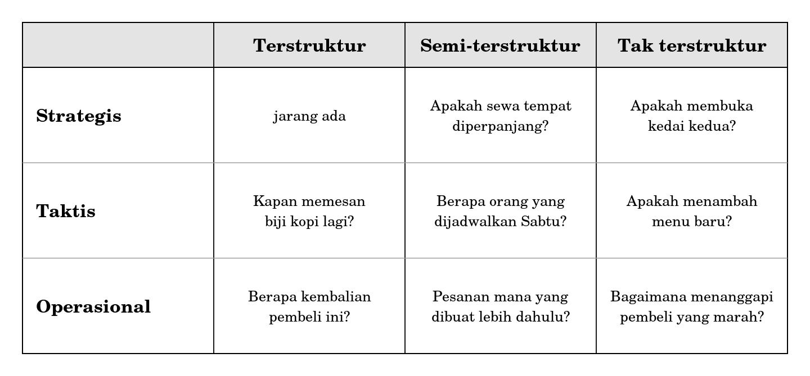
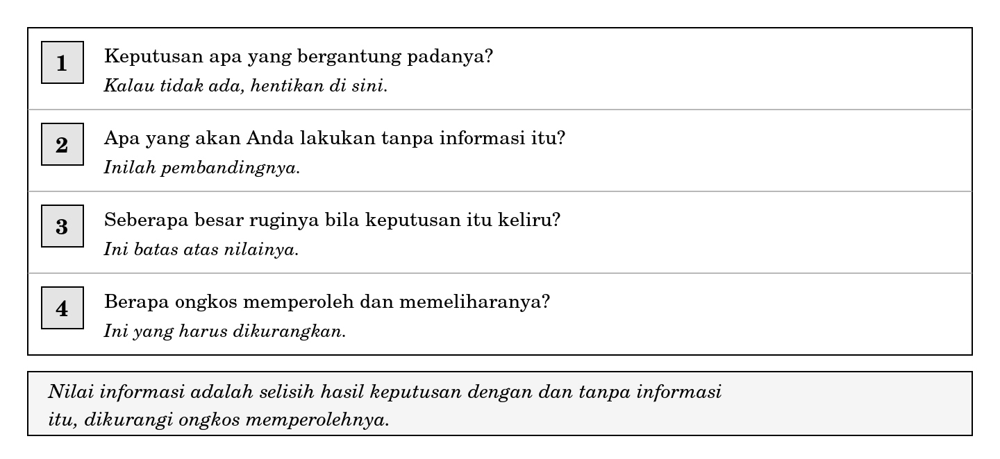

**BAGIAN II INFORMASI SEBAGAI SESUATU YANG BERNILAI**

**Bab 5**

**Nilai Informasi dan Pengambilan Keputusan**

**Peta bab**

**Sub-CPMK yang diampu.** Mampu menjelaskan dimensi kualitas dan nilai informasi serta kaitannya dengan pengambilan keputusan pada tiap tingkat manajemen.

Bab 4 mengerjakan bagian kualitas. Bab ini mengerjakan bagian nilai, dan menghubungkannya dengan tingkat manajemen serta jenis keputusan. Keduanya menjadi dasar bagi seluruh Bagian III dan Bagian IV.

Setelah membaca bab ini Anda akan mampu:

1.  menjelaskan mengapa informasi mempunyai nilai sekaligus mempunyai ongkos;

2.  membedakan tiga tingkat manajemen dan tiga jenis keputusan, serta memetakan sebuah keputusan ke dalamnya;

3.  menaksir nilai sebuah informasi dengan empat pertanyaan;

4.  menjelaskan mengapa menambah data tidak selalu menambah nilai;

5.  menolak permintaan informasi yang tidak mengubah keputusan apa pun, disertai alasan yang dapat disampaikan dengan sopan.

**Bab prasyarat.** Bab 1 untuk perbedaan data dan informasi, Bab 4 untuk dimensi kualitas.

**Kata kunci.** Nilai informasi, ongkos informasi, tingkat manajemen, keputusan terstruktur, keputusan tak terstruktur, kelebihan data.

**Yang akan Anda hasilkan.** Satu taksiran tertulis mengenai nilai sebuah informasi, memakai empat pertanyaan, disertai kesimpulan layak atau tidak layak diadakan.

**Layar yang tidak mengubah apa pun**

Sebuah kedai kopi kecil di dekat kampus memasang layar di belakang meja kasir. Layar itu menampilkan jumlah pembeli hari ini, diperbarui setiap menit. Pemiliknya bangga. Ia memasangnya sendiri setelah menonton beberapa video panduan, dan mahasiswa yang datang sering memotretnya.

Tiga bulan kemudian, seorang mahasiswa yang sedang mengerjakan tugas mata kuliah ini bertanya kepadanya: selama tiga bulan ini, keputusan apa yang pernah berubah karena angka di layar itu?

Pemiliknya berpikir cukup lama, lalu menjawab jujur bahwa tidak ada.

Angka pada layar itu benar. Ia tepat waktu, bahkan sangat tepat waktu. Ia lengkap, konsisten, dan dapat dijangkau siapa pun yang berdiri di depan kasir. Menurut ketujuh dimensi pada Bab 4, kualitasnya sangat baik.

Nilainya nol.

Bab ini tentang perbedaan antara kualitas dan nilai, dan tentang cara menaksir yang kedua sebelum uang, waktu, atau perhatian dikeluarkan untuknya.

**5.1 Informasi punya nilai dan punya ongkos**

Pada percakapan sehari-hari, informasi diperlakukan seolah-olah gratis. Anggapan itu berasal dari pengalaman sebagai pemakai: membuka aplikasi tidak memakan biaya yang terasa, dan mencari sesuatu di internet tampak tidak berongkos sama sekali.

Dari sisi organisasi yang menghasilkan informasi, keadaannya berbeda sama sekali. Setiap informasi menuntut sekurang-kurangnya empat hal.

- Waktu orang yang mencatatnya, yang selalu diambil dari waktu mengerjakan hal lain.

- Tempat menyimpannya, beserta pemeliharaan agar tetap dapat dibaca bertahun-tahun kemudian.

- Perhatian orang yang membacanya, yang jumlahnya jauh lebih terbatas daripada tempat penyimpanan.

- Kepercayaan, yang berkurang setiap kali seseorang menemukan angka yang keliru.

Ongkos ketiga adalah yang paling sering dilupakan. Tempat penyimpanan bertambah murah setiap tahun, sedangkan jumlah perhatian yang dapat dicurahkan seseorang dalam sehari tidak bertambah sama sekali. Menambah keluaran berarti membagi perhatian yang tetap ke dalam potongan yang lebih banyak.

|                                                                                                                                                                                  |
|----------------------------------------------------------------------------------------------------------------------------------------------------------------------------------|
| *Nilai sebuah informasi adalah selisih antara hasil keputusan yang diambil dengan informasi itu dan hasil keputusan yang akan diambil tanpanya, dikurangi ongkos memperolehnya.* |

Perhatikan bahwa definisi itu mengandung sebuah syarat tersembunyi. Kalau tidak ada keputusan yang bergantung padanya, selisihnya nol berapa pun bagusnya informasi tersebut. Inilah yang terjadi pada layar di kedai kopi.

**5.2 Tingkat manajemen dan jenis keputusan**

Karena nilai informasi bergantung pada keputusan, langkah berikutnya adalah menggolongkan keputusan. Dua penggolongan dipakai bersama-sama, dan keduanya akan muncul kembali pada Bab 9.

**Menurut tingkat manajemen,** keputusan terbagi menjadi operasional, taktis, dan strategis. Yang membedakan bukan pentingnya, melainkan jangkauan waktunya dan kekerapannya. Keputusan operasional diambil berkali-kali dalam sehari dan akibatnya berumur pendek. Keputusan strategis mungkin diambil sekali dalam beberapa tahun dan akibatnya berumur panjang.

**Menurut sifatnya,** keputusan terbagi menjadi terstruktur, semi-terstruktur, dan tak terstruktur. Keputusan terstruktur mempunyai aturan yang jelas sehingga siapa pun yang mengikuti aturannya akan sampai pada jawaban yang sama. Keputusan tak terstruktur tidak mempunyai aturan semacam itu, sehingga dua orang yang sama-sama masuk akal dapat memutuskan berbeda.

Kedua penggolongan itu berpotongan dan menghasilkan sembilan kotak.

**Gambar 5.1 Tingkat manajemen dan sifat keputusan pada sebuah kedai kopi kecil**

Dua hal perlu diperhatikan pada gambar tersebut.

**Kotak kiri atas hampir selalu kosong.** Keputusan strategis jarang sekali berupa keputusan terstruktur. Kalau sebuah keputusan besar terasa mempunyai aturan yang jelas, biasanya yang terjadi adalah aturannya diwarisi tanpa pernah diperiksa lagi.

**Jenis informasi yang menolong berbeda di tiap kotak.** Keputusan terstruktur menuntut angka yang tepat dan terbaru. Keputusan tak terstruktur lebih membutuhkan gambaran menyeluruh, termasuk hal-hal yang tidak berupa angka. Menyodorkan angka yang sangat rinci untuk keputusan tak terstruktur tidak menolong siapa pun, dan sering justru menunda keputusannya.

**5.3 Menaksir nilai sebuah informasi**

Bagian ini memberi cara kerja yang dapat Anda ulang. Empat pertanyaan, dijawab berurutan.

**Gambar 5.2 Empat pertanyaan untuk menaksir nilai sebuah informasi**

Pertanyaan pertama berfungsi sebagai penyaring. Kalau tidak ada keputusan yang bergantung pada sebuah informasi, tiga pertanyaan berikutnya tidak perlu dijawab. Sebagian besar permintaan laporan berhenti di sini apabila ditanyakan dengan jujur.

Pertanyaan kedua adalah yang paling sering dilewatkan dan yang paling menentukan. Nilai selalu berupa selisih, dan selisih menuntut pembanding. Kalau tanpa informasi itu keputusannya akan sama saja, nilainya nol meskipun informasinya menarik.

Pertanyaan ketiga memberi batas atas. Sebuah informasi tidak mungkin bernilai lebih besar daripada kerugian yang dicegahnya. Kalau kesalahan keputusan hanya merugikan lima puluh ribu rupiah, tidak masuk akal mengeluarkan lima ratus ribu untuk mencegahnya.

Pertanyaan keempat menutup perhitungan, dan harus memasukkan ongkos pemeliharaan, bukan hanya ongkos pengadaan. Banyak informasi yang murah diadakan dan mahal dipelihara, sebab ia menuntut seseorang memperbaruinya terus-menerus sampai bertahun-tahun kemudian.

**5.3.1 Menerapkannya pada layar di kedai kopi**

| **Pertanyaan**                              | **Jawaban**                                    |
|---------------------------------------------|------------------------------------------------|
| Keputusan apa yang bergantung padanya?      | Tidak ada yang dapat disebutkan pemiliknya     |
| Apa yang dilakukan tanpa informasi itu?     | Persis sama seperti sekarang                   |
| Berapa ruginya bila keputusan keliru?       | Tidak berlaku, sebab tidak ada keputusannya    |
| Berapa ongkos memperoleh dan memeliharanya? | Harga layar, listrik, dan perbaikan bila rusak |

Selisihnya nol, ongkosnya positif, sehingga nilainya negatif. Kesimpulan ini terdengar keras, dan sebaiknya disampaikan dengan hati-hati kepada orang yang telanjur bangga memasangnya.

Perlu ditambahkan satu hal supaya penilaian ini adil. Layar tersebut mungkin bernilai untuk hal lain yang tidak berupa keputusan, misalnya membuat pembeli merasa kedai itu ramai, atau membuat pemiliknya senang. Keempat pertanyaan di atas hanya menaksir nilai bagi pengambilan keputusan, dan tidak berpura-pura mengukur segala hal.

**5.4 Mengapa menambah data tidak selalu menambah nilai**

Anggapan bahwa lebih banyak data selalu lebih baik terdengar masuk akal dan hampir selalu keliru. Ada tiga sebabnya.

**Perhatian tidak bertambah.** Ini sudah disebut pada Subbab 5.1 dan diulang di sini karena akibatnya paling besar. Setiap tambahan keluaran mengambil perhatian dari keluaran yang sudah ada, sehingga menambah satu laporan dapat menurunkan kegunaan sepuluh laporan lainnya.

**Data tambahan menunda keputusan.** Ketika seseorang ragu, permintaan akan data tambahan sering merupakan cara yang sopan untuk menunda. Data itu datang, keraguannya tetap, dan permintaan berikutnya menyusul. Ada keputusan yang memang tidak dapat diselesaikan dengan menambah data, sebab yang kurang bukan data melainkan keberanian.

**Data yang tidak dipakai memburuk tanpa diketahui.** Kolom yang tidak pernah dibaca tidak pernah diperiksa, sehingga kekeliruannya menumpuk diam-diam. Ketika suatu hari kolom itu dibutuhkan, isinya sudah tidak dapat dipercaya, padahal ia terlihat lengkap.

|                                                                                                                                                                                            |
|--------------------------------------------------------------------------------------------------------------------------------------------------------------------------------------------|
| *Uji sederhana sebelum menambahkan sesuatu: seandainya angka ini berubah, keputusan apa yang ikut berubah? Pertanyaan yang sama akan Anda pakai lagi pada Bab 8 dengan nama uji lalu apa.* |

**5.5 Nilai tidak selalu berupa uang**

Perhitungan pada Subbab 5.3 memakai kerugian sebagai ukuran, dan kerugian paling mudah dinyatakan dalam uang. Namun tidak semua nilai dapat dinyatakan demikian, dan memaksakannya justru menyesatkan.

| **Jenis nilai** | **Contoh**                             | **Cara menaksirnya**                                |
|-----------------|----------------------------------------|-----------------------------------------------------|
| Uang            | Kerugian karena salah memesan bahan    | Dapat dihitung dengan cukup teliti                  |
| Waktu           | Jam kerja yang terbuang mencari berkas | Dapat dihitung, lalu diubah menjadi uang bila perlu |
| Keselamatan     | Kesalahan dosis pada layanan kesehatan | Tidak boleh diubah menjadi uang begitu saja         |
| Kepercayaan     | Pelanggan yang berhenti tanpa mengeluh | Sulit diukur, tetapi tidak boleh diabaikan          |

Baris ketiga dan keempat menuntut kejujuran khusus. Sesuatu yang tidak dapat diukur bukan berarti bernilai nol. Perancang yang hanya memperhitungkan apa yang dapat diukur akan menghasilkan sistem yang unggul pada hal-hal yang mudah dihitung dan buruk pada hal-hal yang paling penting.

Cara menanganinya bukan dengan mengarang angka, melainkan dengan menuliskannya sebagai pertimbangan yang tidak berupa angka, lalu menyerahkan penimbangannya kepada orang yang menanggung akibatnya.

<table>
<colgroup>
<col style="width: 100%" />
</colgroup>
<tbody>
<tr class="odd">
<td>
<strong>Di balik layar: apa yang terjadi pada laporan yang tidak dipakai</strong>

Sebuah laporan yang tidak pernah dibuka tidak berhenti begitu saja. Ia mempunyai riwayat yang cukup ajek.

Pada bulan-bulan pertama, laporan itu masih diperiksa sesekali oleh orang yang menyusunnya, sebab ia masih merasa hasil kerjanya diperhatikan. Kekeliruan yang muncul pada tahap ini masih ditemukan dan diperbaiki.

Setelah beberapa bulan tanpa satu pun pertanyaan dari pembacanya, pemeriksaan berhenti. Laporan tetap terbit karena sudah menjadi kebiasaan, tetapi tidak ada lagi yang membacanya, termasuk penyusunnya sendiri.

Bertahun-tahun kemudian, seseorang membutuhkan angka dari laporan itu untuk sebuah keputusan yang sungguh-sungguh. Angkanya ada, tersusun rapi, dan sudah lama keliru. Tidak ada yang tahu sejak kapan, sebab tidak ada yang memeriksanya sepanjang waktu itu.

Inilah sebabnya menghentikan laporan yang tidak dipakai bukan sekadar penghematan waktu. Ia mencegah terbentuknya sumber keliru yang kelak akan dipercaya justru karena tampak sudah lama ada.
</td>
</tr>
</tbody>
</table>

<table>
<colgroup>
<col style="width: 100%" />
</colgroup>
<tbody>
<tr class="odd">
<td>
<strong>Salah kaprah</strong>

<strong>“Informasi yang berkualitas pasti bernilai.”</strong> Kualitas menjawab pertanyaan apakah informasi itu baik. Nilai menjawab pertanyaan apakah ada yang berubah karenanya. Layar di kedai kopi berkualitas tinggi dan bernilai negatif.

<strong>“Data tidak ada ruginya dikumpulkan, siapa tahu nanti berguna.”</strong> Data yang dikumpulkan tanpa keputusan yang jelas memakan waktu pencatat, memburuk tanpa diketahui, dan menghabiskan perhatian yang jumlahnya tetap. “Siapa tahu nanti berguna” adalah cara yang sopan untuk mengatakan bahwa pertanyaan pertama pada Gambar 5.2 tidak dapat dijawab.

<strong>“Kalau tidak dapat diukur, berarti tidak perlu diperhitungkan.”</strong> Keselamatan dan kepercayaan sulit diukur dan tetap penting. Yang benar bukan mengarang angka untuk keduanya, melainkan menuliskannya sebagai pertimbangan tanpa angka.
</td>
</tr>
</tbody>
</table>

**Studi kasus terpandu: haruskah kedai kopi mencatat waktu tunggu**

Pemilik kedai pada cerita pembuka, setelah menyadari bahwa layarnya tidak berguna, mengajukan gagasan baru. Ia ingin mencatat berapa lama setiap pembeli menunggu pesanannya, dari saat memesan sampai saat menerima.

Jalankan keempat pertanyaan pada Gambar 5.2.

**Pertanyaan 1 Keputusan apa yang bergantung padanya**

Pemilik menyebutkan dua: apakah perlu menambah satu orang pada jam sibuk, dan apakah perlu mengubah susunan meja kerja agar langkah peracik lebih pendek. Keduanya keputusan taktis dan diambil beberapa bulan sekali.

Penyaring pertama terlewati. Ada keputusan yang bergantung padanya, dan keputusan itu dapat disebutkan dengan jelas.

**Pertanyaan 2 Apa yang dilakukan tanpa informasi itu**

Tanpa catatan waktu tunggu, pemilik memutuskan berdasarkan kesan. Kesan itu terbentuk dari keluhan pembeli, dan keluhan hanya muncul dari sebagian kecil orang yang benar-benar terganggu.

Inilah pembandingnya, dan pembandingnya cukup lemah. Selisih antara keputusan berdasarkan catatan dan keputusan berdasarkan kesan kemungkinan besar cukup besar.

**Pertanyaan 3 Berapa ruginya bila keputusan keliru**

Kalau pemilik menambah satu orang padahal tidak perlu, kerugiannya adalah upah satu orang selama beberapa bulan sampai kekeliruannya disadari. Kalau ia tidak menambah orang padahal perlu, kerugiannya adalah pembeli yang pergi, dan besarnya tidak diketahui.

Batas atas nilai informasi ini karena itu sekurang-kurangnya sebesar upah beberapa bulan. Angka itu jauh lebih besar daripada ongkos pencatatannya, dan itu sudah cukup untuk melanjutkan ke pertanyaan terakhir.

**Pertanyaan 4 Berapa ongkosnya**

Mencatat waktu tunggu menuntut dua penanda waktu untuk setiap pesanan, yaitu saat memesan dan saat menerima. Penanda pertama mudah, sebab bersamaan dengan mencatat pesanan. Penanda kedua sulit, sebab pada saat itu peracik sedang memegang gelas.

Di sinilah ongkos sebenarnya berada, dan ongkos itu bukan uang melainkan gangguan terhadap pekerjaan. Perkiraan kasar: lima detik untuk setiap pesanan, dengan seratus dua puluh pesanan sehari, menjadi sekitar sepuluh menit sehari, atau sekitar lima jam sebulan.

**Kesimpulan dan usul yang lebih murah**

Nilainya positif dan cukup besar, sehingga pencatatan ini layak diadakan. Namun bentuk pencatatannya masih dapat diperbaiki.

Karena keputusan yang dilayani hanya diambil beberapa bulan sekali, tidak diperlukan pencatatan setiap hari sepanjang tahun. Mencatat selama dua pekan pada masa sibuk dan dua pekan pada masa sepi sudah cukup untuk keputusan tersebut, dengan ongkos kurang dari sepersepuluhnya.

Ini pola yang layak Anda ingat. Ketika sebuah informasi bernilai tetapi ongkosnya terasa berat, periksa kembali kekerapan keputusannya. Informasi untuk keputusan yang jarang diambil tidak perlu dikumpulkan terus-menerus.

**Kritik atas hasil sendiri**

1.  Pencatatan selama empat pekan mengandaikan bahwa masa sibuk dan masa sepi cukup mewakili sepanjang tahun. Andaian itu belum diperiksa, dan bila keliru, kesimpulan yang ditarik dari catatan tersebut akan menyesatkan justru karena angkanya tampak nyata.

2.  Taksiran lima detik per pesanan berasal dari perkiraan, bukan pengukuran. Seluruh perhitungan ongkos bergantung padanya. Menyebutkan asal sebuah angka adalah bagian dari kejujuran, dan angka yang berasal dari perkiraan harus dinyatakan demikian, bukan disamarkan menjadi seolah-olah hasil pengukuran.

**Rangkuman**

- Kualitas menjawab apakah informasi itu baik. Nilai menjawab apakah ada yang berubah karenanya.

- Nilai informasi adalah selisih hasil keputusan dengan dan tanpa informasi itu, dikurangi ongkos memperolehnya.

- Ongkos informasi meliputi waktu pencatat, tempat penyimpanan, perhatian pembaca, dan kepercayaan.

- Perhatian adalah ongkos yang paling sering dilupakan, sebab jumlahnya tidak bertambah meskipun penyimpanan bertambah murah.

- Keputusan digolongkan menurut tingkat manajemen dan menurut sifatnya. Keputusan strategis hampir tidak pernah terstruktur.

- Empat pertanyaan penaksir nilai dijawab berurutan, dan pertanyaan pertama berfungsi sebagai penyaring.

- Sebuah informasi tidak mungkin bernilai lebih besar daripada kerugian yang dicegahnya.

- Permintaan akan data tambahan sering merupakan cara yang sopan untuk menunda keputusan.

- Informasi untuk keputusan yang jarang diambil tidak perlu dikumpulkan terus-menerus.

- Sesuatu yang tidak dapat diukur bukan berarti bernilai nol. Ia dituliskan sebagai pertimbangan tanpa angka.

**Latihan**

Setiap soal ditandai dengan Sub-CPMK yang diukurnya.

**Tingkat A Memastikan Anda ingat**

1.  Sebutkan empat jenis ongkos informasi dan jelaskan mengapa ongkos perhatian paling sering dilupakan. \[Sub-CPMK-2\]

2.  Tuliskan rumusan nilai informasi dan jelaskan mengapa ia selalu berupa selisih. \[Sub-CPMK-2\]

3.  Bedakan keputusan terstruktur, semi-terstruktur, dan tak terstruktur, masing-masing dengan satu contoh. \[Sub-CPMK-2\]

4.  Mengapa kotak keputusan strategis yang terstruktur hampir selalu kosong? \[Sub-CPMK-2\]

5.  Sebutkan tiga sebab mengapa menambah data tidak selalu menambah nilai. \[Sub-CPMK-2\]

**Tingkat B Menerapkan**

1.  Pilih satu informasi yang disajikan kampus Anda kepada mahasiswa, misalnya papan pengumuman digital atau notifikasi aplikasi akademik. Jalankan keempat pertanyaan pada Gambar 5.2 dan simpulkan nilainya. \[Sub-CPMK-2\]

2.  Buatlah matriks seperti Gambar 5.1 untuk sebuah kepanitiaan mahasiswa. Isilah kesembilan kotaknya, dan bila ada kotak yang menurut Anda kosong, katakan demikian beserta alasannya. \[Sub-CPMK-2\]

3.  Ambil satu keputusan yang Anda ambil sendiri secara berulang, misalnya memilih jam berangkat ke kampus. Taksirlah nilai sebuah informasi yang dapat menolongnya, dan tentukan apakah layak Anda kumpulkan sendiri. \[Sub-CPMK-2\]

**Tingkat C Menganalisis dan menilai**

1.  Seorang ketua panitia meminta agar setiap seksi mengirim laporan harian. Susun tanggapan tertulis yang menolak permintaan tersebut apabila menurut penaksiran Anda nilainya rendah, atau menyetujuinya apabila tinggi. Tanggapan harus memuat keempat pertanyaan, taksiran ongkos, dan usul bentuk yang lebih murah bila ada. Tulislah dengan nada yang dapat diterima oleh orang yang mengajukan permintaan itu dengan niat baik. \[Sub-CPMK-2\]

2.  Sebuah unit di kampus hendak memasang papan digital yang menampilkan jumlah pengunjung perpustakaan secara langsung. Nilailah gagasan tersebut. Kalau menurut Anda nilainya rendah bagi pengambilan keputusan, periksa apakah ia mungkin bernilai untuk hal lain yang bukan keputusan, dan nyatakan dengan jelas bagian mana dari penilaian Anda yang dapat diukur dan bagian mana yang tidak. \[Sub-CPMK-2\]

**Rujukan bab**

1.  Laudon, K. C. dan Laudon, J. P. Management Information Systems: Managing the Digital Firm. Pearson, edisi terbaru. Bagian mengenai pengambilan keputusan dan tingkat organisasi.

2.  Pearlson, K., Saunders, C. dan Galletta, D. Managing and Using Information Systems: A Strategic Approach. Wiley, edisi terbaru. Bagian mengenai nilai sistem informasi bagi organisasi.

3.  Bourgeois, D. Information Systems for Business and Beyond. Buku teks terbuka. Bab mengenai sistem informasi untuk pengambilan keputusan.

**Lampiran bab: daftar gambar**

Halaman ini tidak dicetak dalam buku. Kedua gambar sudah jadi dan tersedia dalam bentuk vektor.

| **No.** | **Judul**                                                          | **Tinggi cetak** | **Status** |
|---------|--------------------------------------------------------------------|------------------|------------|
| 5.1     | Tingkat manajemen dan sifat keputusan pada sebuah kedai kopi kecil | 2,2 inci         | Selesai    |
| 5.2     | Empat pertanyaan untuk menaksir nilai sebuah informasi             | 2,2 inci         | Selesai    |
