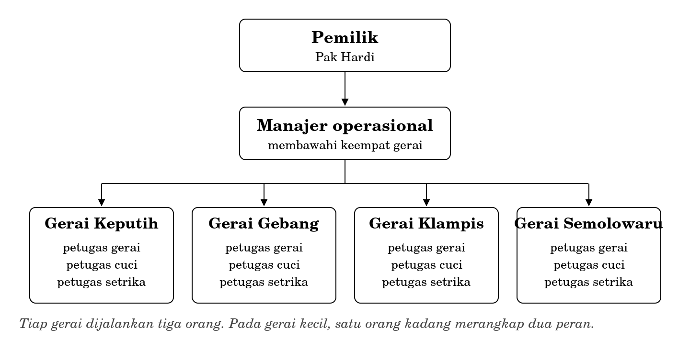
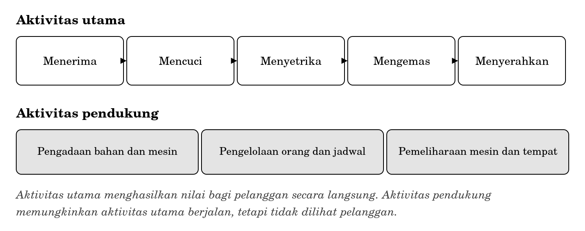
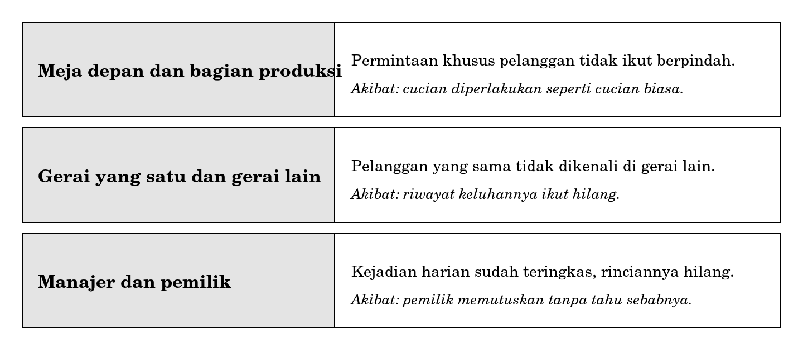

**BAGIAN III ORGANISASI DAN PROSES**

**Bab 6**

**Organisasi, Struktur, dan Rantai Nilai**

**Peta bab**

**Sub-CPMK yang diampu.** Mampu memetakan proses bisnis sederhana dan mengidentifikasi kebutuhan informasi di dalamnya.

Bab ini membuka Bagian III. Ia belum mengajarkan pemetaan proses, sebab pemetaan menuntut pemahaman mengenai tempat proses itu berjalan. Yang dikerjakan di sini adalah menyiapkan tempatnya: apa itu organisasi, mengapa ia dibagi-bagi, dan mengapa pembagian itu membuat informasi mudah hilang.

Setelah membaca bab ini Anda akan mampu:

1.  menjelaskan mengapa organisasi harus dibagi menjadi bagian-bagian;

2.  membaca bagan struktur sebuah organisasi kecil dan menyebutkan siapa bertanggung jawab kepada siapa;

3.  membedakan aktivitas utama dari aktivitas pendukung dalam rantai nilai;

4.  menunjuk perbatasan antarbagian sebagai tempat informasi paling mungkin tersendat;

5.  menjelaskan mengapa struktur menentukan apa yang mudah dan sulit diketahui pimpinan.

**Bab prasyarat.** Bab 1 untuk pengertian sistem dan batas, Bab 2 untuk empat komponen, Bab 5 untuk tingkat manajemen.

**Kata kunci.** Organisasi, struktur, tanggung jawab, rantai nilai, aktivitas utama, aktivitas pendukung, perbatasan, silo.

**Yang akan Anda hasilkan.** Satu bagan struktur dan satu rantai nilai untuk sebuah organisasi kecil, disertai penunjukan satu perbatasan yang paling rawan.

**Gerai kedua**

Pak Hardi membuka usaha laundry pertamanya sepuluh tahun lalu di sebuah ruko kecil di daerah Keputih. Selama dua tahun pertama ia mengerjakan hampir segalanya sendiri. Menerima cucian, menimbang, mencuci, menyetrika, dan menyerahkan kembali. Seorang pegawai membantu pada jam sibuk.

Selama dua tahun itu, ia tidak pernah sekali pun perlu memberi tahu siapa pun apa pun. Kalau seorang pelanggan meminta agar kemeja putihnya tidak dicampur, ia mengingatnya. Kalau ada cucian yang harus selesai lebih cepat, ia tahu tanpa perlu ditulis. Seluruh keterangan yang dibutuhkan usahanya tersimpan di satu kepala.

Pada tahun ketiga ia membuka gerai kedua.

Sejak hari itu, segala sesuatu yang dahulu cukup diingat harus mulai diberitahukan. Permintaan pelanggan yang diterima di gerai satu harus sampai ke orang yang mencuci di tempat yang berbeda. Kalau ia tidak sampai, kemeja putih itu akan dicampur, dan tidak ada seorang pun yang merasa telah berbuat salah.

Di situlah organisasi lahir, dan di situ pula informasi mulai bisa hilang. Keduanya terjadi pada saat yang sama, dan bukan kebetulan.

Bab ini memperkenalkan Laundry Nusa, organisasi yang akan menemani Anda sampai Bab 10. Ia dipilih karena cukup kecil untuk dipahami seluruhnya dalam satu bab, dan cukup rumit untuk memuat hampir semua persoalan yang akan Anda pelajari.

**6.1 Mengapa organisasi harus dibagi**

Sebuah organisasi dibagi karena satu orang tidak dapat mengerjakan segalanya. Pernyataan itu benar tetapi terlalu dangkal. Yang lebih berguna adalah memahami apa yang diperoleh dan apa yang dikorbankan oleh pembagian tersebut.

| **Yang diperoleh**                                    | **Yang dikorbankan**                                                |
|-------------------------------------------------------|---------------------------------------------------------------------|
| Orang menjadi mahir pada pekerjaan yang diulang-ulang | Tidak ada lagi yang melihat keseluruhan                             |
| Pekerjaan dapat berjalan bersamaan, bukan berurutan   | Muncul perbatasan yang harus dilewati keterangan                    |
| Tanggung jawab dapat ditunjuk dengan jelas            | Tanggung jawab atas hal yang tidak ditunjuk menjadi milik siapa pun |

Baris ketiga pada kolom kanan adalah yang paling penting dan paling sering diabaikan. Ketika tanggung jawab dibagi, yang terbagi hanyalah hal-hal yang terpikirkan pada saat pembagian dilakukan. Hal-hal yang tidak terpikirkan menjadi milik semua orang, dan sesuatu yang menjadi milik semua orang pada praktiknya tidak dikerjakan siapa pun.

|                                                                                                                                                                                                                    |
|--------------------------------------------------------------------------------------------------------------------------------------------------------------------------------------------------------------------|
| *Organisasi adalah sekelompok orang yang bekerja menuju hasil yang sama, dengan pembagian tugas yang disepakati, sehingga keterangan harus berpindah dari satu orang ke orang lain agar pekerjaan dapat berjalan.* |

Perhatikan bagian terakhir definisi tersebut. Keharusan memindahkan keterangan bukan akibat sampingan dari organisasi, melainkan ciri pokoknya. Setiap kali Anda melihat sebuah organisasi, Anda sedang melihat sesuatu yang keberlangsungannya bergantung pada perpindahan keterangan.

**6.2 Struktur Laundry Nusa**

Sepuluh tahun setelah gerai pertama, Laundry Nusa memiliki empat gerai. Struktur organisasinya sederhana dan khas untuk usaha sebesar itu.

**Gambar 6.1 Struktur organisasi Laundry Nusa**

Bagan semacam ini menyatakan dua hal dan menyembunyikan banyak hal lain. Yang dinyatakan adalah siapa bertanggung jawab kepada siapa, dan bagaimana orang dikelompokkan. Yang disembunyikan adalah bagaimana pekerjaan sebenarnya mengalir, siapa berbicara dengan siapa setiap hari, dan di mana keputusan sesungguhnya diambil.

Karena itu bagan struktur tidak pernah cukup untuk memahami sebuah organisasi. Ia titik awal, bukan jawaban. Pada Subbab 6.3 Anda akan melihat gambaran kedua yang melengkapinya.

**6.2.1 Tiga hal yang dapat dibaca dari bagan**

1.  **Jarak antara pemilik dan pelaksana.** Di Laundry Nusa hanya ada dua tingkat antara Pak Hardi dan petugas yang memegang cucian. Semakin banyak tingkatnya, semakin banyak penyaringan yang dialami keterangan sebelum sampai ke atas.

2.  **Rentang kendali.** Manajer operasional membawahi empat gerai sekaligus. Angka empat masih dapat dikelola. Kalau kelak menjadi lima belas, manajer itu tidak akan sanggup mengetahui keadaan masing-masing, dan struktur harus berubah sebelum keadaan itu tiba.

3.  **Kelompok yang setara.** Keempat gerai berkedudukan sama dan tidak saling membawahi. Akibatnya, tidak ada jalur resmi bagi keterangan untuk berpindah dari satu gerai ke gerai lain. Keterangan semacam itu harus naik dahulu ke manajer lalu turun kembali, dan pada praktiknya sering tidak berpindah sama sekali.

**6.3 Rantai nilai**

Bagan struktur menunjukkan bagaimana orang dikelompokkan. Rantai nilai menunjukkan bagaimana pekerjaan mengalir. Keduanya perlu dilihat bersama-sama, sebab keduanya hampir tidak pernah sejalan.

|                                                                                                                                                                                                                                                            |
|------------------------------------------------------------------------------------------------------------------------------------------------------------------------------------------------------------------------------------------------------------|
| *Rantai nilai adalah rangkaian aktivitas yang dikerjakan sebuah organisasi untuk menghasilkan sesuatu yang bernilai bagi pelanggannya. Aktivitas utama menghasilkan nilai itu secara langsung. Aktivitas pendukung memungkinkan aktivitas utama berjalan.* |

**Gambar 6.2 Rantai nilai Laundry Nusa**

Gagasan rantai nilai berasal dari kajian strategi bisnis dan akan Anda temui kembali pada Bab 10 ketika membahas keunggulan kompetitif. Untuk sekarang, kegunaannya terletak pada satu hal: ia memaksa Anda melihat pekerjaan sebagai rangkaian, bukan sebagai kumpulan bagian.

Bandingkan Gambar 6.1 dan Gambar 6.2. Bagan struktur membagi Laundry Nusa menurut tempat, yaitu empat gerai. Rantai nilai membaginya menurut tahapan pekerjaan, yaitu menerima sampai menyerahkan. Sehelai cucian melewati seluruh tahapan itu, dan seluruh tahapan itu terjadi di dalam satu gerai.

Pada organisasi sekecil ini, ketidaksesuaian antara keduanya masih ringan. Pada organisasi yang lebih besar, ketidaksesuaian tersebut menjadi sumber persoalan yang serius, sebab satu rangkaian pekerjaan dapat melewati lima bagian yang masing-masing punya atasan berbeda.

**6.3.1 Mengapa aktivitas pendukung sering terlupakan**

Aktivitas pendukung tidak dilihat pelanggan, dan karena itu mudah dianggap kurang penting. Anggapan tersebut menimbulkan dua akibat yang lazim.

Yang pertama, ketika ongkos harus dipotong, aktivitas pendukung dipotong lebih dahulu. Pemeliharaan mesin ditunda, pelatihan petugas baru dilewati. Akibatnya baru terasa beberapa bulan kemudian, dan pada saat itu hubungan sebab akibatnya sudah sulit ditelusuri.

Yang kedua, ketika sistem informasi dibangun, aktivitas pendukung hampir selalu dilupakan. Sistem dibuat untuk mencatat pesanan, bukan untuk mencatat riwayat pemeliharaan mesin, padahal mesin yang rusak menghentikan seluruh aktivitas utama sekaligus.

**6.4 Perbatasan: tempat informasi tersendat**

Sekarang kedua gambaran itu dapat disatukan menjadi satu kesimpulan yang akan Anda pakai sepanjang Bagian III.

|                                                                                                                                       |
|---------------------------------------------------------------------------------------------------------------------------------------|
| *Informasi paling mungkin tersendat pada perbatasan, yaitu tempat pekerjaan berpindah dari satu orang atau satu bagian ke yang lain.* |

Sebabnya dapat diterangkan dengan Bab 2. Di dalam satu bagian, keempat komponen sistem informasi berada di tangan orang yang sama, sehingga keterangan tidak perlu berpindah. Di perbatasan, keterangan harus melewati dua kepala yang berbeda, dan pada saat itulah ia dapat hilang, berubah, atau tertunda.

**Gambar 6.3 Tiga perbatasan yang paling rawan di Laundry Nusa**

Perbatasan kedua pada gambar itu perlu diperhatikan, sebab ia langsung mengikuti dari bagan struktur pada Subbab 6.2.1. Keempat gerai berkedudukan setara dan tidak punya jalur resmi untuk saling memberi tahu. Akibatnya seorang pelanggan yang pindah gerai dianggap pelanggan baru, dan riwayat keluhannya hilang.

Perhatikan bahwa tidak satu pun dari ketiga perbatasan itu dapat diperbaiki dengan bekerja lebih keras. Petugas gerai yang paling rajin sekalipun tidak dapat memberi tahu gerai lain kalau tidak ada jalur untuk melakukannya.

**6.5 Struktur menentukan apa yang mudah diketahui**

Ada satu akibat dari struktur yang jarang disadari dan sangat berguna bagi calon perancang sistem informasi.

Struktur organisasi menentukan pertanyaan mana yang mudah dijawab dan pertanyaan mana yang sulit. Pertanyaan yang jawabannya berada di dalam satu bagian mudah dijawab. Pertanyaan yang jawabannya menuntut menggabungkan keterangan dari beberapa bagian sulit dijawab, dan tingkat kesulitannya sebanding dengan jauhnya jarak antarbagian tersebut di dalam bagan.

| **Pertanyaan**                                      | **Sumber jawabannya**         | **Kemudahan** |
|-----------------------------------------------------|-------------------------------|---------------|
| Berapa pesanan Gerai Keputih hari ini?              | Satu gerai                    | Mudah         |
| Berapa pesanan keempat gerai pekan ini?             | Empat gerai, digabungkan      | Sedang        |
| Apakah pelanggan ini pernah mengeluh di gerai lain? | Antargerai, tanpa jalur resmi | Sangat sulit  |
| Mengapa keluhan di Klampis meningkat?               | Antargerai dan antar tingkat  | Sangat sulit  |

Dua baris terakhir menunjukkan sesuatu yang penting. Kesulitannya bukan kesulitan teknis. Tidak ada perangkat lunak yang mustahil dibuat di sana. Kesulitannya berasal dari struktur, dan pada Bab 10 Anda akan melihat bahwa itulah sebabnya sebagian organisasi mengubah strukturnya ketika memasang sistem informasi baru.

Bagi Anda, kesimpulan praktisnya adalah ini: ketika seseorang meminta jawaban atas pertanyaan yang melintasi banyak bagian, bersiaplah bahwa pekerjaan yang sesungguhnya bukan membuat perangkat lunak, melainkan mempertemukan orang-orang yang selama ini tidak pernah bertemu.

**6.6 Yang tidak dibahas di sini**

Bab ini bukan pengantar teori organisasi, dan pembatasannya perlu dinyatakan agar Anda tidak salah menduga apa yang sudah Anda kuasai.

- Bentuk-bentuk struktur organisasi selain yang paling sederhana, misalnya struktur matriks dan struktur berdasarkan produk, tidak dibahas. Yang dilatih di sini hanya membaca bagan, bukan merancangnya.

- Pengelolaan orang, penilaian kinerja, dan hubungan kerja adalah bidang tersendiri yang tidak disentuh sama sekali.

- Kewirausahaan dan penyusunan ide usaha menjadi lingkup mata kuliah Bisnis Berbasis Teknologi.

- Analisis strategi bersaing secara mendalam berada di luar cakupan mata kuliah ini. Rantai nilai dipakai di sini semata-mata sebagai alat untuk melihat aliran pekerjaan.

<table>
<colgroup>
<col style="width: 100%" />
</colgroup>
<tbody>
<tr class="odd">
<td>
<strong>Di balik layar: sehari di Gerai Keputih</strong>

Gerai Keputih dijalankan tiga orang, dan ketiganya akan Anda temui lagi pada Bab 7.

Sdri. R menjaga meja depan. Ia menerima cucian, menimbang, menulis nota, menerima pembayaran, dan menyerahkan cucian yang sudah selesai. Ia pula yang menerima keluhan, meskipun tidak ada tempat untuk menuliskannya.

Mas T mengerjakan pencucian. Ia bekerja di ruang belakang dan hampir tidak pernah bertemu pelanggan. Yang sampai kepadanya hanyalah keranjang cucian beserta potongan nota, dan apa pun yang tidak tertulis pada nota itu tidak sampai kepadanya.

Mbak S mengerjakan penyetrikaan, pelipatan, dan pengemasan. Ia datang siang dan pulang malam, sehingga jarang bertemu Sdri. R yang masuk pagi. Bila ada yang perlu disampaikan di antara keduanya, jalurnya adalah secarik kertas yang ditempel di lemari.

Perhatikan pola yang terbentuk. Keterangan mengalir lancar di dalam pekerjaan masing-masing dan tersendat di antara mereka. Secarik kertas di lemari adalah satu-satunya jalur antara meja depan dan penyetrikaan, dan jalur itu tidak menyimpan apa pun setelah kertasnya dilepas.
</td>
</tr>
</tbody>
</table>

<table>
<colgroup>
<col style="width: 100%" />
</colgroup>
<tbody>
<tr class="odd">
<td>
<strong>Salah kaprah</strong>

<strong>“Bagan struktur menggambarkan bagaimana organisasi bekerja.”</strong> Bagan struktur menggambarkan siapa bertanggung jawab kepada siapa. Bagaimana pekerjaan mengalir adalah gambaran lain, dan keduanya hampir tidak pernah sejalan.

<strong>“Masalah di perbatasan terjadi karena orangnya kurang rajin.”</strong> Perbatasan yang tidak punya jalur tidak dapat diseberangi seberapa pun rajinnya seseorang. Menyalahkan orang untuk masalah struktur adalah cara yang murah untuk tidak memperbaiki apa pun.

<strong>“Aktivitas pendukung kurang penting karena tidak dilihat pelanggan.”</strong> Mesin yang rusak menghentikan seluruh aktivitas utama sekaligus. Yang tidak dilihat pelanggan bukan berarti tidak menentukan.
</td>
</tr>
</tbody>
</table>

**Studi kasus terpandu: sebuah kepanitiaan mahasiswa**

Bagian ini memakai organisasi yang hampir pasti pernah Anda masuki, yaitu kepanitiaan sebuah kegiatan kampus.

**Narasi**

Sebuah himpunan mahasiswa menyelenggarakan seminar sehari. Panitianya berjumlah dua puluh dua orang, terbagi menjadi ketua, sekretaris, bendahara, dan empat seksi: acara, perlengkapan, konsumsi, dan hubungan masyarakat.

Peserta mendaftar melalui tautan yang disebarkan seksi hubungan masyarakat. Pembayaran dikirim ke rekening bendahara. Konsumsi dipesan berdasarkan jumlah peserta. Sertifikat disiapkan sekretaris berdasarkan daftar hadir yang dikumpulkan seksi acara pada hari pelaksanaan.

**Langkah 1 Bagan struktur**

Strukturnya dapat digambar dalam beberapa menit: ketua di atas, sekretaris dan bendahara sejajar di bawahnya, dan empat seksi berkedudukan setara di bawah ketua. Gambarlah sendiri sebelum melanjutkan.

Perhatikan bahwa keempat seksi setara dan tidak saling membawahi, persis seperti keempat gerai Laundry Nusa. Ini sudah cukup untuk menduga di mana persoalan akan muncul.

**Langkah 2 Rantai nilai**

Aktivitas utama, yaitu yang langsung menghasilkan nilai bagi peserta: mengumumkan, menerima pendaftaran, menerima pembayaran, menyelenggarakan acara, dan menerbitkan sertifikat.

Aktivitas pendukung: pengadaan perlengkapan, pengelolaan keuangan, dan pengelolaan orang.

Perhatikan bahwa aktivitas utama melewati tiga seksi yang berbeda ditambah sekretaris dan bendahara. Tidak ada satu pun seksi yang mengerjakan rangkaian itu dari ujung ke ujung.

**Langkah 3 Menunjuk perbatasan yang rawan**

| **Perbatasan**         | **Yang harus berpindah**   | **Yang mungkin terjadi**                              |
|------------------------|----------------------------|-------------------------------------------------------|
| Humas dan bendahara    | Siapa yang sudah mendaftar | Ada yang membayar tanpa terdaftar, atau sebaliknya    |
| Bendahara dan konsumsi | Jumlah peserta yang pasti  | Konsumsi dipesan berdasarkan angka yang sudah berubah |
| Acara dan sekretaris   | Daftar hadir sebenarnya    | Sertifikat terbit untuk orang yang tidak hadir        |

Ketiga perbatasan itu mempunyai pola yang sama: sebuah angka atau daftar harus berpindah dari satu seksi ke seksi lain pada waktu tertentu, dan tidak ada seorang pun yang bertanggung jawab memastikan perpindahan itu terjadi.

**Langkah 4 Menunjuk yang paling rawan**

Dari ketiganya, perbatasan kedua paling rawan, dan alasannya bukan karena paling sering keliru melainkan karena akibatnya paling sulit diperbaiki. Kekeliruan pada perbatasan pertama masih dapat dibetulkan sampai hari pelaksanaan. Kekeliruan pada perbatasan ketiga dapat diperbaiki dengan menerbitkan ulang sertifikat. Kekeliruan pada perbatasan kedua terwujud sebagai makanan yang sudah telanjur dipesan, dan makanan tidak dapat ditarik kembali.

Menunjuk yang paling rawan karena itu tidak sama dengan menunjuk yang paling sering. Ukurannya adalah seberapa sulit kekeliruannya diperbaiki setelah terjadi.

**Kritik atas hasil sendiri**

1.  Analisis ini disusun dari luar, berdasarkan gambaran umum kepanitiaan. Panitia yang sebenarnya mungkin sudah punya kebiasaan yang menutup salah satu perbatasan tersebut, misalnya rapat harian menjelang hari pelaksanaan. Kebiasaan semacam itu tidak tampak pada bagan mana pun, dan hanya dapat ditemukan dengan bertanya.

2.  Ketiga perbatasan yang disebut adalah perbatasan antarseksi. Ada pula perbatasan yang tidak terlihat pada bagan, yaitu antara panitia dan peserta. Peserta yang salah mengisi nama pada formulir pendaftaran menimbulkan persoalan yang sama besarnya, dan tidak satu pun seksi merasa bertanggung jawab atasnya.

**Rangkuman**

- Organisasi lahir pada saat keterangan mulai harus diberitahukan, bukan cukup diingat.

- Pembagian tugas menghasilkan kemahiran dan kejelasan tanggung jawab, dan mengorbankan pandangan menyeluruh.

- Hal yang tidak terpikirkan pada saat pembagian menjadi milik semua orang, dan pada praktiknya tidak dikerjakan siapa pun.

- Bagan struktur menyatakan siapa bertanggung jawab kepada siapa. Ia tidak menyatakan bagaimana pekerjaan mengalir.

- Rantai nilai membedakan aktivitas utama dari aktivitas pendukung. Aktivitas pendukung sering dipotong lebih dahulu dan sering dilupakan ketika sistem dibangun.

- Informasi paling mungkin tersendat pada perbatasan, yaitu tempat pekerjaan berpindah tangan.

- Perbatasan yang tidak punya jalur tidak dapat diseberangi seberapa pun rajinnya seseorang.

- Struktur menentukan pertanyaan mana yang mudah dijawab dan mana yang sulit, dan kesulitannya bukan kesulitan teknis.

- Perbatasan yang paling rawan bukan yang paling sering keliru, melainkan yang kekeliruannya paling sulit diperbaiki.

**Latihan**

Setiap soal ditandai dengan Sub-CPMK yang diukurnya.

**Tingkat A Memastikan Anda ingat**

1.  Jelaskan apa yang diperoleh dan apa yang dikorbankan ketika sebuah organisasi membagi tugasnya. \[Sub-CPMK-3\]

2.  Apa yang dinyatakan dan apa yang disembunyikan oleh sebuah bagan struktur? \[Sub-CPMK-3\]

3.  Bedakan aktivitas utama dari aktivitas pendukung, masing-masing dengan dua contoh dari Laundry Nusa. \[Sub-CPMK-3\]

4.  Mengapa informasi paling mungkin tersendat pada perbatasan? Kaitkan dengan empat komponen pada Bab 2. \[Sub-CPMK-3\]

5.  Mengapa pertanyaan yang melintasi banyak bagian sulit dijawab, padahal tidak ada kesulitan teknis di dalamnya? \[Sub-CPMK-3\]

**Tingkat B Menerapkan**

1.  Gambarlah bagan struktur dan rantai nilai untuk sebuah organisasi kecil yang Anda kenal, misalnya kantin, fotokopi, atau unit kegiatan mahasiswa. Keduanya cukup satu halaman. \[Sub-CPMK-3\]

2.  Dari kedua gambar pada soal nomor 1, tunjuk sekurang-kurangnya dua perbatasan dan tuliskan apa yang harus berpindah pada masing-masing. \[Sub-CPMK-3\]

3.  Perhatikan Tabel pada Subbab 6.5. Susun tabel serupa untuk organisasi pada soal nomor 1, memuat empat pertanyaan dengan tingkat kesulitan yang berbeda-beda. \[Sub-CPMK-3\]

**Tingkat C Menganalisis dan menilai**

1.  Untuk organisasi pada latihan tingkat B, tunjuk satu perbatasan yang paling rawan dan pertahankan penunjukan Anda. Ukurannya bukan seberapa sering kekeliruan terjadi, melainkan seberapa sulit kekeliruan itu diperbaiki setelah terjadi. Sertakan satu usulan penutup perbatasan tersebut yang tidak menuntut perangkat lunak apa pun. \[Sub-CPMK-3\]

2.  Seorang ketua panitia menyatakan bahwa masalah pada kepanitiaannya berasal dari anggota yang kurang berkomitmen. Nilailah pernyataan itu dengan memakai gagasan perbatasan pada bab ini. Susun tanggapan tertulis yang menunjukkan bagian mana dari masalah tersebut yang benar-benar berasal dari orang dan bagian mana yang berasal dari struktur, tanpa membela salah satu pihak. \[Sub-CPMK-3\]

**Rujukan bab**

1.  Porter, M. E. dan Millar, V. E. (1985). “How Information Gives You a Competitive Advantage.” Harvard Business Review. Sumber gagasan rantai nilai sebagaimana dipakai dalam kepustakaan sistem informasi.

2.  Laudon, K. C. dan Laudon, J. P. Management Information Systems: Managing the Digital Firm. Pearson, edisi terbaru. Bagian mengenai organisasi dan sistem informasi.

3.  Dumas, M., La Rosa, M., Mendling, J. dan Reijers, H. A. (2018). Fundamentals of Business Process Management. Edisi ke-2. Berlin: Springer. Bab pembuka mengenai organisasi sebagai rangkaian proses.

**Lampiran bab: daftar gambar**

Halaman ini tidak dicetak dalam buku. Ketiga gambar sudah jadi dan tersedia dalam bentuk vektor.

| **No.** | **Judul**                                         | **Tinggi cetak** | **Status** |
|---------|---------------------------------------------------|------------------|------------|
| 6.1     | Struktur organisasi Laundry Nusa                  | 2,4 inci         | Selesai    |
| 6.2     | Rantai nilai Laundry Nusa                         | 1,9 inci         | Selesai    |
| 6.3     | Tiga perbatasan yang paling rawan di Laundry Nusa | 2,1 inci         | Selesai    |
