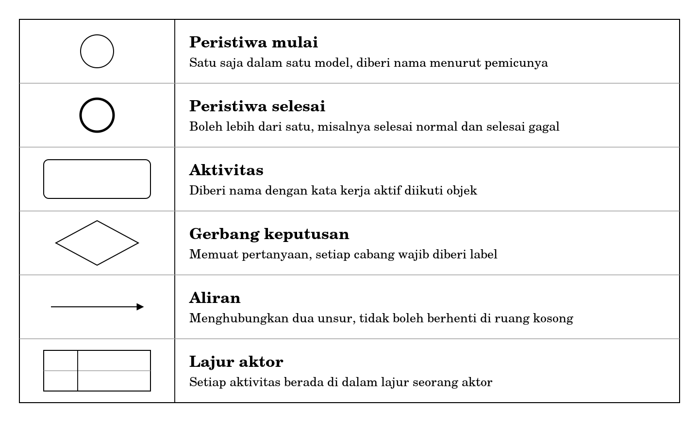
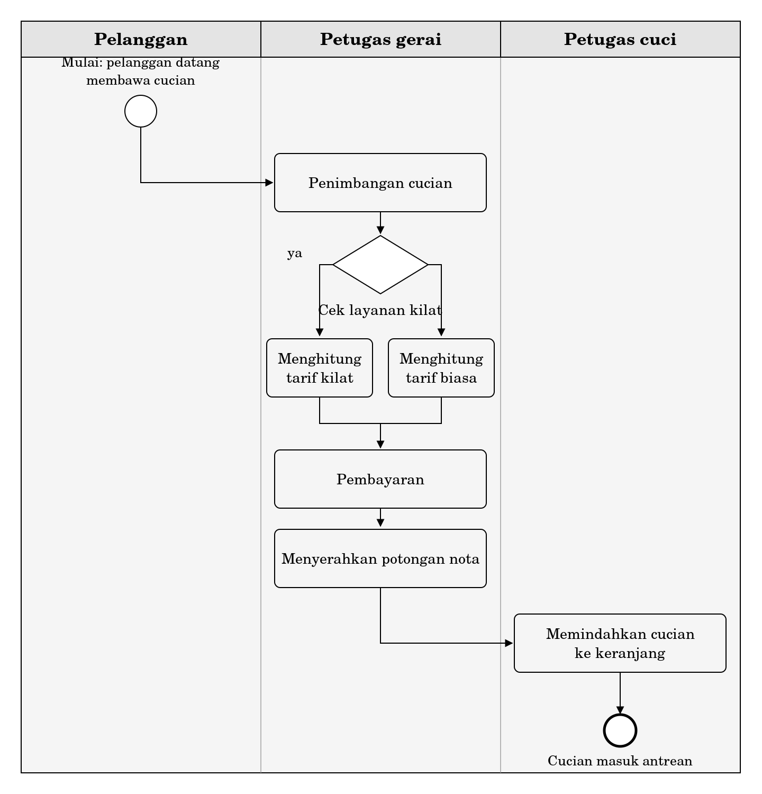
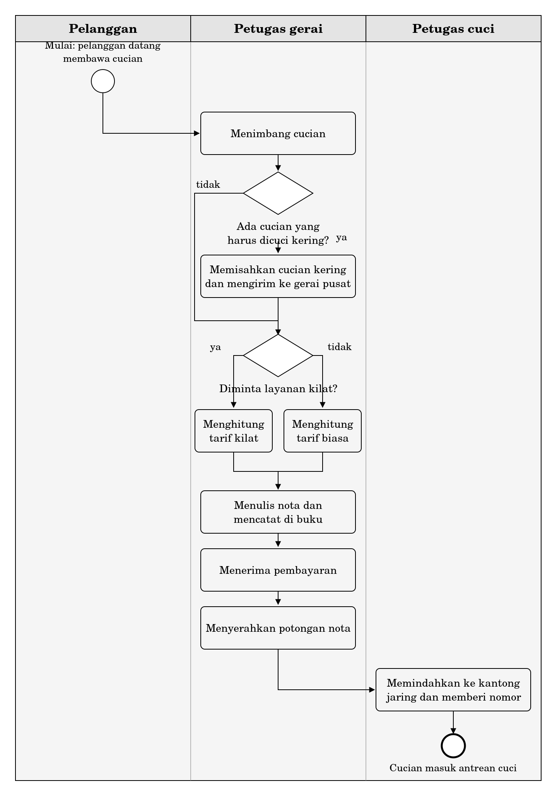
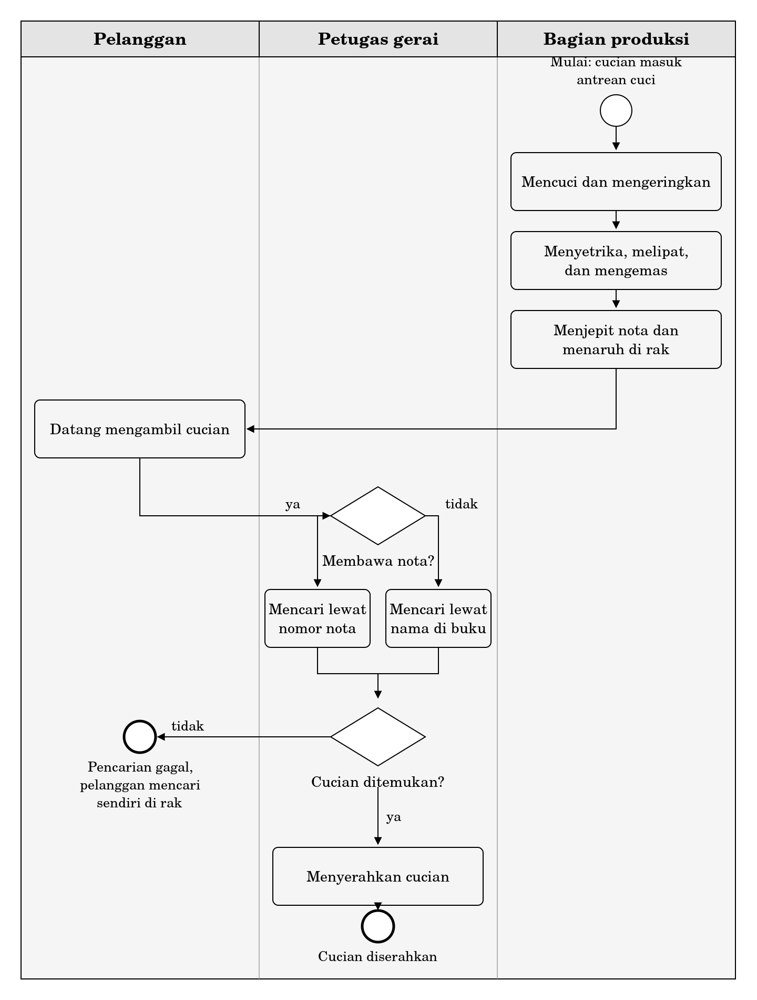
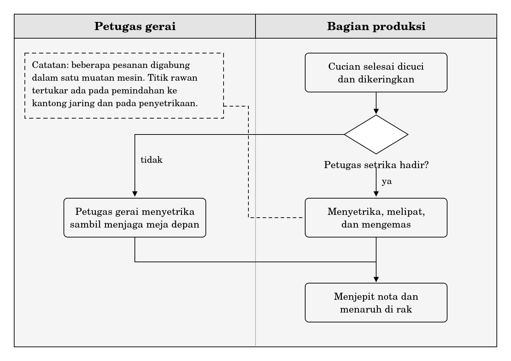

**BAGIAN III ORGANISASI DAN PROSES**

**Bab 7**

**Proses Bisnis dan Pemodelan Alur Kerja**

**Peta bab**

**Sub-CPMK yang diampu.** Mampu memetakan proses bisnis sederhana dan mengidentifikasi kebutuhan informasi di dalamnya.

Bab ini mengampu bagian pertama dari Sub-CPMK tersebut, yaitu pemetaan proses. Bagian kedua, penurunan kebutuhan informasi, dikerjakan pada Bab 8 dengan memakai model yang Anda hasilkan di sini.

Setelah membaca bab ini Anda akan mampu:

1.  menjelaskan apa yang membedakan proses bisnis dari fungsi dan dari prosedur;

2.  membaca sebuah model proses dan menelusuri jalannya satu kasus nyata di dalam model itu;

3.  menyusun model proses dari sebuah narasi dengan memakai lima elemen notasi;

4.  menetapkan tingkat kerincian model dan mempertahankan pilihan tersebut;

5.  mengenali enam kesalahan pemodelan yang lazim terjadi pada karya pemula.

**Bab prasyarat.** Bab 1 untuk pengertian sistem, Bab 2 untuk empat komponen sistem informasi, Bab 6 untuk struktur organisasi dan rantai nilai.

**Kata kunci.** Proses bisnis, aktor, aktivitas, gerbang keputusan, lajur, tingkat kerincian, uji telusur.

**Yang akan Anda hasilkan.** Satu model proses lengkap dengan lajur aktor, disertai catatan tertulis mengenai bagian mana dari kenyataan yang Anda sederhanakan dan atas dasar apa.

**Sehelai kaos yang tidak kembali**

Anda menyerahkan cucian ke gerai laundry pada Senin sore. Delapan potong: empat kaos, dua celana, dua handuk. Petugas menaruhnya di atas timbangan, menulis angka pada secarik nota, menyobek separuhnya, dan menyerahkan potongan itu kepada Anda.

Rabu siang Anda datang mengambil. Cucian sudah rapi terlipat di dalam kantong plastik. Sampai di kos Anda menghitung ulang. Tujuh potong. Satu kaos hitam tidak ada.

Anda kembali ke gerai. Petugas yang berjaga bukan petugas yang menerima cucian Anda dua hari lalu. Ia membuka buku, mencari nomor nota, dan menemukan satu baris catatan: tanggal, nama, berat 2,4 kilogram, lunas. Tidak ada keterangan berapa potong. Tidak ada keterangan apa saja isinya. Petugas itu berkata, dengan nada sopan yang sama sekali tidak membantu, bahwa seluruh cucian Anda sudah diserahkan.

Pertanyaan yang menarik di sini bukan siapa yang bersalah. Pertanyaan yang menarik adalah di titik mana kaos itu bisa hilang.

Untuk menjawabnya Anda perlu tahu apa yang terjadi antara saat kaos itu lepas dari tangan Anda dan saat kantong plastik itu kembali. Anda tidak pernah melihatnya. Yang Anda lihat hanya dua ujung, penyerahan dan pengambilan. Di antara keduanya ada belasan aktivitas, beberapa orang, sejumlah keputusan, dan sekurang-kurangnya tiga kesempatan bagi sehelai kaos untuk tersesat.

Rangkaian aktivitas itulah yang disebut proses bisnis. Bab ini mengajarkan cara melihatnya, cara menggambarnya, dan cara memeriksa apakah gambar Anda benar.

Satu peringatan sebelum mulai. Godaan terbesar mahasiswa Teknik Informatika ketika berhadapan dengan cerita seperti ini adalah melompat ke solusi: buat aplikasi, catat per potong, tempel kode QR. Tahan dulu. Anda belum tahu prosesnya. Merancang sistem untuk proses yang belum Anda pahami adalah cara paling mahal untuk menghasilkan sesuatu yang tidak dipakai orang.

**7.1 Apa yang disebut proses bisnis**

|                                                                                                                                                                                                             |
|-------------------------------------------------------------------------------------------------------------------------------------------------------------------------------------------------------------|
| *Proses bisnis adalah rangkaian aktivitas yang saling berkaitan, dikerjakan oleh satu atau lebih pelaku, yang diawali oleh sebuah pemicu dan diakhiri oleh sebuah hasil yang bernilai bagi pihak tertentu.* |

Definisi ini memuat empat syarat, dan keempatnya harus dipenuhi sekaligus.

1.  Ada rangkaian, bukan aktivitas tunggal. Menimbang cucian bukan proses bisnis. Menerima, mencuci, dan mengembalikan cucian adalah proses bisnis.

2.  Ada pelaku yang dapat disebut namanya atau jabatannya. Kalau Anda tidak dapat menyebut siapa yang mengerjakan sebuah aktivitas, Anda belum memahami proses itu.

3.  Ada pemicu yang jelas. Proses tidak berjalan sendiri. Selalu ada sesuatu yang memulainya, entah kedatangan pelanggan, jatuhnya tanggal, atau selesainya proses lain.

4.  Ada hasil yang bernilai bagi seseorang. Kalau tidak ada pihak yang peduli pada hasilnya, yang Anda lihat bukan proses bisnis melainkan kebiasaan.

| **Contoh**                                    | **Proses bisnis?** | **Alasan**                                                                           |
|-----------------------------------------------|--------------------|--------------------------------------------------------------------------------------|
| Menerima cucian sampai menyerahkannya kembali | Ya                 | Berangkai, ada pelaku, dipicu kedatangan pelanggan, hasilnya bernilai bagi pelanggan |
| Menimbang cucian                              | Bukan              | Aktivitas tunggal, bagian dari proses yang lebih besar                               |
| Menyusun laporan pendapatan bulanan           | Ya                 | Dipicu jatuhnya akhir bulan, hasilnya dipakai pemilik untuk mengambil keputusan      |
| Mesin cuci berputar selama empat puluh menit  | Bukan              | Peristiwa teknis tanpa pelaku yang mengambil keputusan                               |

**7.1.1 Proses menyilang, struktur membagi**

Pada Bab 6 Anda melihat bahwa organisasi disusun menurut fungsi. Di Laundry Nusa ada bagian penerimaan, bagian cuci, bagian setrika, dan bagian antar. Masing-masing punya penanggung jawab, punya ruang kerja sendiri, dan dinilai atas pekerjaannya sendiri.

Proses tidak mengikuti pembagian itu. Sehelai kaos melewati keempat bagian tersebut secara berurutan. Tidak ada satu pun bagian yang bertanggung jawab atas keseluruhan perjalanan kaos itu dari meja depan sampai kembali ke tangan pelanggan.

Di sinilah masalah lahir, dan lahirnya selalu di perbatasan. Bagian cuci merasa pekerjaannya selesai ketika cucian sudah kering. Bagian setrika merasa pekerjaannya mulai ketika cucian sudah ada di mejanya. Kalau ada potongan yang hilang di antara keduanya, tidak ada yang merasa itu urusannya. Kekosongan tanggung jawab di perbatasan antar bagian inilah yang membuat pemodelan proses bernilai: model memaksa perbatasan itu digambar.

**7.1.2 Proses bukan prosedur**

Kedua kata ini sering dipertukarkan, padahal cakupannya berbeda. Prosedur adalah petunjuk kerja untuk satu aktivitas, misalnya cara mengoperasikan mesin cuci berkapasitas delapan kilogram. Proses adalah rangkaian aktivitasnya, dari pelanggan datang sampai pelanggan pulang membawa cuciannya.

Satu proses biasanya memuat beberapa prosedur. Menulis prosedur tanpa memahami prosesnya menghasilkan petunjuk kerja yang rapi untuk pekerjaan yang tidak perlu dikerjakan.

**7.1.3 Mengapa proses harus digambar**

Menggambar terasa merepotkan bagi orang yang sudah menjalankan prosesnya bertahun-tahun. Ada tiga alasan mengapa langkah ini tetap perlu.

**Untuk memperoleh kesepakatan.** Kalau Anda meminta pemilik, manajer, dan petugas gerai menceritakan proses yang sama, Anda akan mendapat tiga cerita yang berbeda. Bukan karena ada yang berbohong, melainkan karena masing-masing hanya melihat bagiannya. Gambar memaksa ketiganya berhadapan dengan satu versi.

**Untuk memperoleh keterlacakan.** Tanpa gambar, keluhan pelanggan hanya bisa dijawab dengan dugaan. Dengan gambar, Anda dapat menunjuk aktivitas tertentu dan bertanya apa yang terjadi di situ.

**Untuk menjadi dasar penurunan kebutuhan informasi.** Ini yang paling penting bagi mata kuliah ini. Pada Bab 8 Anda akan menurunkan kebutuhan informasi dari model yang dibuat di bab ini. Model yang buruk menghasilkan daftar kebutuhan yang buruk, dan daftar kebutuhan yang buruk menghasilkan sistem yang tidak terpakai.

**7.2 Enam unsur yang harus ada dalam model**

Sebuah model proses yang lengkap menjawab enam pertanyaan. Kalau salah satu pertanyaan tidak terjawab oleh gambar Anda, gambar itu belum selesai.

| **Unsur**         | **Pertanyaan yang dijawab**   | **Contoh di Laundry Nusa**                       |
|-------------------|-------------------------------|--------------------------------------------------|
| Peristiwa mulai   | Apa yang memicu proses ini?   | Pelanggan datang membawa cucian                  |
| Aktivitas         | Pekerjaan apa yang dilakukan? | Menimbang cucian                                 |
| Aktor             | Siapa yang mengerjakannya?    | Petugas gerai                                    |
| Gerbang keputusan | Pilihan apa yang muncul?      | Apakah pelanggan meminta layanan kilat?          |
| Aliran            | Apa urutannya?                | Menimbang lalu mencatat lalu menerima pembayaran |
| Peristiwa selesai | Kapan proses ini berhenti?    | Cucian diserahkan kepada pelanggan               |

Ada unsur ketujuh yang tidak digambar sebagai lambang tersendiri dalam notasi sederhana kita, tetapi harus Anda catat di samping model, yaitu objek yang mengalir. Di Laundry Nusa objek yang mengalir adalah cucian itu sendiri, nota, dan baris catatan di buku. Objek inilah yang akan menjadi bahan utama Bab 8.

**7.3 Notasi: lima elemen dan tidak lebih**

Notasi pemodelan proses yang dipakai di industri, yaitu BPMN, memuat lebih dari seratus lambang. Buku ini memakai lima.

Pembatasan ini bukan penyederhanaan demi kemudahan semata. Notasi yang lengkap memindahkan perhatian dari proses ke lambang. Mahasiswa yang sibuk memilih antara dua jenis peristiwa pesan berhenti memikirkan apakah modelnya menggambarkan kenyataan. Lima elemen sudah cukup untuk hampir semua proses pada organisasi kecil, dan kalau kelak Anda memerlukan notasi penuh, dasarnya sudah terpasang.

**Gambar 7.1 Lima elemen notasi yang dipakai dalam buku ini**

| **Lambang**          | **Nama**          | **Aturan pemakaian**                                                          |
|----------------------|-------------------|-------------------------------------------------------------------------------|
| Lingkaran tipis      | Peristiwa mulai   | Satu saja dalam satu model. Diberi nama menurut pemicunya.                    |
| Lingkaran tebal      | Peristiwa selesai | Boleh lebih dari satu, misalnya selesai normal dan selesai karena dibatalkan. |
| Persegi sudut tumpul | Aktivitas         | Diberi nama dengan kata kerja aktif diikuti objek.                            |
| Belah ketupat        | Gerbang keputusan | Memuat pertanyaan yang jawabannya saling meniadakan.                          |
| Panah                | Aliran            | Menghubungkan dua unsur. Cabang dari gerbang wajib diberi label.              |
| Lajur                | Aktor             | Setiap aktivitas berada di dalam lajur seorang aktor.                         |

**7.3.1 Tujuh aturan menggambar**

1.  Satu peristiwa mulai dalam satu model. Kalau ada dua pemicu yang benar-benar berbeda, yang Anda hadapi adalah dua proses, bukan satu.

2.  Sekurang-kurangnya satu peristiwa selesai. Boleh lebih, dan justru sering perlu lebih.

3.  Nama aktivitas memakai kata kerja aktif diikuti objek. Tulis “menimbang cucian”, bukan “penimbangan” dan bukan “timbangan”.

4.  Gerbang keputusan memuat pertanyaan, bukan pernyataan. Tulis “Berat lebih dari lima kilogram?”, bukan “cek berat”.

5.  Setiap cabang yang keluar dari gerbang wajib berlabel, sekurang-kurangnya “ya” dan “tidak”.

6.  Tidak boleh ada aliran yang berhenti di tengah tanpa peristiwa selesai. Aliran yang menggantung berarti ada bagian proses yang belum Anda tanyakan.

7.  Setiap aktivitas berada di dalam lajur seorang aktor.

Aturan ketujuh paling sering dilanggar dan paling besar akibatnya. Aktivitas yang melayang tanpa lajur biasanya menandakan salah satu dari dua hal: Anda belum menanyakan siapa yang mengerjakannya, atau memang tidak ada yang merasa mengerjakannya. Kemungkinan kedua jauh lebih menarik. Aktivitas tanpa pemilik adalah tempat pekerjaan menghilang, dan biasanya di situlah keluhan pelanggan bermula.

**7.4 Membacalah dahulu, menggambar kemudian**

Orang belajar menulis setelah belajar membaca. Pemodelan proses tidak berbeda. Sebelum Anda menggambar model sendiri, latihlah membaca model buatan orang lain dan menguji apakah model itu sanggup menampung kenyataan.

Gambar 7.2 memperlihatkan model penerimaan cucian di Gerai Keputih, salah satu gerai Laundry Nusa. Model ini dibuat berdasarkan pengamatan selama dua hari.

**Gambar 7.2 Proses penerimaan cucian di Gerai Keputih, versi awal**

Model ini disalin apa adanya dari tangan pertama, termasuk kekurangannya. Sekurang-kurangnya dua di antara tujuh aturan pada Subbab 7.3.1 dilanggar di dalamnya. Anda akan diminta menemukannya pada latihan tingkat B, jadi tahan dahulu keinginan untuk memperbaikinya sekarang.

**7.4.1 Uji telusur**

Uji telusur adalah cara paling murah untuk memeriksa sebuah model. Caranya sederhana: ambil satu kasus nyata, jalankan di atas model, dan lihat apakah model itu sanggup menampungnya dari awal sampai akhir tanpa Anda perlu berimprovisasi.

Jalankan tiga kasus berikut di atas Gambar 7.2.

| **Kasus**                                                             | **Hasil telusur**                                                                                                                                                               |
|-----------------------------------------------------------------------|---------------------------------------------------------------------------------------------------------------------------------------------------------------------------------|
| Pelanggan menyerahkan 2,4 kilogram cucian biasa, membayar tunai       | Lancar. Model menampung seluruh langkah.                                                                                                                                        |
| Pelanggan membawa satu jas yang harus dicuci kering, bukan dicuci air | Tersendat. Model tidak punya cabang untuk jenis cucian yang berbeda. Petugas dalam kenyataan memisahkan jas dan menuliskannya di nota, tetapi kegiatan itu tidak ada di gambar. |
| Pelanggan datang mengambil tanpa membawa potongan nota                | Gagal total. Proses pengambilan memang belum termasuk dalam batas model ini.                                                                                                    |

Ketiga hasil itu memberi pelajaran yang berbeda. Kasus pertama tidak mengajarkan apa pun, karena model memang dibuat dari kasus semacam itu. Kasus kedua menemukan lubang: ada kenyataan yang tidak tergambar. Kasus ketiga menemukan sesuatu yang lain, yaitu bahwa batas model memang tidak mencakup pengambilan.

Perbedaan antara kedua temuan terakhir penting. Lubang harus ditambal. Batas tidak perlu ditambal, tetapi harus dinyatakan. Model yang tidak menyatakan batasnya akan dibaca orang lain sebagai gambaran seluruh proses, dan itu menyesatkan.

|                                                                                                                       |
|-----------------------------------------------------------------------------------------------------------------------|
| *Model yang tidak sanggup menjalankan kasus nyata bukan model yang salah gambar, melainkan model yang belum selesai.* |

**7.5 Dari narasi ke model dalam enam langkah**

Bagian ini memberi urutan kerja yang dapat Anda pakai berulang kali. Urutannya tidak kaku, tetapi melewatkan langkah pertama hampir selalu berakhir dengan model yang harus dibongkar.

**Langkah 1 Tetapkan batas proses**

Tentukan peristiwa apa yang memulai dan peristiwa apa yang mengakhiri. Tulis keduanya sebagai kalimat sebelum Anda menggambar apa pun.

Batas yang terlalu lebar membuat model tidak pernah selesai. Batas yang terlalu sempit membuat model tidak menjawab pertanyaan yang mendorong Anda membuatnya. Ukuran yang berguna: batas harus cukup lebar untuk memuat masalah yang sedang Anda selidiki. Kalau Anda menyelidiki kaos yang hilang, batas harus mencakup penyerahan sampai pengambilan, karena kaos bisa hilang di mana saja di antara keduanya.

**Langkah 2 Daftar aktor**

Tulis siapa saja yang menyentuh proses ini. Sertakan pihak luar seperti pelanggan dan pemasok. Aktor boleh berupa jabatan, bagian, atau sistem, tetapi jangan berupa nama orang, karena orang berganti sedangkan peran bertahan.

Kalau daftar aktor Anda lebih dari lima untuk sebuah organisasi kecil, kemungkinan besar batas proses Anda terlalu lebar.

**Langkah 3 Daftar aktivitas**

Tulis semua pekerjaan yang terjadi, satu baris satu pekerjaan, dengan kata kerja aktif. Belum perlu diurutkan. Pada tahap ini kelengkapan lebih penting daripada kerapian.

Cara termurah memperoleh daftar ini adalah bertanya kepada pelakunya dengan pertanyaan “selesai itu apa” yang diulang terus sampai pelaku menjawab bahwa pekerjaannya sudah selesai.

**Langkah 4 Urutkan**

Susun aktivitas menurut urutan waktu. Di sinilah Anda akan menemukan bahwa beberapa aktivitas ternyata tidak selalu berurutan, atau bahwa ada aktivitas yang muncul hanya kadang-kadang. Catat keduanya, karena itu bahan untuk langkah berikutnya.

**Langkah 5 Temukan titik keputusan**

Setiap aktivitas yang muncul hanya kadang-kadang menandakan adanya keputusan sebelum aktivitas itu. Rumuskan keputusan tersebut sebagai pertanyaan tertutup, lalu tentukan cabang-cabangnya.

Perhatikan keputusan yang diambil tanpa disadari. Petugas gerai yang memisahkan jas dari tumpukan cucian sedang mengambil keputusan, meskipun ia tidak merasa sedang memutuskan apa-apa. Keputusan semacam ini adalah yang paling sering tertinggal dari model, dan paling sering menjadi sumber kesalahan ketika prosesnya kelak diserahkan kepada orang baru.

**Langkah 6 Gambar dan uji telusur**

Baru pada langkah ini Anda menggambar. Setelah gambar selesai, jalankan sekurang-kurangnya tiga kasus di atasnya: satu kasus biasa, satu kasus yang jarang terjadi, dan satu kasus yang gagal. Kasus ketiga yang paling banyak mengajar.

**7.6 Sampai seberapa rinci**

Pertanyaan ini tidak punya jawaban tunggal, tetapi punya aturan praktis yang cukup dapat diandalkan.

|                                                                                                                 |
|-----------------------------------------------------------------------------------------------------------------|
| *Berhentilah memecah aktivitas ketika pemecahan berikutnya tidak lagi mengubah keputusan yang akan Anda ambil.* |

Perhatikan tiga tingkat kerincian untuk pekerjaan yang sama di bawah ini.

| **Tingkat**   | **Rumusan**                                                            | **Penilaian**                                                                        |
|---------------|------------------------------------------------------------------------|--------------------------------------------------------------------------------------|
| Terlalu kasar | Memproses cucian                                                       | Menyembunyikan seluruh titik rawan. Tidak ada yang bisa diperbaiki dari rumusan ini. |
| Memadai       | Memisahkan warna; mencuci; mengeringkan                                | Cukup untuk menunjuk di aktivitas mana potongan bisa tertukar.                       |
| Terlalu rinci | Menuang deterjen 40 mililiter; menekan tombol mulai; menunggu 42 menit | Menambah panjang model tanpa menambah kemampuan Anda mengambil keputusan.            |

Ada ukuran kedua yang lebih kasar tetapi berguna sebagai rambu: satu model proses sebaiknya muat dalam satu halaman dan memuat antara delapan sampai dua puluh aktivitas. Kalau model Anda melebihi itu, kemungkinan besar batasnya terlalu lebar atau kerinciannya terlalu dalam. Pecah menjadi dua model dan hubungkan keduanya.

Perlu ditegaskan bahwa tingkat kerincian bukan soal benar atau salah, melainkan soal tujuan. Model yang dipakai untuk melatih pegawai baru perlu lebih rinci daripada model yang dipakai pemilik untuk memutuskan apakah perlu membeli mesin baru. Karena itu setiap model wajib menyebutkan untuk apa ia dibuat.

**7.7 Enam kesalahan yang lazim**

Daftar berikut disusun dari kesalahan yang paling sering muncul pada tugas mahasiswa. Kelima yang pertama mudah dikenali sendiri. Yang keenam tidak.

**Kesalahan 1 Menggambar sistem, bukan proses**

Gejalanya: kotak-kotak dalam model berisi nama layar aplikasi seperti “form pendaftaran” atau “halaman pembayaran”. Yang Anda gambar adalah rancangan perangkat lunak, bukan pekerjaan orang. Perbaikannya: kembali bertanya siapa mengerjakan apa, bukan layar apa yang dibuka.

**Kesalahan 2 Aktivitas tanpa aktor**

Gejalanya: ada kotak yang melayang di luar lajur mana pun, atau seluruh model tidak memakai lajur sama sekali. Akibatnya perbatasan antar bagian tidak terlihat, padahal di situlah letak sebagian besar masalah.

**Kesalahan 3 Gerbang tanpa pertanyaan**

Gejalanya: belah ketupat berisi kata seperti “periksa” atau “validasi”, dan cabangnya tidak berlabel. Pembaca tidak dapat mengetahui apa yang membedakan kedua cabang. Perbaikannya: ubah menjadi pertanyaan tertutup dan beri label pada setiap cabang.

**Kesalahan 4 Aliran yang menggantung**

Gejalanya: ada panah yang berakhir di ruang kosong. Biasanya ini terjadi pada cabang “tidak” dari sebuah gerbang, ketika pembuat model tidak sempat menanyakan apa yang terjadi jika jawabannya tidak. Cabang yang menggantung hampir selalu menandakan bagian proses yang belum diselidiki.

**Kesalahan 5 Mencampur tingkat kerincian**

Gejalanya: dalam satu model terdapat kotak “menerima cucian” yang mencakup lima pekerjaan, berdampingan dengan kotak “menekan tombol mulai”. Pembaca kehilangan ukuran. Perbaikannya: tetapkan satu tingkat kerincian dan patuhi di seluruh model.

**Kesalahan 6 Memodelkan proses yang diinginkan, bukan yang berjalan**

Ini kesalahan yang paling berbahaya karena tidak tampak sebagai kesalahan. Modelnya rapi, aturannya terpenuhi, dan uji telusurnya lancar. Masalahnya, yang tergambar adalah bagaimana proses seharusnya berjalan menurut pemilik, bukan bagaimana ia benar-benar berjalan menurut petugas.

Gejala yang bisa Anda pakai untuk mendeteksinya: model tidak memuat satu pun jalur pengecualian. Kenyataan selalu punya pengecualian. Proses yang di atas kertas tidak pernah gagal adalah proses yang belum pernah diamati.

Cara mencegahnya hanya satu, yaitu mengamati langsung dan bertanya kepada orang yang mengerjakan, bukan kepada orang yang mengatur. Kalau keduanya memberi jawaban berbeda, perbedaan itu sendiri adalah temuan yang berharga.

<table>
<colgroup>
<col style="width: 100%" />
</colgroup>
<tbody>
<tr class="odd">
<td>
<strong>Di balik layar: perjalanan sehelai kaos</strong>

Berikut yang terjadi pada cucian Anda di Gerai Keputih, yang tidak terlihat dari meja depan.

Setelah ditimbang, cucian Anda tidak dicuci sendirian. Mesin berkapasitas delapan kilogram tidak akan dijalankan untuk muatan 2,4 kilogram. Petugas menunggu sampai terkumpul cucian dari beberapa pelanggan, lalu menggabungkannya dalam satu muatan. Agar tidak tercampur, setiap pelanggan mendapat satu kantong jaring yang diberi nomor dengan pena pada label kain kecil.

Ada tiga titik rawan dalam pengaturan ini.

Titik pertama ada pada pemindahan dari keranjang ke kantong jaring. Kalau ada potongan yang tersangkut di dasar keranjang, ia tidak ikut masuk dan akan tercampur dengan muatan berikutnya.

Titik kedua ada pada penyetrikaan. Kantong jaring dibuka dan isinya dikeluarkan ke meja. Jika dua kantong dibuka berdekatan pada meja yang sama, potongan dapat tertukar tanpa disadari.

Titik ketiga ada pada pengemasan. Petugas menghitung dengan mengira-ngira, karena jumlah potong memang tidak pernah dicatat sejak awal.

Perhatikan bahwa tidak satu pun dari ketiga titik ini terlihat oleh pelanggan, dan tidak satu pun tercatat di buku. Inilah sebabnya keluhan kaos hilang hampir selalu berakhir dengan kalimat “sudah semua”. Bukan karena petugas berbohong, melainkan karena tidak ada catatan yang dapat membantahnya.

Simpan pengamatan ini. Pada Bab 8 Anda akan memakainya untuk menurunkan kebutuhan informasi.
</td>
</tr>
</tbody>
</table>

<table>
<colgroup>
<col style="width: 100%" />
</colgroup>
<tbody>
<tr class="odd">
<td>
<strong>Salah kaprah</strong>

<strong>“Proses bisnis hanya ada di perusahaan besar.”</strong> Proses bisnis ada pada setiap organisasi yang mengerjakan sesuatu secara berulang, termasuk gerai laundry dengan tiga pegawai dan kepanitiaan mahasiswa.

<strong>“Model proses sama dengan flowchart program.”</strong> Flowchart menggambarkan urutan perintah yang dijalankan satu pelaksana, yaitu komputer. Model proses menggambarkan pekerjaan yang dibagi di antara beberapa pelaku, dan sebagian pelakunya manusia yang bisa lupa, salah, atau tidak masuk kerja. Perbedaan itulah yang membuat lajur aktor menjadi wajib.

<strong>“Kalau sudah ada aplikasinya, prosesnya pasti sudah baik.”</strong> Aplikasi dapat mempercepat proses yang buruk. Hasilnya adalah proses buruk yang berjalan lebih cepat, dengan kesalahan yang menumpuk lebih banyak dalam waktu yang sama.
</td>
</tr>
</tbody>
</table>

**Studi kasus terpandu: penerimaan sampai pengembalian di Gerai Keputih**

Bagian ini menjalankan enam langkah pada Subbab 7.5 dari awal sampai akhir. Ikuti sambil membandingkan dengan pekerjaan Anda sendiri.

**Narasi**

Berikut catatan hasil wawancara dengan Sdri. R, penanggung jawab Gerai Keputih, ditambah pengamatan langsung selama dua hari.

“Pelanggan datang, saya timbang di depan. Berat saya catat di buku, saya tulis juga di nota. Nota ada dua bagian, yang atas untuk pelanggan, yang bawah saya selipkan di keranjang. Kalau pelanggan minta kilat saya kasih tahu tarifnya beda, biasanya mereka setuju atau tidak. Bayarnya di muka, itu aturan dari pemilik.

Kalau ada yang harus dicuci kering seperti jas atau jaket kulit, saya pisahkan, saya tulis di nota, dan itu tidak masuk hitungan kilo. Barang seperti itu dikirim ke gerai pusat karena mesinnya cuma ada di sana.

Keranjang saya taruh di belakang. Mas T yang mencuci. Dia yang mindahin ke kantong jaring, dikasih nomor, terus dicuci barengan sama punya pelanggan lain. Sesudah kering, Mbak S yang setrika dan melipat. Nota yang bawah tetap ikut sampai selesai, terus dijepit di plastik.

Pelanggan ambil sendiri, biasanya bawa nota. Kalau tidak bawa, saya cari di buku pakai nama. Kadang ketemu, kadang tidak kalau namanya pasaran. Kalau tidak ketemu, saya suruh cari sendiri di rak.”

**Langkah 1 Batas proses**

**Mulai:** pelanggan datang membawa cucian. **Selesai:** cucian diserahkan kepada pelanggan.

Batas ini sengaja mencakup pengambilan, tidak seperti Gambar 7.2, karena pertanyaan yang hendak dijawab adalah di titik mana sebuah potongan dapat hilang. Kalau batas dipersempit sampai cucian masuk antrean saja, pertanyaan itu tidak akan pernah terjawab.

**Langkah 2 Daftar aktor**

- Pelanggan

- Petugas gerai (Sdri. R)

- Petugas cuci (Mas T)

- Petugas setrika (Mbak S)

- Gerai pusat, sebagai pihak luar yang menerima cucian kering

Lima aktor, dan salah satunya adalah pihak luar. Ini sudah mendekati batas atas yang wajar. Kalau bertambah lagi, batas proses perlu ditinjau ulang.

**Langkah 3 Daftar aktivitas**

Ditulis apa adanya, belum diurutkan.

- menimbang cucian

- mencatat berat di buku

- menulis nota

- memisahkan cucian kering

- menerima pembayaran

- menyerahkan potongan nota

- memindahkan cucian ke kantong jaring

- memberi nomor pada kantong

- mencuci

- mengeringkan

- menyetrika

- melipat

- mengemas dan menjepit nota

- menaruh di rak

- mencari pesanan berdasarkan nota

- mencari pesanan berdasarkan nama

- menyerahkan cucian

**Langkah 4 Urutan dan temuan**

Ketika diurutkan, tiga hal muncul yang tidak terlihat pada daftar mendatar.

1.  Aktivitas mengirim ke gerai pusat hanya terjadi kadang-kadang, yang berarti ada keputusan sebelumnya.

2.  Aktivitas mencari berdasarkan nama hanya terjadi kalau pelanggan tidak membawa nota, yang berarti ada keputusan lagi.

3.  Tidak ada satu pun aktivitas menghitung jumlah potong. Yang dicatat hanya berat. Ini bukan keputusan, melainkan lubang.

**Langkah 5 Titik keputusan**

| **Pertanyaan**                       | **Cabang** | **Akibat**                                              |
|--------------------------------------|------------|---------------------------------------------------------|
| Ada cucian yang harus dicuci kering? | ya / tidak | Cabang ya menambah jalur pengiriman ke gerai pusat      |
| Pelanggan meminta layanan kilat?     | ya / tidak | Mengubah tarif dan urutan antrean                       |
| Pelanggan membawa nota?              | ya / tidak | Cabang tidak mengubah cara pencarian dan berisiko gagal |

**Langkah 6 Model dan uji telusur**

Batas yang ditetapkan pada Langkah 1 mencakup penerimaan sampai pengembalian. Ketika digambar, seluruh rangkaian itu memuat lima belas aktivitas dan empat gerbang keputusan, yang berarti melebihi rambu satu halaman pada Subbab 7.6. Sesuai anjuran subbab tersebut, model dipecah menjadi dua dan keduanya dihubungkan melalui peristiwa yang sama, yaitu cucian masuk antrean cuci.

**Gambar 7.3 Proses penerimaan cucian di Gerai Keputih, bagian pertama**

**Gambar 7.4 Pengerjaan dan pengembalian cucian di Gerai Keputih, bagian kedua**

Dua keputusan pemodelan pada kedua gambar itu perlu dijelaskan, sebab keduanya menyimpang dari cara yang paling lugas.

**Gerai pusat tidak diberi lajur.** Gerai pusat adalah pihak luar yang tidak diamati. Yang tergambar hanyalah aktivitas mengirim, yang memang dikerjakan petugas gerai. Memberi lajur kepada pihak yang tidak Anda amati akan membuat model tampak lebih lengkap daripada pengetahuan Anda yang sebenarnya.

**Petugas cuci dan petugas setrika digabung menjadi bagian produksi pada gambar kedua.** Penggabungan ini dilakukan karena tidak ada satu pun keputusan yang diambil di antara keduanya, sehingga perbatasan mereka tidak menghasilkan apa-apa bagi analisis. Penggabungan semacam ini boleh dilakukan, asalkan dinyatakan. Yang tidak boleh adalah menggabungkan dua aktor yang di antaranya terdapat perpindahan tanggung jawab.

Uji telusur dijalankan dengan tiga kasus.

- Kasus biasa, cucian 2,4 kilogram tanpa permintaan khusus, pelanggan membawa nota. Lancar.

- Kasus jarang, terdapat satu jas yang harus dicuci kering. Model menampung, melalui cabang pengiriman ke gerai pusat.

- Kasus gagal, pelanggan tidak membawa nota dan namanya tidak ditemukan di buku. Model menampung, dan berakhir pada peristiwa selesai kedua yang menyatakan pencarian gagal.

Perhatikan bahwa peristiwa selesai kedua bukan tanda model yang buruk. Justru sebaliknya. Model yang jujur menggambarkan bahwa proses ini memang dapat berakhir dengan kegagalan, dan menunjukkan di titik mana kegagalan itu terjadi.

**Kritik atas model sendiri**

Model yang baru saja dibuat memiliki sekurang-kurangnya tiga kelemahan, dan menyebutkannya adalah bagian dari pekerjaan, bukan pengakuan kekalahan.

1.  Model tidak memuat waktu. Tidak terlihat berapa lama cucian menunggu di antrean, padahal keterlambatan adalah keluhan pelanggan yang kedua terbanyak setelah potongan hilang.

2.  Model menganggap ketiga petugas selalu ada. Kenyataannya Mbak S libur setiap Minggu, dan pada hari itu penyetrikaan dikerjakan Sdri. R sambil menjaga meja depan. Jalur pengecualian ini belum tergambar.

3.  Model tidak menunjukkan berapa banyak pesanan yang berjalan bersamaan. Padahal justru penggabungan beberapa pesanan dalam satu muatan mesin itulah yang menjadi sumber potongan tertukar.

Kelemahan ketiga yang paling menarik. Notasi lima elemen memang tidak dirancang untuk memperlihatkan beberapa jalannya proses secara bersamaan. Ini batas notasi, bukan kelalaian pembuat model. Cara menanganinya adalah menuliskannya sebagai catatan di samping model, bukan memaksakan lambang yang tidak ada.

**Model perbaikan**

Perbaikan dilakukan pada dua hal saja, sesuai asas berhenti memecah ketika pemecahan tidak lagi mengubah keputusan. Karena yang berubah hanya sebagian kecil, yang ditampilkan pun cukup potongannya saja. Menggambar ulang seluruh model untuk perubahan sekecil ini hanya menambah pekerjaan tanpa menambah pemahaman.

- Menambahkan jalur pengecualian ketika petugas setrika tidak hadir.

- Menambahkan catatan di samping model mengenai penggabungan muatan, disertai penanda pada dua aktivitas yang menjadi titik rawan.

Aktivitas menghitung jumlah potong sengaja tidak ditambahkan, meskipun godaannya besar. Alasannya, aktivitas itu belum ada dalam kenyataan. Menambahkannya berarti melakukan Kesalahan 6, yaitu memodelkan proses yang diinginkan. Kebutuhan akan pencatatan jumlah potong akan muncul dengan sendirinya pada Bab 8, sebagai kebutuhan informasi, dan di situlah tempatnya.

**Gambar 7.5 Potongan model perbaikan pada bagian penyetrikaan**

**Rangkuman**

- Proses bisnis adalah rangkaian aktivitas dengan pelaku, pemicu, dan hasil yang bernilai bagi pihak tertentu. Keempat syarat itu harus terpenuhi sekaligus.

- Struktur organisasi membagi orang menurut fungsi, sedangkan proses menyilang menembus fungsi. Masalah paling sering lahir di perbatasan antar bagian.

- Model proses yang lengkap menjawab enam pertanyaan: apa pemicunya, pekerjaan apa saja, siapa pelakunya, pilihan apa yang muncul, bagaimana urutannya, dan kapan berhenti.

- Buku ini memakai lima elemen notasi. Pembatasan ini menjaga perhatian tetap pada proses, bukan pada lambang.

- Aturan yang paling sering dilanggar adalah setiap aktivitas harus berada di dalam lajur seorang aktor. Aktivitas tanpa pemilik adalah tempat pekerjaan menghilang.

- Uji telusur adalah cara termurah memeriksa model. Jalankan satu kasus biasa, satu kasus jarang, dan satu kasus gagal. Kasus gagal yang paling banyak mengajar.

- Kerincian ditentukan oleh tujuan. Berhentilah memecah ketika pemecahan berikutnya tidak lagi mengubah keputusan yang akan diambil.

- Kesalahan paling berbahaya adalah memodelkan proses yang diinginkan, bukan yang berjalan. Gejalanya, model tidak memuat satu pun jalur pengecualian.

**Latihan**

Setiap soal ditandai dengan Sub-CPMK yang diukurnya.

**Tingkat A Memastikan Anda ingat**

1.  Sebutkan empat syarat yang harus dipenuhi sekaligus agar sesuatu disebut proses bisnis. \[Sub-CPMK-3\]

2.  Jelaskan perbedaan antara proses dan prosedur, disertai satu contoh dari lingkungan kampus Anda. \[Sub-CPMK-3\]

3.  Sebutkan lima elemen notasi yang dipakai buku ini beserta aturan pemakaian masing-masing. \[Sub-CPMK-3\]

4.  Mengapa setiap cabang yang keluar dari gerbang keputusan wajib diberi label? \[Sub-CPMK-3\]

5.  Apa yang dimaksud dengan uji telusur, dan mengapa kasus yang gagal lebih banyak mengajar daripada kasus biasa? \[Sub-CPMK-3\]

**Tingkat B Menerapkan**

1.  Perhatikan Gambar 7.2. Temukan sekurang-kurangnya dua pelanggaran terhadap tujuh aturan menggambar pada Subbab 7.3.1, lalu tuliskan perbaikannya. \[Sub-CPMK-3\]

2.  Berikut penggalan narasi: “Mahasiswa mengajukan surat keterangan aktif ke bagian akademik. Petugas memeriksa status pembayaran. Kalau ada tunggakan, mahasiswa disuruh ke bagian keuangan dulu. Kalau lunas, surat dicetak dan ditandatangani koordinator program studi. Kalau koordinator sedang tidak di tempat, surat menunggu.” Jalankan enam langkah pada Subbab 7.5 dan hasilkan sebuah model. \[Sub-CPMK-3\]

3.  Ambil model yang Anda hasilkan pada soal nomor 2, lalu jalankan tiga kasus telusur: satu biasa, satu jarang, satu gagal. Laporkan temuan Anda. \[Sub-CPMK-3\]

**Tingkat C Menganalisis dan menilai**

1.  Kunjungi satu usaha kecil di sekitar tempat tinggal Anda, misalnya laundry, fotokopi, atau bengkel. Amati satu proses dari awal sampai akhir dan wawancarai sekurang-kurangnya dua orang yang berbeda perannya. Hasilkan sebuah model proses. Sertakan satu halaman catatan yang menjelaskan: batas yang Anda tetapkan dan alasannya, bagian kenyataan yang Anda sederhanakan dan alasannya, serta satu perbedaan keterangan antara kedua narasumber Anda beserta penafsiran Anda atas perbedaan itu. \[Sub-CPMK-3\]

2.  Seorang rekan mengumpulkan model proses yang rapi, memenuhi seluruh tujuh aturan, dan lulus uji telusur untuk tiga kasus. Model itu tidak memuat satu pun jalur pengecualian. Nilailah model tersebut. Apakah kerapiannya merupakan tanda kekuatan atau tanda masalah? Pertahankan pendirian Anda dengan alasan, bukan dengan perasaan. \[Sub-CPMK-3\]

**Rujukan bab**

Rujukan berikut khusus untuk bab ini. Daftar pustaka gabungan ada di bagian akhir buku.

1.  Dumas, M., La Rosa, M., Mendling, J., dan Reijers, H. A. (2018). Fundamentals of Business Process Management. Edisi ke-2. Berlin: Springer. Bab 1 dan Bab 3 untuk pengertian proses dan dasar pemodelan.

2.  Laudon, K. C. dan Laudon, J. P. Management Information Systems: Managing the Digital Firm. Pearson, edisi terbaru. Bagian mengenai proses bisnis dan sistem informasi.

3.  The Joint ACM/AIS IS2020 Task Force. IS2020: A Competency Model for Undergraduate Programs in Information Systems. ACM dan AIS. Bagian Foundations of Information Systems.

**Lampiran bab: daftar gambar yang harus dibuat**

Halaman ini tidak dicetak dalam buku. Kelima gambar sudah jadi dan tersedia dalam bentuk vektor.

| **No.** | **Judul**                                 | **Tinggi cetak** | **Status** |
|---------|-------------------------------------------|------------------|------------|
| 7.1     | Lima elemen notasi                        | 2,9 inci         | Selesai    |
| 7.2     | Proses penerimaan cucian, versi awal      | 5,0 inci         | Selesai    |
| 7.3     | Proses penerimaan cucian, bagian pertama  | 6,8 inci         | Selesai    |
| 7.4     | Pengerjaan dan pengembalian, bagian kedua | 6,3 inci         | Selesai    |
| 7.5     | Potongan model perbaikan                  | 3,4 inci         | Selesai    |

Catatan umum untuk kelima gambar: dicetak hitam putih, sehingga pembedaan tidak boleh bergantung pada warna. Gunakan tebal garis dan pola garis sebagai pembeda. Tinggi huruf di dalam gambar tidak kurang dari 8 pt setelah gambar diperkecil ke lebar kolom.
