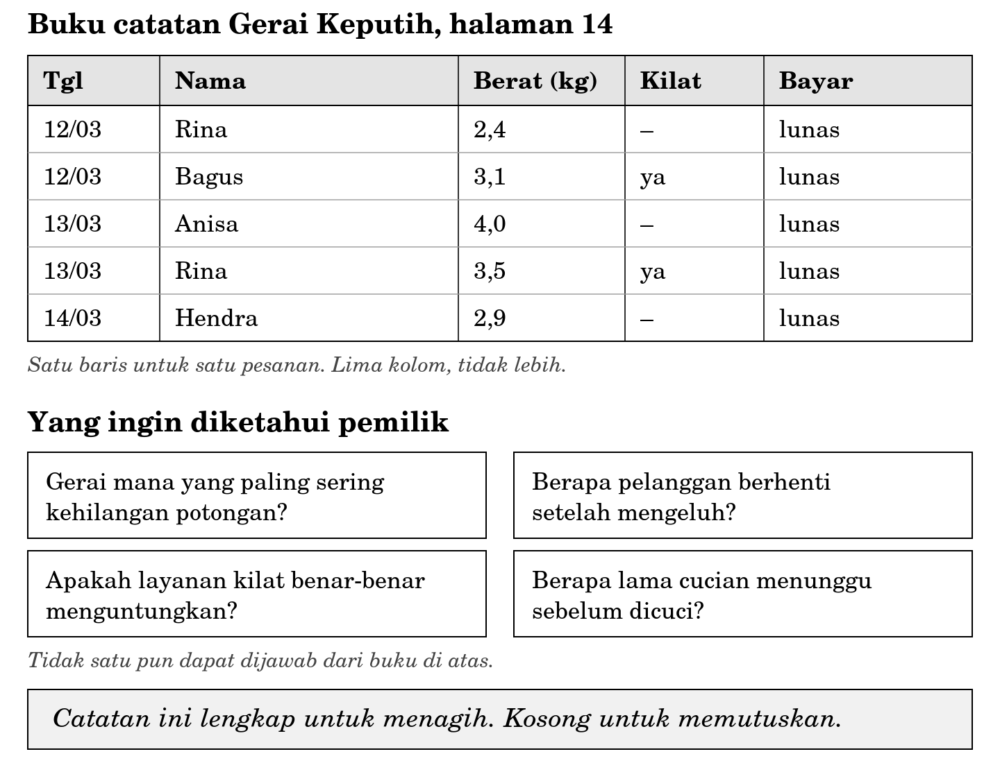

**BAGIAN III ORGANISASI DAN PROSES**

**Bab 8**

**Menurunkan Kebutuhan Informasi dari Proses Bisnis**

*Naskah bagian pemantik. Uraian materi, studi kasus, rangkuman, dan latihan menyusul.*

**Buku yang lengkap untuk menagih**

Pak Hardi memiliki empat gerai Laundry Nusa. Setiap awal bulan ia menerima empat buku catatan dari keempat penanggung jawab gerai. Isinya rapi. Setiap pesanan tercatat, tidak ada baris yang bolong, tidak ada tanggal yang terlewat. Dalam urusan mencatat, keempat gerai itu tertib.

Bulan ini ada tiga hal yang mengganggunya. Keluhan mengenai potongan yang hilang bertambah, tetapi ia tidak tahu keluhan itu datang dari gerai yang mana. Layanan kilat sudah berjalan setahun dengan tarif yang lebih tinggi, tetapi ia tidak yakin layanan itu benar-benar menambah keuntungan, sebab urutan antrean menjadi kacau setiap kali ada pesanan kilat masuk. Dua pelanggan langganan berhenti tanpa pamit, dan ia baru menyadarinya sebulan kemudian.

Ia membuka keempat buku. Semuanya tercatat. Tidak satu pun pertanyaannya terjawab.

**Gambar 8.1 Buku catatan Gerai Keputih dan pertanyaan yang tidak dapat dijawabnya**

Ini bukan persoalan ketelitian. Petugas gerai tidak lalai, dan tidak ada satu pun baris yang salah. Yang tercatat adalah yang dibutuhkan untuk menagih: siapa yang datang, berapa berat cuciannya, dan sudah membayar atau belum. Pertanyaan Pak Hardi bukan pertanyaan penagihan, melainkan pertanyaan keputusan. Keduanya menuntut data yang berbeda, dan perbedaan itulah pokok bahasan bab ini.

Pada Bab 7 Anda menggambar prosesnya. Sekarang Anda mengerjakan langkah berikutnya, yaitu menurunkan dari proses itu: informasi apa yang perlu ada, siapa yang membutuhkannya, dan kapan ia dibutuhkan.

Sebelum membaca uraiannya, kerjakan diskusi berikut dalam kelompok kecil. Jangan membuka subbab berikutnya sebelum kelompok Anda menuliskan jawaban. Pertanyaan yang sama akan Anda temui lagi dalam bentuk yang lebih rapi di akhir bab, dan akan terasa berbeda kalau Anda sudah pernah bergulat dengannya lebih dahulu.

<table>
<colgroup>
<col style="width: 100%" />
</colgroup>
<tbody>
<tr class="odd">
<td>
<strong>Pemantik diskusi: apa yang tidak dicatat</strong>

Kerjakan dalam kelompok tiga sampai empat orang. Waktu 25 menit. Tuliskan jawaban kelompok Anda, jangan hanya membicarakannya.

<ol type="1">
<li>
Daftar seluruh data yang tercatat pada Gambar 8.1. Ada berapa jenis? Sebutkan satu per satu.
</li>
<li>
Pilih satu pertanyaan Pak Hardi. Agar pertanyaan itu terjawab, data apa saja yang harus ada? Sebutkan serinci mungkin, termasuk satuannya.
</li>
<li>
Untuk setiap data yang Anda sebut pada nomor 2, tunjuk aktivitas mana pada model proses Bab 7 yang menjadi tempat paling wajar untuk mencatatnya. Kalau tidak ada aktivitas yang cocok, apa artinya?
</li>
<li>
Ada satu pertanyaan Pak Hardi yang tidak dapat dijawab hanya dengan menambah kolom pada buku, sebanyak apa pun kolom yang ditambahkan. Pertanyaan yang mana, dan mengapa?
</li>
<li>
Setiap kolom baru berarti pekerjaan tambahan bagi petugas gerai. Atas dasar apa Anda memutuskan sebuah kolom layak ditambahkan dan kolom lain tidak?
</li>
</ol></td>
</tr>
</tbody>
</table>

<table>
<colgroup>
<col style="width: 100%" />
</colgroup>
<tbody>
<tr class="odd">
<td>
<strong>Catatan untuk dosen (tidak dicetak dalam buku mahasiswa)</strong>

<strong>Tujuan.</strong> Memisahkan gagasan “data yang dicatat” dari “informasi yang dibutuhkan”. Ini pintu masuk bagian kedua Sub-CPMK-3 dan satu-satunya tempat IK H-1 diperkenalkan secara utuh.

<strong>Waktu.</strong> 25 menit diskusi kelompok, 15 menit pembahasan kelas.

<strong>Nomor 1.</strong> Jawabannya lima: tanggal, nama, berat, penanda layanan kilat, dan status pembayaran. Sebagian mahasiswa akan menyebut nomor nota atau jumlah potong, padahal keduanya tidak ada pada gambar. Kekeliruan ini justru berguna. Tunjukkan bahwa mereka menambahkan sesuatu dari bayangan sendiri, dan bahwa kecenderungan itulah yang menghasilkan Kesalahan 6 pada Bab 7.

<strong>Nomor 3.</strong> Pertanyaan ini memaksa mahasiswa kembali ke model Bab 7. Jika tidak ada aktivitas yang cocok, artinya prosesnya sendiri yang harus berubah, bukan sekadar bukunya. Gagasan ini akan diulang pada Bab 9 dan Bab 10.

<strong>Nomor 4.</strong> Jawaban paling kuat adalah pertanyaan mengenai pelanggan yang berhenti, sebab jawabannya menuntut data tentang sesuatu yang tidak terjadi, yaitu pesanan yang tidak pernah masuk. Buku hanya mencatat peristiwa yang terjadi. Jawaban lain dapat diterima bila alasannya kuat, misalnya pertanyaan mengenai keluhan, karena keluhan tidak pernah masuk ke dalam proses sama sekali sehingga yang dibutuhkan adalah aktivitas baru, bukan kolom baru.

<strong>Nomor 5.</strong> Tidak ada jawaban tunggal. Yang dinilai adalah apakah kelompok menyebut ongkosnya, bukan hanya manfaatnya. Kelompok yang menjawab “semua kolom berguna, tambahkan saja” belum memahami bahwa pencatatan adalah pekerjaan yang harus dikerjakan seseorang.

<strong>Jebakan yang paling lazim.</strong> Mahasiswa langsung mengusulkan aplikasi atau basis data. Kembalikan mereka ke pertanyaan semula: data apa dahulu, alatnya belakangan. Pada semester 1 mereka belum menempuh Basis Data, dan justru di situ keuntungannya. Mereka terpaksa berpikir mengenai informasi, bukan mengenai tabel.
</td>
</tr>
</tbody>
</table>

**Lampiran: berkas gaya gambar**

Gambar 8.1 adalah gambar pertama yang dibuat untuk buku ini, sehingga ia sekaligus menetapkan aturan gaya bagi seluruh gambar berikutnya. Aturan berikut wajib diikuti agar gambar seragam.

- Hitam putih sepenuhnya. Tidak ada warna. Pembedaan dinyatakan dengan tebal garis, pola garis, dan isian abu, bukan dengan warna.

- Hanya dua nilai isian abu yang dipakai: abu muda untuk baris kepala tabel, dan abu lebih muda untuk bidang penegas. Tidak ada nilai abu yang ketiga.

- Garis tepi bidang utama 1,6 titik. Garis pembagi di dalam bidang 1,2 titik. Garis pemisah baris memakai abu, bukan hitam.

- Huruf di dalam gambar memakai keluarga huruf berkait yang sama dengan naskah, sehingga gambar tidak tampak seperti tempelan.

- Lebar baku gambar 1440 titik gambar. Pada lebar kolom B5 ini setara dengan kerapatan sekitar 300 titik per inci.

- Ukuran huruf terkecil di dalam gambar tidak kurang dari 30 titik gambar pada lebar baku tersebut, setara dengan sekitar 7 titik setelah gambar diperkecil ke lebar kolom. Huruf isi tabel dan teks utama di dalam gambar tidak kurang dari 34 titik gambar, setara 8 titik cetak.

- Susunan bersusun ke bawah lebih diutamakan daripada susunan berdampingan. Susunan berdampingan memaksa huruf mengecil di bawah batas keterbacaan.

- Berkas kerja disimpan dalam bentuk vektor, dan gambar untuk naskah dihasilkan dari berkas vektor itu, bukan sebaliknya.
