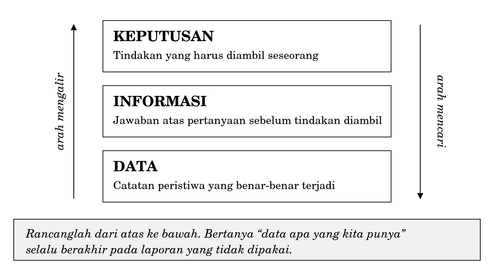
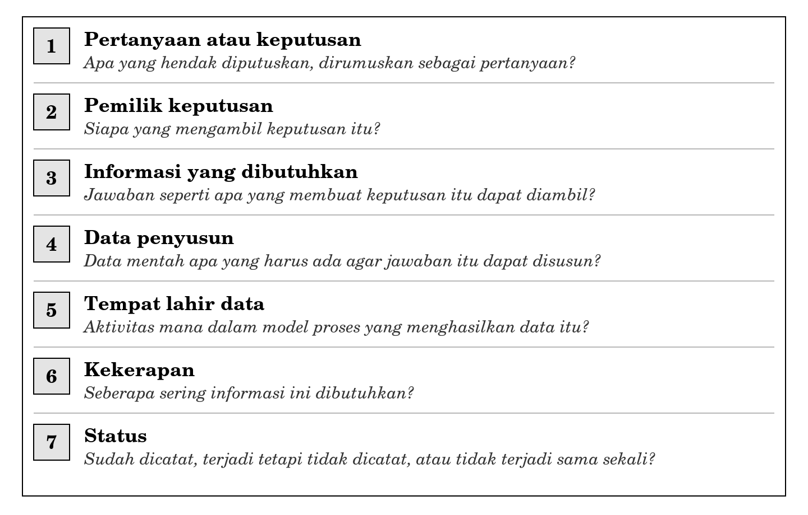
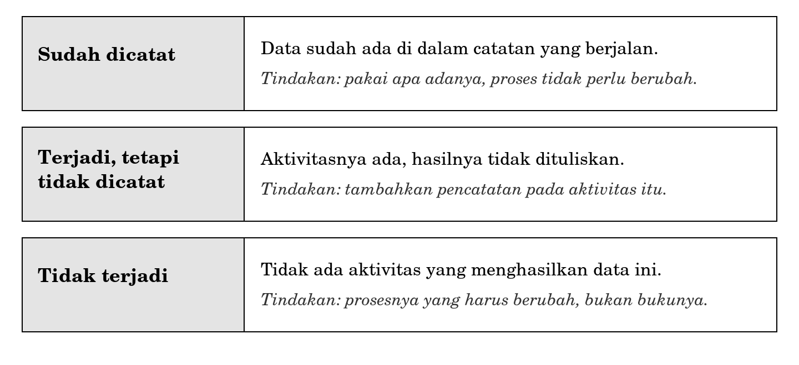

**BAGIAN III ORGANISASI DAN PROSES**

**Bab 8**

**Menurunkan Kebutuhan Informasi dari Proses Bisnis**

**Peta bab**

**Sub-CPMK yang diampu.** Mampu memetakan proses bisnis sederhana dan mengidentifikasi kebutuhan informasi di dalamnya.

Bab 7 mengerjakan bagian pertama, yaitu pemetaan proses. Bab ini mengerjakan bagian kedua, yaitu penurunan kebutuhan informasi. Keduanya menjadi satu kesatuan, dan bab ini tidak dapat dikerjakan tanpa model proses yang Anda hasilkan sebelumnya.

Setelah membaca bab ini Anda akan mampu:

1.  menjelaskan hubungan bertingkat antara data, informasi, dan keputusan, serta arah yang benar untuk menelusurinya;

2.  merumuskan kebutuhan informasi berangkat dari keputusan, bukan dari data yang kebetulan tersedia;

3.  menyusun tabel kebutuhan informasi bertujuh kolom untuk sebuah organisasi kecil;

4.  menempelkan setiap data pada aktivitas tempat data itu lahir di dalam model proses;

5.  menimbang ongkos pencatatan dan menolak data yang tidak mengubah keputusan apa pun;

6.  mengenali dua jenis pertanyaan yang tidak dapat dijawab oleh pencatatan.

**Bab prasyarat.** Bab 4 untuk dimensi kualitas informasi, Bab 5 untuk tingkat manajemen dan jenis keputusan, Bab 7 untuk model proses.

**Kata kunci.** Kebutuhan informasi, pemilik keputusan, tempat lahir data, kekerapan, ongkos pencatatan, uji lalu apa.

**Yang akan Anda hasilkan.** Satu tabel kebutuhan informasi bertujuh kolom, disertai usulan perubahan proses beserta perkiraan ongkosnya.

**Buku yang lengkap untuk menagih**

Pak Hardi memiliki empat gerai Laundry Nusa. Setiap awal bulan ia menerima empat buku catatan dari keempat penanggung jawab gerai. Isinya rapi. Setiap pesanan tercatat, tidak ada baris yang bolong, tidak ada tanggal yang terlewat. Dalam urusan mencatat, keempat gerai itu tertib.

Bulan ini ada tiga hal yang mengganggunya. Keluhan mengenai potongan yang hilang bertambah, tetapi ia tidak tahu keluhan itu datang dari gerai yang mana. Layanan kilat sudah berjalan setahun dengan tarif yang lebih tinggi, tetapi ia tidak yakin layanan itu benar-benar menambah keuntungan, sebab urutan antrean menjadi kacau setiap kali ada pesanan kilat masuk. Dua pelanggan langganan berhenti tanpa pamit, dan ia baru menyadarinya sebulan kemudian.

Ia membuka keempat buku. Semuanya tercatat. Tidak satu pun pertanyaannya terjawab.

**Gambar 8.1 Buku catatan Gerai Keputih dan pertanyaan yang tidak dapat dijawabnya**

Ini bukan persoalan ketelitian. Petugas gerai tidak lalai, dan tidak ada satu pun baris yang salah. Yang tercatat adalah yang dibutuhkan untuk menagih: siapa yang datang, berapa berat cuciannya, dan sudah membayar atau belum. Pertanyaan Pak Hardi bukan pertanyaan penagihan, melainkan pertanyaan keputusan. Keduanya menuntut data yang berbeda, dan perbedaan itulah pokok bahasan bab ini.

Pada Bab 7 Anda menggambar prosesnya. Sekarang Anda mengerjakan langkah berikutnya, yaitu menurunkan dari proses itu: informasi apa yang perlu ada, siapa yang membutuhkannya, dan kapan ia dibutuhkan.

Sebelum membaca uraiannya, kerjakan diskusi berikut dalam kelompok kecil. Jangan membuka subbab berikutnya sebelum kelompok Anda menuliskan jawaban.

<table>
<colgroup>
<col style="width: 100%" />
</colgroup>
<tbody>
<tr class="odd">
<td>
<strong>Pemantik diskusi: apa yang tidak dicatat</strong>

Kerjakan dalam kelompok tiga sampai empat orang. Waktu 25 menit. Tuliskan jawaban kelompok Anda, jangan hanya membicarakannya.

<ol type="1">
<li>
Daftar seluruh data yang tercatat pada Gambar 8.1. Ada berapa jenis? Sebutkan satu per satu.
</li>
<li>
Pilih satu pertanyaan Pak Hardi. Agar pertanyaan itu terjawab, data apa saja yang harus ada? Sebutkan serinci mungkin, termasuk satuannya.
</li>
<li>
Untuk setiap data yang Anda sebut pada nomor 2, tunjuk aktivitas mana pada model proses Bab 7 yang menjadi tempat paling wajar untuk mencatatnya. Kalau tidak ada aktivitas yang cocok, apa artinya?
</li>
<li>
Ada satu pertanyaan Pak Hardi yang tidak dapat dijawab hanya dengan menambah kolom pada buku, sebanyak apa pun kolom yang ditambahkan. Pertanyaan yang mana, dan mengapa?
</li>
<li>
Setiap kolom baru berarti pekerjaan tambahan bagi petugas gerai. Atas dasar apa Anda memutuskan sebuah kolom layak ditambahkan dan kolom lain tidak?
</li>
</ol></td>
</tr>
</tbody>
</table>

**8.1 Tiga lapis dan dua arah**

Pada Bab 1 Anda membedakan data dari informasi. Bab ini memakai pembedaan tersebut untuk bekerja, dan menambahkan satu lapis di atasnya.

|                                                                                                                                                                                                            |
|------------------------------------------------------------------------------------------------------------------------------------------------------------------------------------------------------------|
| *Data adalah catatan mengenai peristiwa yang terjadi. Informasi adalah jawaban atas pertanyaan seseorang, yang disusun dari data. Keputusan adalah tindakan yang diambil setelah pertanyaan itu terjawab.* |

Ketiganya tersusun bertingkat. Persoalannya, data mengalir ke atas, sedangkan pekerjaan merancang harus berjalan ke bawah.

**Gambar 8.2 Arah mengalir dan arah mencari**

**Arah mengalir** adalah yang terjadi dalam kenyataan sehari-hari. Petugas mencatat, catatan dikumpulkan, ringkasan disusun, pemilik membaca ringkasan, lalu memutuskan sesuatu. Arah ini berjalan dengan sendirinya dan tidak perlu dirancang.

**Arah mencari** adalah yang Anda tempuh ketika merancang. Mulailah dari keputusan. Tanyakan informasi apa yang membuat keputusan itu dapat diambil. Baru setelah itu tanyakan data apa yang menyusun informasi tersebut, dan dari aktivitas mana data itu lahir.

Membalik arah ini adalah kesalahan yang paling sering terjadi dan paling mahal akibatnya. Pertanyaan “data apa yang kita punya” terdengar praktis dan hemat, tetapi ia menghasilkan laporan yang lengkap, rapi, dan tidak dipakai siapa pun. Anda mungkin pernah melihat laporan semacam itu: dicetak setiap bulan, ditumpuk di sudut meja, tidak pernah dibuka. Laporan itu bukan hasil kemalasan. Ia hasil dari bekerja pada arah yang salah.

Ada satu tanda yang cukup dapat diandalkan untuk mengenali laporan yang lahir dari arah yang salah: laporan itu tidak dapat menyebutkan siapa pembacanya. Kalau Anda bertanya siapa yang membaca laporan ini dan jawabannya “semua pihak yang berkepentingan”, hampir dapat dipastikan tidak ada seorang pun yang membacanya.

**8.2 Bertanya dari sisi keputusan**

Karena penelusuran dimulai dari keputusan, langkah pertama adalah mendaftar keputusan. Rumusannya terdiri atas tiga bagian: siapa, memutuskan apa, dan seberapa sering.

Pada Bab 5 Anda mengenal tiga tingkat manajemen. Daftar keputusan menjadi jauh lebih rapi kalau disusun menurut tingkat itu.

| **Tingkat** | **Siapa**           | **Memutuskan apa**                                | **Kekerapan**        |
|-------------|---------------------|---------------------------------------------------|----------------------|
| Operasional | Petugas gerai       | Cucian mana yang dikerjakan lebih dahulu          | Beberapa kali sehari |
| Taktis      | Manajer operasional | Gerai mana yang perlu tambahan tenaga pekan depan | Mingguan             |
| Taktis      | Manajer operasional | Kapan deterjen harus dipesan lagi                 | Mingguan             |
| Strategis   | Pemilik             | Apakah layanan kilat diteruskan                   | Setahun sekali       |
| Strategis   | Pemilik             | Apakah membuka gerai kelima                       | Setahun sekali       |

Perhatikan kolom kekerapan. Keputusan operasional diambil berkali-kali dalam sehari, keputusan strategis mungkin sekali dalam setahun. Perbedaan ini akan menentukan berapa sering informasinya perlu disiapkan, dan pada Subbab 8.5 akan terlihat bahwa perbedaan itu berpengaruh besar terhadap ongkos.

**8.2.1 Keputusan yang tidak pernah diambil**

Ada jenis keputusan yang tidak akan muncul dalam daftar mana pun, bukan karena tidak penting, melainkan karena tidak pernah ada informasinya. Pak Hardi tidak pernah memutuskan gerai mana yang perlu dibenahi penanganan cuciannya, sebab ia tidak pernah tahu gerai mana yang bermasalah. Bagi dirinya sendiri, keputusan itu tidak pernah ada.

Ini menimbulkan kesulitan yang nyata ketika Anda mewawancarai. Orang hanya menyebutkan keputusan yang biasa mereka ambil. Keputusan yang tidak pernah mereka ambil tidak akan disebut, dan justru di situlah nilai terbesar sebuah sistem informasi sering berada.

Ada satu cara sederhana untuk menemukannya: jangan bertanya tentang keputusan, bertanyalah tentang keluhan. Setiap keluhan yang berulang menandakan ada keputusan yang seharusnya diambil tetapi tidak pernah bisa diambil. Keluhan potongan hilang yang terus berulang di Laundry Nusa adalah petunjuk bahwa ada keputusan yang hilang, bukan sekadar petunjuk bahwa petugas kurang hati-hati.

**8.3 Tabel kebutuhan informasi**

Hasil pekerjaan bab ini berbentuk sebuah tabel. Tabel ini yang akan Anda serahkan, bukan uraian panjang, sebab tabel memaksa setiap kolom terisi dan memperlihatkan dengan segera bagian mana yang belum Anda pikirkan.

**Gambar 8.3 Tujuh kolom tabel kebutuhan informasi**

Tiga kolom pertama masih berada di alam pikiran pengguna. Kolom keempat sampai ketujuh menyeret pikiran itu ke dalam kenyataan proses. Peralihan antara kolom ketiga dan keempat adalah bagian tersulit, dan di situlah sebagian besar pekerjaan Anda berada.

**Aturan pengisian.** Isi dari kiri ke kanan, jangan melompat. Kolom keempat tidak boleh diisi sebelum kolom ketiga selesai dirumuskan. Melompat ke kolom data adalah bentuk lain dari membalik arah pada Gambar 8.2, dan akibatnya sama.

Dua kolom perlu penjelasan tambahan.

**Kolom 5, tempat lahir data.** Setiap data harus dapat ditunjuk asalnya pada satu aktivitas tertentu di dalam model proses Bab 7. Kolom inilah yang menyambungkan kedua bab, dan kolom ini pula yang paling sering dikosongkan mahasiswa. Data tanpa tempat lahir adalah data yang Anda andaikan ada.

**Kolom 7, status.** Hanya ada tiga nilai yang boleh diisikan, dan ketiganya dibahas pada subbab berikut. Batasan tiga nilai ini disengaja, sebab nilai keempat seperti “mungkin ada” selalu berarti Anda belum memeriksanya.

**8.4 Tempat lahir data**

Setelah data dirumuskan, langkah berikutnya adalah menempelkannya pada aktivitas. Hasil penempelan itu selalu jatuh ke salah satu dari tiga keadaan.

**Gambar 8.4 Tiga keadaan tempat lahir data**

Keadaan pertama menyenangkan tetapi jarang. Keadaan kedua paling mudah ditangani, sebab aktivitasnya sudah ada dan yang kurang hanya pencatatannya.

Keadaan ketiga adalah yang paling sering ditemui mahasiswa, dan paling sering ditangani dengan keliru. Godaannya adalah menambah kolom pada buku. Menambah kolom tidak menolong sama sekali kalau tidak ada seorang pun yang menghasilkan isinya. Kolom yang tidak ada isinya akan diisi dengan tanda hubung, lalu tidak lama kemudian tidak diisi sama sekali.

Ambil contoh yang sudah Anda kenal. Untuk mengetahui apakah sebuah potongan benar-benar hilang, dibutuhkan data jumlah potong pada saat penerimaan. Di Gerai Keputih tidak ada aktivitas yang menghasilkan angka itu. Petugas menimbang, tidak menghitung. Karena itu yang dibutuhkan bukan kolom baru pada buku, melainkan aktivitas baru di dalam proses, yaitu menghitung potongan pada saat penerimaan. Aktivitas baru berarti waktu tambahan, dan waktu tambahan berarti ongkos.

|                                                                                                                                                                                      |
|--------------------------------------------------------------------------------------------------------------------------------------------------------------------------------------|
| *Penurunan kebutuhan informasi hampir selalu berakhir pada usulan perubahan proses, bukan sekadar usulan perubahan pencatatan. Inilah sebabnya Bab 7 harus dikerjakan lebih dahulu.* |

**8.5 Kekerapan dan ketepatan waktu**

Pada Bab 4 Anda melihat bahwa ketepatan waktu adalah salah satu dimensi kualitas informasi. Di sini dimensi itu berubah menjadi keputusan rancangan yang nyata: seberapa sering informasi perlu disiapkan.

Aturannya lugas. Kekerapan informasi ditentukan oleh kekerapan keputusannya, bukan oleh kemampuan alat yang tersedia.

Pak Hardi memutuskan nasib layanan kilat setahun sekali. Menyediakan perhitungan keuntungan layanan kilat setiap hari tidak menambah nilai apa pun bagi keputusan itu. Sebaliknya, petugas gerai memutuskan urutan pengerjaan berkali-kali dalam sehari, sehingga informasi mengenai pesanan mana yang paling mendesak harus tersedia seketika, bukan besok pagi.

| **Kekerapan**        | **Contoh keputusan**                     | **Ongkos penyediaan**                              |
|----------------------|------------------------------------------|----------------------------------------------------|
| Seketika             | Cucian mana yang dikerjakan lebih dahulu | Tinggi. Menuntut pencatatan pada saat kejadian.    |
| Harian atau mingguan | Gerai mana yang perlu tambahan tenaga    | Sedang. Cukup rekapitulasi berkala.                |
| Bulanan atau tahunan | Apakah layanan kilat diteruskan          | Rendah. Dapat disusun dari catatan yang sudah ada. |

Perhatikan bahwa ongkos naik tajam ke arah baris pertama. Informasi yang harus tersedia seketika menuntut pencatatan pada saat peristiwa terjadi, dan pencatatan pada saat peristiwa terjadi selalu mengganggu pekerjaan yang sedang berlangsung. Karena itu permintaan akan informasi seketika harus diperiksa dengan sungguh-sungguh. Sebagian besar permintaan semacam itu, setelah ditelusuri, ternyata berasal dari keinginan untuk memantau, bukan dari keperluan untuk memutuskan.

**8.6 Ongkos pencatatan**

Setiap kolom baru adalah pekerjaan yang harus dikerjakan seseorang. Mahasiswa yang baru belajar merancang cenderung melupakan hal ini, sebab dalam bayangannya data muncul dengan sendirinya. Dalam kenyataan, data muncul karena ada orang yang berhenti sejenak dari pekerjaannya lalu menuliskan sesuatu.

Ada tiga ongkos yang perlu dihitung.

1.  **Waktu pelaksana.** Dapat dihitung dengan cukup teliti. Menghitung potongan cucian memakan waktu sekitar sepuluh detik untuk satu pesanan. Dengan empat puluh pesanan sehari pada empat gerai, angka itu menjadi sekitar dua puluh tujuh menit sehari, atau setara dengan sekitar tiga belas jam kerja dalam sebulan.

2.  **Peluang salah catat.** Semakin banyak yang harus dituliskan, semakin besar peluang keliru. Kekeliruan pada data yang dipakai untuk mengambil keputusan lebih berbahaya daripada ketiadaan data, sebab angka yang keliru tetap terlihat seperti angka yang benar.

3.  **Penolakan pelaksana.** Ini yang paling sering dilupakan. Pencatatan yang dianggap tidak masuk akal oleh orang yang harus mengerjakannya akan diisi seadanya. Petugas akan menuliskan angka yang kira-kira benar agar kolomnya tidak kosong. Data yang diisi seadanya lebih berbahaya daripada data yang tidak ada sama sekali, karena tidak ada tandanya.

Untuk menyaring, pakailah satu pertanyaan yang sangat sederhana.

|                                                                                                                                          |
|------------------------------------------------------------------------------------------------------------------------------------------|
| *Uji lalu apa: seandainya angka ini berubah, keputusan apa yang ikut berubah? Kalau tidak ada jawabannya, data itu tidak layak dicatat.* |

Uji ini terdengar kasar, dan memang seharusnya begitu. Sebagian besar usulan penambahan data tidak lolos, dan itu hasil yang baik. Daftar kebutuhan informasi yang pendek dan seluruhnya terpakai jauh lebih berharga daripada daftar panjang yang setengahnya diabaikan setelah bulan ketiga.

**8.7 Apa yang tidak dapat dijawab oleh pencatatan**

Bagian ini menutup bab dengan hal yang jarang dituliskan di buku ajar, padahal penting untuk dipahami sejak awal. Ada pertanyaan yang tidak akan terjawab berapa pun banyaknya data yang Anda kumpulkan.

**8.7.1 Pertanyaan mengenai peristiwa yang tidak terjadi**

Catatan hanya memuat peristiwa yang terjadi. Pelanggan yang berhenti datang tidak meninggalkan baris apa pun di dalam buku. Ketiadaannya justru berupa ketiadaan baris, dan ketiadaan tidak dapat dihitung dari sesuatu yang tidak ditulis.

Untuk menjawab pertanyaan semacam ini diperlukan aktivitas baru yang sengaja diadakan untuk menghasilkan data, misalnya menelusuri pelanggan yang sudah lama tidak datang lalu menghubunginya. Perhatikan bahwa ini bukan pekerjaan pencatatan, melainkan pekerjaan baru yang harus dimasukkan ke dalam proses dan dibiayai.

**8.7.2 Pertanyaan mengenai sebab**

Catatan dapat menunjukkan bahwa keluhan di satu gerai lebih banyak daripada di gerai lain. Catatan tidak dapat menjelaskan mengapa. Sebab tidak tersimpan di dalam data; ia harus dicari melalui pengamatan dan percakapan dengan orang yang mengerjakan.

Ini pembatas yang penting bagi pekerjaan Anda kelak. Sebagian besar kekecewaan terhadap sistem informasi bermula dari harapan yang keliru, yaitu anggapan bahwa dengan mengumpulkan cukup banyak data, seluruh pertanyaan akan terjawab dengan sendirinya. Data menunjukkan tempat untuk mencari. Data tidak menggantikan pencarian itu sendiri.

<table>
<colgroup>
<col style="width: 100%" />
</colgroup>
<tbody>
<tr class="odd">
<td>
<strong>Di balik layar: pesanan yang dibatalkan</strong>

Di Gerai Keputih, pelanggan sesekali membatalkan pesanan setelah cucian diserahkan, biasanya karena mendadak harus pulang ke kampung halaman. Petugas mengembalikan cucian, mengembalikan uang, lalu mencoret baris yang sudah telanjur ditulis di buku.

Coretan itu masuk akal menurut pembukuan. Pesanan itu memang tidak jadi, dan uangnya sudah kembali. Akibatnya, di dalam catatan, pembatalan tidak pernah terjadi. Tidak ada yang tahu berapa banyak pembatalan dalam sebulan, pada hari apa biasanya terjadi, atau apakah jumlahnya bertambah dari bulan ke bulan.

Ini contoh dari keadaan ketiga pada Gambar 8.4 dengan satu putaran tambahan yang menarik: peristiwanya terjadi, sempat tercatat, lalu sengaja dihapus. Penghapusan itu dilakukan dengan niat baik, dan justru itulah yang membuatnya sulit ditemukan ketika Anda mewawancarai. Tidak ada yang merasa telah menyembunyikan apa pun.

Simpan pengamatan ini. Pada Bab 9, ketika membahas sistem pemrosesan transaksi, Anda akan melihat bahwa mencoret dan membatalkan adalah dua hal yang berbeda, dan bahwa perbedaan itu punya akibat yang cukup jauh.
</td>
</tr>
</tbody>
</table>

<table>
<colgroup>
<col style="width: 100%" />
</colgroup>
<tbody>
<tr class="odd">
<td>
<strong>Salah kaprah</strong>

<strong>“Semakin banyak data dikumpulkan, semakin baik.”</strong> Data yang tidak dipakai tetap memakan waktu untuk dicatat, tempat untuk disimpan, dan perhatian untuk dipelihara. Data yang tidak dipakai juga cenderung menjadi keliru tanpa ada yang menyadari, sebab tidak ada yang memeriksanya.

<strong>“Kebutuhan informasi ditanyakan kepada pengguna, lalu dicatat apa adanya.”</strong> Pengguna menyebutkan apa yang mereka bayangkan, dan yang mereka bayangkan biasanya berbentuk tampilan atau laporan, bukan kebutuhan. Tugas Anda menurunkan kebutuhan dari keputusan mereka, bukan menampung keinginan mereka.

<strong>“Kalau datanya sudah ada di dalam sistem, kebutuhan informasi otomatis terpenuhi.”</strong> Data yang ada hanya menjawab pertanyaan yang pernah dipikirkan ketika sistem itu dibuat. Pertanyaan baru hampir selalu menuntut data yang belum pernah dikumpulkan.
</td>
</tr>
</tbody>
</table>

**Studi kasus terpandu: gerai mana yang perlu dibenahi lebih dahulu**

Bagian ini mengerjakan satu pertanyaan Pak Hardi sampai tuntas, termasuk bagian yang tidak menyenangkan pada akhirnya.

**Langkah 1 Ubah pertanyaan menjadi keputusan**

Pertanyaan asli Pak Hardi berbunyi: gerai mana yang paling sering kehilangan potongan? Pertanyaan ini belum berupa keputusan. Rumusan yang dapat dikerjakan berbunyi: gerai mana yang perlu dibenahi penanganan cuciannya lebih dahulu?

Perbedaan kedua rumusan itu tidak sekadar soal kata. Rumusan pertama menuntut angka kehilangan. Rumusan kedua menuntut perbandingan antargerai, dan perbandingan menuntut penyebut.

**Langkah 2 Tetapkan pemilik dan kekerapan**

Pemilik keputusan adalah Pak Hardi sendiri. Kekerapannya tiga bulan sekali, sebab pembenahan penanganan cucian memerlukan waktu dan tidak masuk akal ditinjau setiap minggu.

**Langkah 3 Rumuskan informasi yang dibutuhkan**

Jumlah kejadian potongan hilang pada tiap gerai selama tiga bulan, dibagi jumlah pesanan gerai tersebut pada periode yang sama.

Pembagi itu bukan hiasan. Tanpa pembagi, gerai yang paling ramai akan selalu tampak paling bermasalah semata-mata karena melayani lebih banyak pesanan. Mahasiswa yang melewatkan pembagi akan menghasilkan tabel yang benar secara hitungan dan menyesatkan secara kesimpulan.

**Langkah 4 sampai 7 Susun tabelnya**

| **Kolom**                     | **Isi**                                                                            |
|-------------------------------|------------------------------------------------------------------------------------|
| 1\. Pertanyaan atau keputusan | Gerai mana yang perlu dibenahi penanganan cuciannya lebih dahulu?                  |
| 2\. Pemilik keputusan         | Pemilik (Pak Hardi)                                                                |
| 3\. Informasi yang dibutuhkan | Kejadian potongan hilang per gerai per tiga bulan, dibagi jumlah pesanan gerai itu |
| 4a. Data penyusun             | Jumlah pesanan per gerai per bulan                                                 |
| 5a. Tempat lahir              | Aktivitas “menulis nota” pada model Bab 7                                          |
| 7a. Status                    | Sudah dicatat                                                                      |
| 4b. Data penyusun             | Jumlah kejadian keluhan potongan hilang per gerai per bulan                        |
| 5b. Tempat lahir              | Tidak ada aktivitas yang menghasilkannya                                           |
| 7b. Status                    | Tidak terjadi                                                                      |
| 6\. Kekerapan                 | Tiga bulan sekali                                                                  |

Baris 5b adalah temuan yang sebenarnya. Keluhan pelanggan memang terjadi, tetapi tidak ada aktivitas yang menampungnya. Keluhan disampaikan di meja depan, dijawab seadanya, lalu selesai. Tidak ada yang tertinggal.

**Usulan perubahan proses.** Tambahkan satu aktivitas pada saat pengambilan, yaitu mencatat keluhan yang disampaikan pelanggan, sekurang-kurangnya tanggal, gerai, dan jenis keluhan. Aktivitas ini memakan waktu kurang dari satu menit dan hanya terjadi ketika ada keluhan, sehingga ongkosnya kecil.

**Kritik atas hasil sendiri**

Tabel di atas sudah dapat dikerjakan, tetapi mengandung tiga kelemahan yang harus dinyatakan, bukan disembunyikan.

1.  Yang terhitung adalah keluhan, bukan kehilangan. Pelanggan yang tidak menghitung cuciannya, atau yang menghitung tetapi enggan kembali, tidak akan pernah muncul dalam angka. Angka yang dihasilkan hampir pasti lebih kecil daripada kejadian yang sebenarnya, dan besar selisihnya tidak diketahui.

2.  Gerai yang petugasnya ramah mungkin menerima lebih banyak keluhan, bukan karena lebih sering kehilangan, melainkan karena pelanggannya lebih berani menyampaikan. Perbandingan antargerai karena itu tidak sepenuhnya adil.

3.  Pencatatan keluhan dikerjakan oleh petugas gerai yang gerainya sedang dinilai. Ada dorongan yang tidak perlu diperdebatkan untuk mencatat lebih sedikit daripada yang sebenarnya.

Ketiga kelemahan itu tidak membatalkan usulan. Angka yang tidak sempurna tetap jauh lebih berguna daripada tidak ada angka sama sekali, asalkan keterbatasannya diketahui oleh orang yang memakainya. Yang membatalkan usulan adalah menyerahkan angka tanpa menyebutkan bahwa angka itu mengukur keluhan, bukan kehilangan.

**Pertanyaan yang sengaja tidak dijawab**

Sepanjang bab ini muncul godaan untuk mengusulkan pencatatan jumlah potong pada saat penerimaan. Usulan itu menjawab pertanyaan yang berbeda, yaitu menyelesaikan sengketa pada kasus tertentu, dan ongkosnya sudah dihitung pada Subbab 8.6, yakni sekitar tiga belas jam kerja sebulan.

Apakah sepadan? Itu bukan keputusan Anda. Itu keputusan Pak Hardi, sebab ia yang menanggung ongkosnya dan ia yang menikmati manfaatnya. Tugas Anda adalah menyajikan pilihan itu dengan lengkap: apa yang diperoleh, berapa harganya, dan apa yang terjadi kalau tidak dikerjakan. Merancang sistem informasi bukan pekerjaan memutuskan untuk orang lain, melainkan pekerjaan membuat orang lain dapat memutuskan.

**Rangkuman**

- Data, informasi, dan keputusan tersusun bertingkat. Data mengalir ke atas, tetapi pekerjaan merancang harus berjalan dari keputusan ke bawah.

- Laporan yang tidak dapat menyebutkan siapa pembacanya hampir pasti lahir dari arah yang salah.

- Daftar keputusan disusun menurut tingkat manajemen, dengan rumusan siapa, memutuskan apa, dan seberapa sering.

- Keputusan yang tidak pernah diambil tidak akan disebutkan siapa pun. Cara menemukannya adalah bertanya tentang keluhan yang berulang.

- Tabel kebutuhan informasi memuat tujuh kolom dan diisi dari kiri ke kanan tanpa melompat.

- Setiap data harus dapat ditunjuk aktivitas tempat lahirnya. Tiga keadaan yang mungkin: sudah dicatat, terjadi tetapi tidak dicatat, atau tidak terjadi sama sekali.

- Keadaan ketiga menuntut perubahan proses, bukan penambahan kolom. Karena itu penurunan kebutuhan informasi hampir selalu berakhir pada usulan perubahan proses.

- Kekerapan informasi ditentukan oleh kekerapan keputusan, bukan oleh kemampuan alat.

- Setiap data yang dicatat menimbulkan tiga ongkos: waktu pelaksana, peluang salah catat, dan penolakan pelaksana. Saringlah dengan uji lalu apa.

- Pencatatan tidak dapat menjawab pertanyaan mengenai peristiwa yang tidak terjadi dan pertanyaan mengenai sebab.

**Latihan**

Setiap soal ditandai dengan Sub-CPMK yang diukurnya.

**Tingkat A Memastikan Anda ingat**

1.  Jelaskan perbedaan antara arah mengalir dan arah mencari pada Gambar 8.2, serta akibat yang timbul bila keduanya tertukar. \[Sub-CPMK-3\]

2.  Sebutkan tujuh kolom tabel kebutuhan informasi beserta pertanyaan yang dijawab masing-masing kolom. \[Sub-CPMK-3\]

3.  Sebutkan tiga keadaan tempat lahir data dan tindakan yang sesuai untuk masing-masing keadaan. \[Sub-CPMK-3\]

4.  Apa bunyi uji lalu apa, dan untuk apa uji itu dipakai? \[Sub-CPMK-3\]

5.  Sebutkan dua jenis pertanyaan yang tidak dapat dijawab oleh pencatatan, disertai satu contoh untuk masing-masing. \[Sub-CPMK-3\]

**Tingkat B Menerapkan**

1.  Ambil pertanyaan Pak Hardi mengenai layanan kilat: apakah layanan kilat benar-benar menguntungkan? Susun tabel kebutuhan informasi bertujuh kolom untuk pertanyaan tersebut. \[Sub-CPMK-3\]

2.  Pada tabel yang Anda hasilkan di soal nomor 1, tandai setiap data dengan salah satu dari tiga keadaan pada Gambar 8.4, lalu tuliskan usulan perubahan proses untuk setiap data yang berstatus tidak terjadi. \[Sub-CPMK-3\]

3.  Perkirakan ongkos waktu untuk seluruh usulan pencatatan yang Anda ajukan pada soal nomor 2. Nyatakan asumsi Anda secara terbuka, misalnya berapa detik satu pencatatan dan berapa pesanan sehari. \[Sub-CPMK-3\]

**Tingkat C Menganalisis dan menilai**

1.  Kembalilah ke usaha kecil yang Anda amati pada latihan Bab 7. Wawancarai pemiliknya dengan pertanyaan mengenai keluhan yang berulang, bukan pertanyaan mengenai keputusan. Dari keluhan itu, temukan sekurang-kurangnya satu keputusan yang seharusnya diambil tetapi tidak pernah bisa diambil karena tidak ada informasinya. Susun tabel kebutuhan informasi untuk keputusan tersebut, lengkap dengan usulan perubahan proses dan perkiraan ongkosnya. \[Sub-CPMK-3\]

2.  Seorang rekan menyerahkan tabel kebutuhan informasi dengan dua puluh tiga baris data, seluruhnya berstatus sudah dicatat. Ia bangga karena tidak satu pun usulannya menuntut perubahan proses. Nilailah hasil kerjanya. Apakah ketiadaan usulan perubahan itu tanda pekerjaan yang efisien atau tanda pekerjaan yang belum selesai? Pertahankan pendirian Anda dengan alasan. \[Sub-CPMK-3\]

**Rujukan bab**

Rujukan berikut khusus untuk bab ini. Daftar pustaka gabungan ada di bagian akhir buku.

1.  Laudon, K. C. dan Laudon, J. P. Management Information Systems: Managing the Digital Firm. Pearson, edisi terbaru. Bagian mengenai kebutuhan informasi menurut tingkat manajemen.

2.  Dumas, M., La Rosa, M., Mendling, J., dan Reijers, H. A. (2018). Fundamentals of Business Process Management. Edisi ke-2. Berlin: Springer. Bab mengenai analisis proses secara kuantitatif.

3.  Pearlson, K., Saunders, C., dan Galletta, D. Managing and Using Information Systems: A Strategic Approach. Wiley, edisi terbaru. Bagian mengenai keselarasan antara kebutuhan pengambilan keputusan dan penyediaan informasi.

4.  The Joint ACM/AIS IS2020 Task Force. IS2020: A Competency Model for Undergraduate Programs in Information Systems. ACM dan AIS. Bagian Foundations of Information Systems, kompetensi mengenai penggunaan informasi untuk pengambilan keputusan.

**Lampiran bab: daftar gambar**

Halaman ini tidak dicetak dalam buku. Keempat gambar sudah jadi dan tersedia dalam bentuk vektor.

| **No.** | **Judul**                                                             | **Tinggi cetak** | **Status** |
|---------|-----------------------------------------------------------------------|------------------|------------|
| 8.1     | Buku catatan Gerai Keputih dan pertanyaan yang tidak dapat dijawabnya | 3,6 inci         | Selesai    |
| 8.2     | Arah mengalir dan arah mencari                                        | 2,6 inci         | Selesai    |
| 8.3     | Tujuh kolom tabel kebutuhan informasi                                 | 3,0 inci         | Selesai    |
| 8.4     | Tiga keadaan tempat lahir data                                        | 2,2 inci         | Selesai    |
