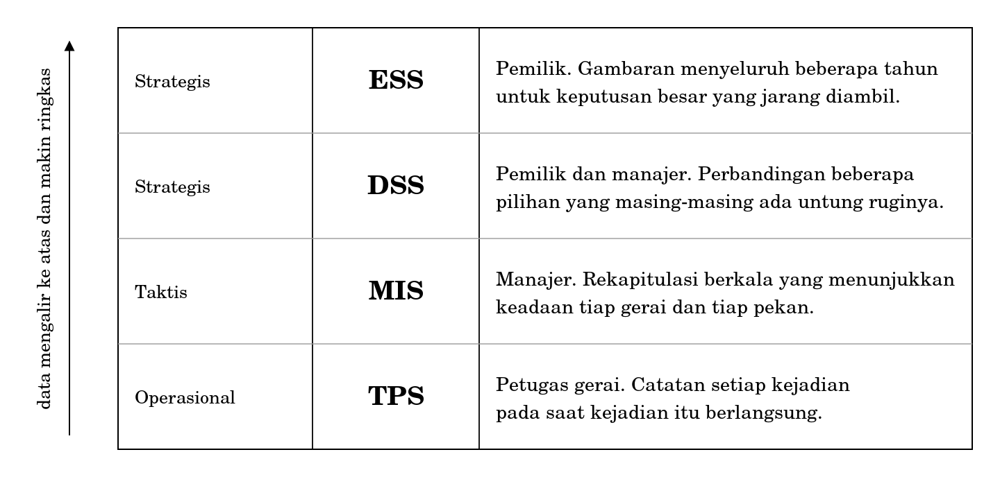
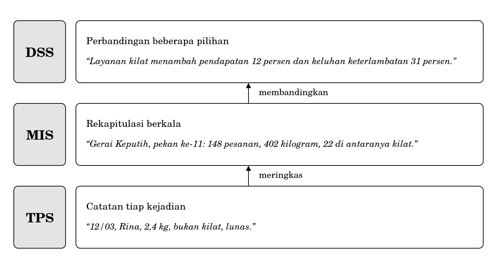
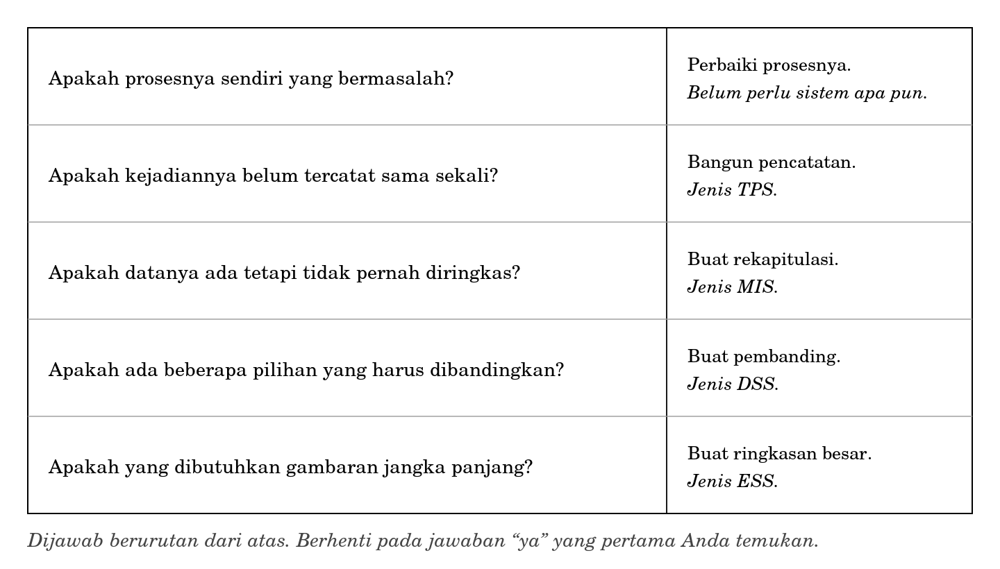

**BAGIAN IV RAGAM SISTEM INFORMASI**

**Bab 9**

**Ragam Sistem Informasi: TPS, MIS, DSS, dan ESS**

**Peta bab**

**Sub-CPMK yang diampu.** Mampu mengklasifikasikan jenis sistem informasi dan mengevaluasi kesesuaiannya terhadap masalah organisasi.

Bab 8 mengajarkan cara menurunkan kebutuhan informasi. Bab ini melanjutkannya dengan pertanyaan berikutnya: kalau kebutuhan itu hendak dipenuhi, jenis sistem apa yang sesuai, dan kapan jawabannya adalah tidak perlu sistem apa pun.

Setelah membaca bab ini Anda akan mampu:

1.  menjelaskan mengapa sistem informasi perlu digolongkan dan apa gunanya penggolongan itu;

2.  membedakan TPS, MIS, DSS, dan ESS menurut pemakai serta jenis keputusan yang ditopangnya;

3.  menjelaskan mengapa catatan transaksi bertambah dan tidak berkurang;

4.  menjelaskan bagaimana keempat jenis sistem saling memberi makan, dan apa akibatnya bila lapis terbawah keliru;

5.  memilih jenis sistem yang sesuai untuk sebuah masalah organisasi, sekaligus menolak alternatifnya dengan alasan.

**Bab prasyarat.** Bab 5 untuk tingkat manajemen dan jenis keputusan, Bab 7 untuk model proses, Bab 8 untuk tabel kebutuhan informasi.

**Kata kunci.** TPS, MIS, DSS, ESS, transaksi, pembatalan, rekapitulasi, tangga keputusan.

**Yang akan Anda hasilkan.** Satu penilaian tertulis mengenai jenis sistem yang sesuai untuk beberapa masalah organisasi, lengkap dengan alasan menolak alternatifnya.

**Aplikasi kasir yang tidak menjawab apa pun**

Seorang mahasiswa magang menawarkan aplikasi kasir kepada Pak Hardi. Gratis untuk tiga bulan pertama, setelah itu berlangganan bulanan dengan harga yang masuk akal. Aplikasinya rapi. Setiap pesanan dicatat, struk dapat dicetak, nota tidak perlu ditulis tangan lagi. Petugas gerai menyukainya karena antrean bergerak lebih cepat.

Tiga bulan berjalan tanpa keluhan. Pada awal bulan keempat Pak Hardi membuka aplikasi itu dan mencari jawaban atas pertanyaan yang sama seperti dulu. Gerai mana yang paling sering kehilangan potongan? Apakah layanan kilat benar-benar menguntungkan? Berapa pelanggan yang berhenti?

Yang ditemukannya adalah daftar transaksi. Panjang, rapi, lengkap, tersusun menurut waktu, dan dapat dicari. Tidak satu pun pertanyaannya terjawab.

Aplikasi itu bukan aplikasi yang buruk. Ia mengerjakan dengan sangat baik apa yang memang dirancang untuk dikerjakannya, yaitu mencatat transaksi. Persoalannya sederhana: pertanyaan Pak Hardi bukan pertanyaan transaksi.

Kekeliruan semacam ini mahal dan sangat lazim. Organisasi membeli sistem pencatat untuk menjawab pertanyaan perbandingan, lalu menyimpulkan bahwa sistem informasi tidak berguna. Bab ini tentang mengenali perbedaan tersebut sebelum uang dikeluarkan.

**9.1 Mengapa perlu digolongkan**

Penggolongan sistem informasi bukan daftar istilah untuk dihafalkan. Ia alat untuk menolak.

Ketika seseorang menawarkan sesuatu kepada organisasi Anda, atau ketika Anda sendiri hendak mengusulkan sesuatu, penggolongan ini memungkinkan satu pertanyaan yang tajam: jenis pertanyaan apa yang hendak dijawab, dan apakah jenis sistem yang ditawarkan memang menjawab jenis pertanyaan itu. Tanpa penggolongan, percakapan berhenti pada kesan bahwa suatu barang tampak canggih.

Perlu diakui sejak awal bahwa batas antarjenis tidak setajam yang akan digambarkan. Penggolongan ini berasal dari kepustakaan sistem informasi dan sudah dipakai puluhan tahun, sementara produk yang beredar di pasar hampir selalu menggabungkan beberapa jenis sekaligus. Yang penting bukan kotak-kotaknya, melainkan pertanyaan yang membedakannya.

**9.2 Empat jenis menurut tingkat keputusan**

Penggolongan yang dipakai buku ini mengikuti tingkat manajemen yang sudah Anda kenal pada Bab 5.

**Gambar 9.1 Empat jenis sistem informasi menurut tingkat keputusan**

Perhatikan anak panah di sebelah kiri gambar. Data mengalir dari bawah ke atas, dan makin ke atas makin ringkas. Satu baris pada lapis paling atas dapat berasal dari puluhan ribu baris pada lapis paling bawah.

Perhatikan juga bahwa yang membedakan keempat jenis itu bukan kecanggihan alatnya. Sebuah TPS dapat berupa perangkat lunak mahal, dan sebuah ESS dapat berupa selembar kertas berisi lima angka. Yang membedakan adalah pertanyaan yang dilayani.

**9.3 TPS: mencatat kejadian**

|                                                                                                                                                       |
|-------------------------------------------------------------------------------------------------------------------------------------------------------|
| *Sistem pemrosesan transaksi (transaction processing system) mencatat kejadian pada saat kejadian itu berlangsung, satu catatan untuk satu kejadian.* |

Ciri TPS adalah volumenya besar, kejadiannya berulang, dan tuntutan kecepatannya tinggi. Petugas gerai tidak dapat menunggu sepuluh detik untuk menyimpan satu nota ketika antrean mengular.

Yang menentukan mutu sebuah TPS bukan kecanggihannya, melainkan kelengkapan dan kejujuran catatannya. TPS adalah dasar bagi seluruh lapis di atasnya, sehingga kekeliruan di sini akan terbawa ke mana-mana.

**9.3.1 Mencoret bukan membatalkan**

Pada Bab 8 Anda melihat petugas Gerai Keputih mencoret baris pesanan yang dibatalkan pelanggan. Dari sisi pembukuan, tindakan itu masuk akal. Pesanan memang tidak jadi dan uangnya sudah dikembalikan. Dari sisi sistem pemrosesan transaksi, tindakan itu keliru, dan kekeliruannya cukup serius.

|                                                                                                                                                                                      |
|--------------------------------------------------------------------------------------------------------------------------------------------------------------------------------------|
| *Aturan pokok TPS: catatan transaksi bertambah, tidak berkurang. Pembatalan dicatat sebagai kejadian baru yang menunjuk kepada kejadian lama, bukan dengan menghapus kejadian lama.* |

Perbedaannya tidak kelihatan selama semua berjalan lancar. Ia baru kelihatan ketika pertanyaan berubah.

| **Pertanyaan**                          | **Kalau baris dicoret** | **Kalau pembatalan dicatat**      |
|-----------------------------------------|-------------------------|-----------------------------------|
| Berapa pendapatan bulan ini?            | Terjawab                | Terjawab                          |
| Berapa pembatalan bulan lalu?           | Tidak terjawab          | Terjawab tanpa pekerjaan tambahan |
| Pada hari apa pembatalan paling sering? | Tidak terjawab          | Terjawab                          |
| Benarkah pelanggan ini pernah memesan?  | Tidak dapat dibuktikan  | Dapat ditelusuri                  |

Kolom kedua dan ketiga menunjukkan hal yang sama: pencoretan tidak memperkecil pekerjaan, ia hanya memindahkan kerugiannya ke masa depan. Pada saat pencoretan dilakukan, tidak ada yang merasa kehilangan apa pun. Kerugiannya baru muncul berbulan-bulan kemudian, ketika seseorang mengajukan pertanyaan yang tidak dapat dijawab lagi.

Aturan ini juga yang membuat catatan transaksi dapat dipakai sebagai bukti ketika terjadi sengketa. Catatan yang dapat dihapus tidak membuktikan apa-apa, sebab selalu terbuka kemungkinan bahwa yang tidak ada di sana pernah ada di sana.

**9.4 MIS: meringkas yang sudah tercatat**

|                                                                                                                                                  |
|--------------------------------------------------------------------------------------------------------------------------------------------------|
| *Sistem informasi manajemen (management information system) mengambil catatan dari TPS dan meringkasnya secara berkala dalam bentuk yang tetap.* |

Tiga kata pada definisi itu perlu diperhatikan.

- Mengambil dari TPS. MIS tidak menghasilkan data baru. Kalau sesuatu tidak dicatat di lapis bawah, ia tidak akan muncul di sini.

- Berkala. Harian, mingguan, atau bulanan. Bukan seketika, sebab peringkasan menuntut kumpulan kejadian, bukan satu kejadian.

- Bentuk yang tetap. Isinya berubah tiap periode, susunannya tidak. Justru ketetapan susunan itulah yang memungkinkan orang membandingkan pekan ini dengan pekan lalu tanpa berpikir panjang.

Batas MIS terletak pada kata terakhir itu juga. MIS hanya menjawab pertanyaan yang sudah dipikirkan ketika laporannya dirancang. Pertanyaan baru menuntut laporan baru, dan itu berarti pekerjaan baru.

Gejala MIS yang buruk mudah dikenali dan sudah Anda temui pada Bab 8: laporan yang dicetak berkala dan tidak pernah dibuka. Laporan semacam itu bukan MIS, melainkan pekerjaan yang tidak menghasilkan apa-apa.

**9.4.1 Seperti apa keluarannya**

Uraian mengenai MIS mudah dipahami dan mudah pula disalahpahami. Karena itu berikut satu contoh keluaran yang sebenarnya. Seluruh angka bersifat ilustrasi.

| **Gerai**  | **Pesanan** | **Berat (kg)** | **Kilat** | **Keluhan** |
|------------|-------------|----------------|-----------|-------------|
| Keputih    | 148         | 402            | 22        | 5           |
| Gebang     | 121         | 338            | 9         | 1           |
| Klampis    | 96          | 260            | 14        | 4           |
| Semolowaru | 74          | 205            | 6         | 0           |

*Rekapitulasi mingguan Laundry Nusa, pekan ke-11.*

Bacalah tabel itu sejenak sebelum melanjutkan, lalu jawab sendiri: gerai mana yang paling bermasalah dalam urusan keluhan?

Hampir semua orang menjawab Keputih, sebab angkanya paling besar. Jawaban itu keliru, dan kekeliruannya adalah kekeliruan yang sudah Anda pelajari cara menghindarinya pada Bab 8. Keputih juga melayani pesanan paling banyak. Angka mutlak tanpa pembagi selalu memihak kepada yang paling besar.

| **Gerai**  | **Keluhan** | **Pesanan** | **Keluhan per 100 pesanan** |
|------------|-------------|-------------|-----------------------------|
| Keputih    | 5           | 148         | 3,4                         |
| Gebang     | 1           | 121         | 0,8                         |
| Klampis    | 4           | 96          | 4,2                         |
| Semolowaru | 0           | 74          | 0                           |

Dengan pembagi, urutannya berubah. Yang paling bermasalah adalah Klampis, bukan Keputih. Kalau Pak Hardi membenahi Keputih berdasarkan tabel pertama, ia akan menghabiskan waktu pada gerai yang bukan sumber persoalan terbesar.

Ini menunjukkan sesuatu mengenai MIS yang jarang dikatakan. Sebuah rekapitulasi yang seluruh angkanya benar tetap dapat menyesatkan kalau susunannya membuat pembaca menarik kesimpulan yang keliru. Merancang laporan karena itu bukan pekerjaan menata angka, melainkan pekerjaan menata cara orang membacanya.

**9.5 DSS: membandingkan pilihan**

|                                                                                                                                                 |
|-------------------------------------------------------------------------------------------------------------------------------------------------|
| *Sistem pendukung keputusan (decision support system) membantu seseorang membandingkan beberapa pilihan yang masing-masing ada untung ruginya.* |

Yang membedakan DSS dari MIS bukan kecanggihannya, melainkan bahwa pertanyaannya belum diketahui sebelumnya. MIS menjawab pertanyaan yang sama setiap pekan. DSS menjawab pertanyaan yang mungkin hanya diajukan sekali seumur hidup organisasi itu.

Ciri kedua adalah kemampuan mengubah andaian. Pertanyaan yang khas berbunyi seperti ini: bagaimana kalau tarif kilat dinaikkan sepuluh persen, apakah keluhan keterlambatan akan sepadan dengan tambahan pendapatannya? Untuk menjawabnya, angka harus dapat diubah dan akibatnya dilihat.

Ada satu hal yang perlu ditegaskan karena namanya sering disalahpahami. DSS tidak mengambil keputusan. Ia menyiapkan bahan agar seseorang dapat mengambil keputusan. Kata “pendukung” dalam namanya bukan basa-basi, melainkan pembatasan yang disengaja. Yang memutuskan tetap orang yang menanggung akibatnya.

**9.5.1 Seperti apa keluarannya**

Keluaran DSS berbentuk perbandingan antarandaian, bukan satu angka tunggal. Berikut contohnya untuk pertanyaan mengenai layanan kilat. Seluruh angka bersifat ilustrasi.

| **Andaian**               | **Pendapatan kilat sebulan** | **Pesanan biasa tertunda** | **Keluhan keterlambatan** |
|---------------------------|------------------------------|----------------------------|---------------------------|
| Tarif seperti sekarang    | Rp 4,2 juta                  | 18 per pekan               | Naik 31 persen            |
| Tarif dinaikkan 10 persen | Rp 4,0 juta                  | 13 per pekan               | Naik 22 persen            |
| Layanan kilat dihentikan  | Rp 0                         | 0                          | Kembali ke keadaan semula |

Perhatikan bahwa tabel itu tidak menyatakan pilihan mana yang benar, dan memang tidak boleh menyatakannya. Baris kedua menurunkan pendapatan sekaligus menurunkan keluhan. Apakah pertukaran itu sepadan bergantung pada hal-hal yang tidak ada di dalam tabel, misalnya seberapa besar Pak Hardi menghargai pelanggan yang tidak mengeluh tetapi diam-diam berpindah.

Perhatikan juga bahwa baris ketiga menyisakan sesuatu yang tidak berupa angka: sebagian pelanggan layanan kilat mungkin pindah seluruhnya, membawa serta pesanan biasa mereka. Kemungkinan itu tidak dapat dihitung dari catatan yang ada, dan menuliskannya sebagai angka justru akan menyesatkan. Menyatakan bahwa sesuatu tidak diketahui adalah bagian sah dari keluaran sebuah DSS.

Penerapan teknis dan model perhitungan untuk sistem semacam ini dibahas pada mata kuliah Sistem Pendukung Keputusan. Di sini yang perlu Anda kuasai hanya cara mengenali kapan sebuah masalah menuntut DSS dan bukan MIS.

**9.6 ESS: melihat dari jauh**

|                                                                                                                                                                           |
|---------------------------------------------------------------------------------------------------------------------------------------------------------------------------|
| *Sistem informasi eksekutif (executive support system) menyajikan gambaran menyeluruh dalam jumlah angka yang sangat sedikit, untuk keputusan besar yang jarang diambil.* |

Ciri ESS adalah sedikit angka, jangka panjang, dan sering menggabungkan keterangan dari luar organisasi, misalnya harga bahan atau jumlah pesaing di sekitar.

Pada organisasi sebesar Laundry Nusa, ESS mungkin hanya berupa selembar kertas berisi lima angka yang dilihat Pak Hardi setahun sekali. Ukuran organisasi tidak menentukan apakah sebuah sistem tergolong ESS. Yang menentukan adalah jenis keputusan yang dilayaninya.

**9.7 Bagaimana keempatnya saling memberi makan**

Keempat jenis itu tidak berdiri sendiri-sendiri. Masing-masing memakan keluaran yang di bawahnya.

**Gambar 9.2 Aliran antarjenis sistem informasi di Laundry Nusa**

Susunan ini punya akibat praktis yang keras. Mutu seluruh susunan ditentukan oleh lapis paling bawah. TPS yang bolong menghasilkan MIS yang keliru, dan MIS yang keliru menghasilkan DSS yang menyesatkan.

Yang berbahaya adalah bahwa keyakinan justru bertambah ke arah atas. Pada lapis TPS, angka masih tampak apa adanya dan orang mudah curiga kalau ada yang ganjil. Pada lapis DSS, angka sudah diringkas menjadi satu kalimat yang terdengar meyakinkan, dan tidak ada lagi yang mengingat bahwa kalimat itu berasal dari catatan yang setengahnya tidak pernah diisi.

Karena itu, kalau Anda kelak diminta membangun sesuatu di lapis atas, tanyakan lebih dahulu keadaan lapis bawahnya. Membangun DSS di atas TPS yang bolong bukan sekadar sia-sia, melainkan berbahaya, sebab ia menghasilkan keyakinan palsu.

**9.8 Mencocokkan jenis sistem dengan masalah**

Bagian ini memberi cara memilih. Bentuknya tangga: dijawab berurutan dari atas, dan berhenti pada jawaban ya yang pertama ditemukan.

**Gambar 9.3 Tangga keputusan untuk memilih jenis sistem**

Perhatikan bahwa anak tangga pertama sengaja bukan sistem apa pun. Sebagian besar masalah yang dibawa ke ruang rapat dengan kalimat “kita perlu sistem” sebenarnya berhenti di anak tangga itu. Prosesnya sendiri yang bermasalah, dan memasang sistem di atas proses yang bermasalah hanya akan mempercepat masalahnya.

Perhatikan juga bahwa tangga ini menuntut Anda sudah mengerjakan Bab 7 dan Bab 8. Tanpa model proses, Anda tidak dapat menjawab anak tangga pertama. Tanpa tabel kebutuhan informasi, Anda tidak dapat menjawab anak tangga kedua dan ketiga.

**9.9 Tiga pertanyaan sebelum menerima keluaran sebuah sistem**

Bab ini ditutup dengan sesuatu yang akan berguna jauh setelah Anda lulus. Ketika sebuah sistem menyodorkan angka kepada Anda, ajukan tiga pertanyaan berikut sebelum mempercayainya.

1.  **Dari mana angka ini berasal?** Telusuri sampai ke lapis TPS. Kalau tidak ada yang dapat menunjukkan aktivitas tempat data itu lahir, angka tersebut lebih baik diperlakukan sebagai dugaan.

2.  **Apa yang tidak tercakup di dalamnya?** Setiap ringkasan membuang sesuatu. Pertanyaannya bukan apakah ada yang dibuang, melainkan apakah yang dibuang itu penting bagi keputusan yang sedang diambil.

3.  **Keputusan apa yang berubah karena angka ini?** Kalau tidak ada, angka itu tidak perlu disajikan, dan pekerjaan menyusunnya tidak perlu dilakukan. Ini uji lalu apa dari Bab 8, dipakai dari arah yang berlawanan.

Ketiga pertanyaan itu tidak menuntut pengetahuan teknis. Ia hanya menuntut kesediaan untuk tidak langsung percaya pada sesuatu yang tersusun rapi, dan kesediaan semacam itu adalah salah satu hal paling berharga yang dapat dibawa seorang lulusan Teknik Informatika ke tempat kerjanya.

<table>
<colgroup>
<col style="width: 100%" />
</colgroup>
<tbody>
<tr class="odd">
<td>
<strong>Di balik layar: apa yang terjadi ketika sebuah transaksi dibatalkan</strong>

Pada sistem pemrosesan transaksi yang tertata, pembatalan tidak menyentuh catatan aslinya sama sekali.

Catatan asli tetap berada di tempatnya dengan seluruh isinya. Yang terjadi adalah penambahan satu catatan baru yang berjenis pembatalan, memuat waktu pembatalan, alasannya bila ada, siapa yang mengerjakannya, dan rujukan kepada nomor catatan yang dibatalkan. Jumlah akhir dihitung dari kedua catatan itu, bukan dari salah satunya.

Inilah sebabnya struk pembatalan pada banyak tempat mempunyai nomor sendiri, bukan nomor struk yang dibatalkan. Nomor itu bukan kerepotan administratif, melainkan tanda bahwa pembatalan diperlakukan sebagai kejadian tersendiri.

Akibatnya ada tiga. Riwayat dapat ditelusuri sampai ke belakang. Sengketa dapat diselesaikan karena kedua catatan tersedia. Dan jumlah pembatalan dapat dihitung kapan saja tanpa pekerjaan tambahan, sebab datanya memang sudah ada sejak awal.

Bandingkan dengan pencoretan pada buku Gerai Keputih. Setelah dicoret, ketiga akibat itu hilang sekaligus, dan tidak ada seorang pun yang menyadari kehilangan itu pada saat terjadinya.
</td>
</tr>
</tbody>
</table>

<table>
<colgroup>
<col style="width: 100%" />
</colgroup>
<tbody>
<tr class="odd">
<td>
<strong>Salah kaprah</strong>

<strong>“TPS itu jenis lama, sekarang orang memakai yang lebih canggih.”</strong> Setiap jenis yang lebih tinggi berdiri di atas TPS dan memakan keluarannya. Yang berubah dari waktu ke waktu adalah alatnya, bukan perannya. Organisasi yang meninggalkan pencatatan transaksi tidak menjadi lebih maju, melainkan kehilangan dasar bagi seluruh lapis di atasnya.

<strong>“Kalau sudah ada laporan berkala, berarti sudah ada MIS.”</strong> Laporan yang tidak pernah dibuka bukan sistem informasi manajemen, melainkan pekerjaan yang tidak menghasilkan apa-apa. Uji sederhananya: tanyakan keputusan apa yang berubah karena laporan itu.

<strong>“Sistem pendukung keputusan mengambil keputusan.”</strong> Ia menyiapkan bahan. Yang memutuskan tetap orang yang menanggung akibatnya. Menyerahkan keputusan kepada keluaran sebuah sistem adalah cara yang rapi untuk menghindari tanggung jawab, bukan cara untuk memutuskan lebih baik.
</td>
</tr>
</tbody>
</table>

**Studi kasus terpandu: tiga masalah Pak Hardi**

Ketiga masalah berikut sudah Anda kenal sejak Bab 8. Sekarang masing-masing dijalankan melalui tangga keputusan pada Gambar 9.3.

**Masalah 1 Keluhan potongan hilang, tidak diketahui dari gerai mana**

**Anak tangga pertama.** Apakah prosesnya sendiri yang bermasalah? Sebagian iya. Tidak ada aktivitas yang menerima dan menampung keluhan, sehingga keluhan berhenti di meja depan.

**Anak tangga kedua.** Apakah kejadiannya belum tercatat sama sekali? Iya. Keluhan tidak tercatat di mana pun.

**Jawaban.** Perbaikan proses lebih dahulu dengan menambahkan aktivitas mencatat keluhan, lalu pencatatan sederhana yang tergolong TPS. Bukan MIS, sebab tidak ada yang bisa diringkas kalau catatannya belum ada.

**Masalah 2 Tidak diketahui keadaan tiap gerai per pekan**

**Anak tangga pertama.** Prosesnya tidak bermasalah. Pencatatan pesanan sudah berjalan tertib.

**Anak tangga kedua.** Kejadiannya sudah tercatat, yaitu pada nota dan buku.

**Anak tangga ketiga.** Datanya ada tetapi tidak pernah diringkas. Iya.

**Jawaban.** MIS berupa rekapitulasi mingguan per gerai. Bukan DSS, sebab tidak ada pilihan yang sedang dibandingkan.

**Masalah 3 Apakah layanan kilat diteruskan**

**Anak tangga keempat.** Ada dua pilihan yang harus dibandingkan, yaitu meneruskan atau menghentikan, dan masing-masing ada untung ruginya.

**Jawaban.** DSS. Namun DSS ini tidak dapat dibangun sebelum MIS pada masalah kedua ada, sebab bahannya berasal dari sana.

**Urutan pengerjaan**

Ketiga jawaban itu menyusun sebuah urutan yang tidak dapat dibalik.

| **Urutan** | **Yang dikerjakan**                        | **Alasan urutannya**                           |
|------------|--------------------------------------------|------------------------------------------------|
| 1          | Perbaikan proses penerimaan keluhan        | Tidak menuntut sistem apa pun dan paling murah |
| 2          | Pencatatan keluhan dan pesanan (TPS)       | Menjadi dasar bagi seluruh lapis di atasnya    |
| 3          | Rekapitulasi mingguan per gerai (MIS)      | Menuntut catatan yang lengkap dari langkah 2   |
| 4          | Pembanding untung rugi layanan kilat (DSS) | Menuntut rekapitulasi dari langkah 3           |

**Menolak alternatif**

Menyebutkan pilihan yang diambil belum cukup. Anda juga harus dapat menjelaskan mengapa pilihan lain ditolak.

**Mengapa bukan langsung membeli aplikasi kasir yang ditawarkan?** Karena aplikasi itu menjawab masalah yang tidak dimiliki Pak Hardi. Pencatatan pesanannya sudah tertib meskipun memakai buku. Yang belum ada adalah pencatatan keluhan, peringkasan, dan pembandingan, dan tidak satu pun dari ketiganya disediakan aplikasi kasir.

**Mengapa bukan langsung membangun DSS?** Karena bahannya belum ada. DSS yang dibangun di atas catatan yang bolong akan menghasilkan perbandingan yang tampak meyakinkan dan menyesatkan sekaligus, sebagaimana dijelaskan pada Subbab 9.7.

**Kritik atas hasil sendiri**

1.  Urutan pada tabel di atas mengandaikan Pak Hardi sanggup menunggu. Kalau tekanan keluhan sedang besar dan pelanggan mulai pergi, masuk akal untuk mengerjakan pencatatan keluhan lebih dahulu meskipun menurut tangga ia bukan yang paling mendesak. Tangga keputusan menyusun urutan menurut ketergantungan, bukan menurut kegentingan.

2.  Seluruh penilaian ini tidak menyebut ongkos sama sekali. Tangga keputusan menjawab pertanyaan jenis sistem apa, bukan pertanyaan apakah sepadan. Pertanyaan kedua menuntut angka yang cara memperolehnya sudah dibahas pada Bab 8 dan penilaiannya akan dibahas pada Bab 10.

**Rangkuman**

- Penggolongan sistem informasi berguna sebagai alat untuk menolak, bukan sebagai daftar istilah untuk dihafalkan.

- Batas antarjenis tidak tajam. Yang penting bukan kotaknya, melainkan pertanyaan yang membedakannya.

- TPS mencatat kejadian pada saat kejadian berlangsung. Aturan pokoknya: catatan bertambah, tidak berkurang.

- Mencoret dan membatalkan adalah dua hal yang berbeda. Pencoretan memindahkan kerugian ke masa depan.

- MIS meringkas apa yang sudah tercatat, secara berkala dan dalam bentuk yang tetap. Ia hanya menjawab pertanyaan yang sudah dipikirkan ketika laporannya dirancang.

- DSS membandingkan beberapa pilihan. Yang membedakannya dari MIS adalah bahwa pertanyaannya belum diketahui sebelumnya.

- DSS tidak mengambil keputusan. Yang memutuskan tetap orang yang menanggung akibatnya.

- ESS menyajikan gambaran menyeluruh dengan angka yang sangat sedikit, untuk keputusan besar yang jarang diambil.

- Mutu seluruh susunan ditentukan oleh lapis paling bawah, sedangkan keyakinan justru bertambah ke arah atas.

- Rekapitulasi yang seluruh angkanya benar tetap dapat menyesatkan kalau susunannya membuat pembaca menarik kesimpulan keliru.

- Anak tangga pertama dalam memilih jenis sistem bukan sistem apa pun, melainkan perbaikan proses.

- Sebelum menerima keluaran sebuah sistem, tanyakan asal angkanya, apa yang tidak tercakup, dan keputusan apa yang berubah karenanya.

**Latihan**

Setiap soal ditandai dengan Sub-CPMK yang diukurnya.

**Tingkat A Memastikan Anda ingat**

1.  Sebutkan empat jenis sistem informasi beserta pemakai dan jenis keputusan yang dilayani masing-masing. \[Sub-CPMK-4\]

2.  Jelaskan perbedaan antara mencoret dan membatalkan sebuah transaksi, beserta akibatnya. \[Sub-CPMK-4\]

3.  Apa yang membedakan DSS dari MIS? Jawaban yang menyebut kecanggihan tidak diterima. \[Sub-CPMK-4\]

4.  Mengapa membangun DSS di atas TPS yang bolong disebut berbahaya, bukan sekadar sia-sia? \[Sub-CPMK-4\]

5.  Mengapa anak tangga pertama pada Gambar 9.3 bukan sistem apa pun? \[Sub-CPMK-4\]

**Tingkat B Menerapkan**

1.  Untuk setiap pernyataan berikut, tentukan jenis sistem yang paling sesuai dan sebutkan alasannya: (a) “Saya ingin tahu berapa banyak pesanan hari ini.” (b) “Saya ingin tahu apakah membuka gerai kelima masuk akal.” (c) “Saya ingin tahu apakah gerai Keputih membaik dibanding tiga pekan lalu.” (d) “Saya ingin nota tidak perlu ditulis tangan.” \[Sub-CPMK-4\]

2.  Ambil satu baris dari tabel kebutuhan informasi yang Anda hasilkan pada latihan Bab 8. Jalankan melalui tangga keputusan Gambar 9.3 dan laporkan pada anak tangga mana ia berhenti. \[Sub-CPMK-4\]

3.  Susun ulang urutan pengerjaan pada studi kasus di atas dengan andaian bahwa tekanan keluhan sedang sangat besar. Jelaskan apa yang Anda ubah dan apa akibat perubahan itu. \[Sub-CPMK-4\]

**Tingkat C Menganalisis dan menilai**

1.  Sebuah kepanitiaan mahasiswa hendak membeli aplikasi pengelola acara karena panitia sering kebingungan mengenai siapa mengerjakan apa. Jalankan masalah itu melalui tangga keputusan, tentukan jenis sistem yang sesuai, dan tolak sekurang-kurangnya dua alternatif lain dengan alasan. Kalau menurut Anda jawabannya adalah tidak perlu sistem apa pun, katakan demikian dan siapkan alasan yang dapat dipertahankan di hadapan panitia yang sudah telanjur bersemangat. \[Sub-CPMK-4\]

2.  Seorang penjual perangkat lunak menyatakan bahwa produknya adalah TPS, MIS, dan DSS sekaligus. Nilailah pernyataan itu. Apakah pernyataan tersebut mungkin benar? Kalau mungkin, apa yang perlu Anda periksa sebelum mempercayainya? Kalau tidak mungkin, jelaskan mengapa. \[Sub-CPMK-4\]

**Rujukan bab**

1.  Laudon, K. C. dan Laudon, J. P. Management Information Systems: Managing the Digital Firm. Pearson, edisi terbaru. Bagian mengenai jenis sistem informasi menurut tingkat organisasi.

2.  Bourgeois, D. Information Systems for Business and Beyond. Buku teks terbuka. Bab mengenai sistem informasi dalam organisasi.

3.  Rainer, R. K., Prince, B. dan Watson, H. Introduction to Information Systems. Wiley, edisi terbaru. Bagian mengenai sistem pemrosesan transaksi dan pelaporan manajemen.

4.  The Joint ACM/AIS IS2020 Task Force. IS2020: A Competency Model for Undergraduate Programs in Information Systems. ACM dan AIS. Bagian Foundations of Information Systems, kompetensi mengenai klasifikasi dan pemilihan sistem informasi.

**Lampiran bab: daftar gambar**

Halaman ini tidak dicetak dalam buku. Ketiga gambar sudah jadi dan tersedia dalam bentuk vektor.

| **No.** | **Judul**                                              | **Tinggi cetak** | **Status** |
|---------|--------------------------------------------------------|------------------|------------|
| 9.1     | Empat jenis sistem informasi menurut tingkat keputusan | 2,3 inci         | Selesai    |
| 9.2     | Aliran antarjenis sistem informasi di Laundry Nusa     | 2,5 inci         | Selesai    |
| 9.3     | Tangga keputusan untuk memilih jenis sistem            | 2,7 inci         | Selesai    |
