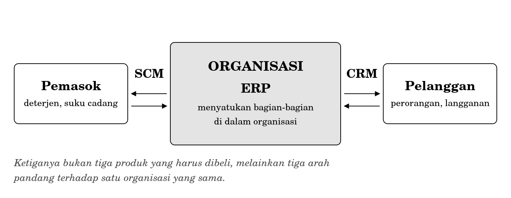
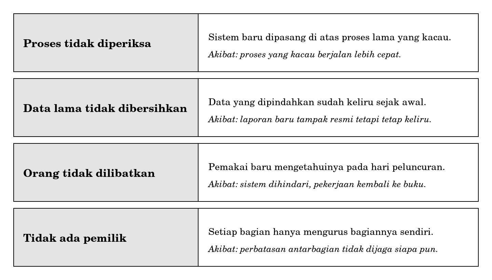
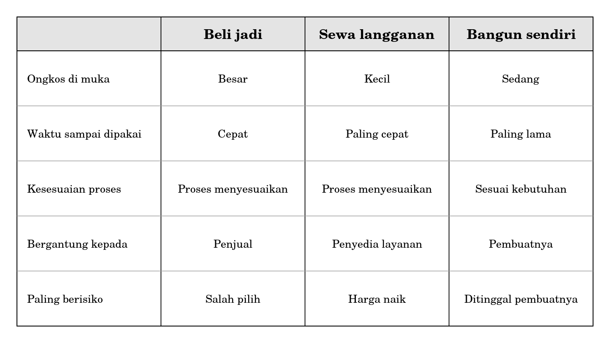

**BAGIAN IV RAGAM SISTEM INFORMASI**

**Bab 10**

**Enterprise Systems dan Keunggulan Kompetitif**

**Peta bab**

**Sub-CPMK yang diampu.** Mampu mengklasifikasikan jenis sistem informasi dan mengevaluasi kesesuaiannya terhadap masalah organisasi.

Bab 9 menggolongkan sistem menurut tingkat keputusan yang dilayaninya. Bab ini menggolongkan menurut cakupannya. Enterprise systems adalah sistem yang mencakup seluruh organisasi sekaligus, dan justru cakupan itulah yang membuatnya bermanfaat sekaligus sering gagal.

Setelah membaca bab ini Anda akan mampu:

1.  menjelaskan masalah pulau-pulau data dan mengapa masalah itu melahirkan enterprise systems;

2.  membedakan ERP, CRM, dan SCM menurut arah pandangnya terhadap organisasi;

3.  menjelaskan mengapa yang mahal dari integrasi bukan perangkat lunaknya melainkan kesepakatannya;

4.  menyebutkan empat sebab lazim kegagalan proyek enterprise system;

5.  membedakan keunggulan yang mudah ditiru dari yang sulit ditiru;

6.  merekomendasikan beli, sewa, atau bangun sendiri untuk sebuah kasus, beserta konsekuensinya.

**Bab prasyarat.** Bab 2 untuk empat komponen dan gagasan sosio-teknis, Bab 6 untuk struktur dan rantai nilai, Bab 9 untuk penggolongan jenis sistem.

**Kata kunci.** Enterprise system, ERP, CRM, SCM, pulau data, integrasi, keunggulan kompetitif, beli sewa bangun.

**Yang akan Anda hasilkan.** Satu rekomendasi pengadaan tertulis, memuat pilihan yang diambil, ongkos yang ditanggung, risiko yang diterima, dan alasan menolak pilihan lain.

**“Semuanya terintegrasi”**

Seorang penjual perangkat lunak datang menemui Pak Hardi dengan tawaran yang disebutnya sistem ERP untuk usaha laundry. Paparannya rapi. Semua bagian terhubung dalam satu basis data. Laporan tersusun otomatis. Pemilik dapat memantau keempat gerai dari telepon genggamnya. Harganya puluhan juta rupiah di muka, ditambah biaya perawatan tiap tahun.

Pak Hardi mendengarkan sampai selesai, lalu mengajukan satu pertanyaan yang sangat sederhana: masalah saya yang mana yang diselesaikan oleh barang ini?

Penjual itu menjawab: semuanya.

Jawaban semacam itu, dalam pengalaman banyak organisasi, hampir selalu berarti tidak satu pun. Sesuatu yang menjawab semua masalah biasanya tidak dirancang untuk menjawab masalah tertentu, dan organisasi yang membelinya akan menghabiskan tahun pertama mencari tahu masalah mana yang sebenarnya sedang diselesaikan.

Bab ini tentang cara menjawab pertanyaan Pak Hardi dengan lebih baik daripada penjual tadi. Bukan dengan menolak enterprise system, sebab kadang ia memang jawabannya, melainkan dengan mengetahui masalah seperti apa yang benar-benar diselesaikannya.

**10.1 Masalah yang melahirkan enterprise systems**

Bayangkan Laundry Nusa sebagaimana adanya sekarang. Empat gerai, empat buku catatan. Bagian produksi memegang catatannya sendiri mengenai muatan mesin. Urusan pemasok deterjen ditangani lewat percakapan telepon dan tidak dicatat di mana pun. Manajer operasional menyimpan catatan tersendiri mengenai jadwal petugas.

Setiap bagian punya catatannya sendiri, dan catatan-catatan itu tidak pernah dipertemukan. Inilah yang disebut pulau data.

|                                                                                                                                                                  |
|------------------------------------------------------------------------------------------------------------------------------------------------------------------|
| *Pulau data adalah keadaan ketika kejadian yang sama dicatat berkali-kali oleh bagian yang berbeda, dalam bentuk yang berbeda, tanpa ada yang menghubungkannya.* |

Gejalanya mudah dikenali. Pertanyaan yang terdengar sederhana menuntut menelepon empat orang. Angka yang sama disebut berbeda oleh dua bagian, dan keduanya yakin bahwa angkanya benar. Pekerjaan yang sama dikerjakan dua kali karena bagian yang satu tidak tahu bahwa bagian yang lain sudah mengerjakannya.

Dari sinilah gagasan enterprise system lahir.

|                                                                                                          |
|----------------------------------------------------------------------------------------------------------|
| *Integrasi berarti satu kejadian dicatat satu kali, lalu dipakai oleh semua bagian yang membutuhkannya.* |

Perhatikan bahwa definisi itu sama sekali tidak menyebut perangkat lunak. Ini disengaja, dan akan dibahas pada Subbab 10.3.

**10.2 ERP, CRM, dan SCM: tiga arah pandang**

Ketiga singkatan itu paling sering diperkenalkan sebagai tiga jenis produk. Cara itu menyesatkan. Lebih tepat memandangnya sebagai tiga arah pandang terhadap satu organisasi yang sama.

**Gambar 10.1 Tiga arah pandang terhadap satu organisasi**

**ERP** memandang ke dalam. Ia menyatukan bagian-bagian di dalam organisasi, misalnya agar pencatatan pesanan di gerai langsung terhubung dengan persediaan deterjen dan dengan pembukuan. Kepanjangannya adalah enterprise resource planning, tetapi kepanjangan itu tidak banyak menolong pemahaman.

**CRM** memandang ke arah pelanggan. Ia menyatukan segala sesuatu yang diketahui organisasi mengenai seorang pelanggan, termasuk riwayat pesanannya dan keluhannya, sehingga siapa pun yang melayani pelanggan itu berbicara dengan pengetahuan yang sama.

**SCM** memandang ke arah pemasok. Ia menghubungkan kebutuhan bahan dengan pemesanan dan pengiriman, sehingga persediaan tidak habis mendadak dan tidak menumpuk berlebihan.

Satu organisasi dapat memerlukan ketiga arah pandang itu, dua di antaranya, atau hanya satu. Laundry Nusa hampir pasti lebih membutuhkan arah pandang pelanggan daripada arah pandang pemasok, sebab pemasoknya sedikit dan hubungannya sederhana, sedangkan pelanggannya banyak dan sebagian pergi tanpa pamit.

**10.3 Integrasi adalah gagasan, bukan produk**

Subbab ini memuat pesan terpenting bab ini, dan pesan itu bertentangan dengan hampir seluruh paparan penjualan yang akan Anda dengar kelak.

Laundry Nusa dapat memperoleh sebagian besar manfaat integrasi tanpa membeli apa pun. Satu berkas bersama yang dapat dibuka dan diisi oleh keempat penanggung jawab gerai sudah memenuhi definisi pada Subbab 10.1: kejadian dicatat satu kali dan dipakai oleh semua yang membutuhkannya.

Kalau begitu, mengapa organisasi menghabiskan uang begitu banyak untuk integrasi? Karena bagian yang mahal bukan tempat penyimpanannya, melainkan kesepakatannya.

Agar satu berkas bersama benar-benar bekerja, keempat gerai harus menyepakati sejumlah hal yang tampak sepele.

- Istilah yang sama. Apakah “kilat” berarti selesai dalam sehari atau dalam dua belas jam? Kalau Gebang memakai arti pertama dan Klampis memakai arti kedua, angka gabungannya tidak berarti apa-apa.

- Kode yang sama. Apakah pelanggan bernama Rina di Keputih adalah orang yang sama dengan Rina di Gebang? Tanpa penanda yang disepakati, pertanyaan itu tidak dapat dijawab.

- Waktu yang sama. Apakah pekan dihitung mulai Senin atau mulai Minggu? Perbedaan sehari membuat perbandingan antargerai keliru.

- Kewenangan yang sama. Siapa yang boleh mengubah catatan yang sudah tersimpan, dan siapa yang hanya boleh membacanya?

Keempat kesepakatan itu tidak dapat dibeli. Ia harus dirundingkan, dan perundingan semacam itu memakan waktu justru karena setiap bagian merasa caranya sendiri sudah benar.

Ini adalah gagasan Bab 2 yang muncul kembali dalam ukuran yang jauh lebih besar. Perubahan teknisnya kecil, yaitu satu berkas bersama. Perubahan manusianya besar, yaitu empat orang yang harus berhenti memakai cara masing-masing. Proyek integrasi yang gagal hampir selalu gagal pada bagian yang kedua.

**10.4 Mengapa proyek enterprise system sering gagal**

Kegagalan proyek semacam ini banyak dibahas dalam kepustakaan sistem informasi. Angka mengenai tingkat kegagalannya beredar luas, tetapi angka-angka itu sulit diverifikasi dan cara menghitungnya berbeda-beda, sehingga buku ini tidak mengutip satu pun di antaranya. Yang lebih berguna bagi Anda adalah pola sebabnya, dan pola itu cukup ajek.

**Gambar 10.3 Empat sebab lazim kegagalan proyek enterprise system**

Sebab pertama adalah yang paling mudah dihindari dan paling sering terjadi. Ia sudah Anda kenal sejak Bab 7 dan Bab 9: memasang sistem di atas proses yang belum diperiksa hanya membuat proses yang kacau berjalan lebih cepat, dengan kekeliruan yang menumpuk lebih banyak dalam waktu yang sama.

Sebab keempat adalah yang paling sulit. Enterprise system menurut sifatnya melintasi seluruh bagian, sehingga tidak ada satu bagian pun yang wajar dijadikan pemiliknya. Kalau tidak ada seorang pun yang bertanggung jawab atas keseluruhan, perbatasan antarbagian tidak dijaga siapa pun, dan Anda sudah tahu sejak Bab 7 bahwa di perbatasan itulah masalah lahir.

Perhatikan bahwa tidak satu pun dari keempat sebab tersebut bersifat teknis. Tidak ada yang menyebut bahasa pemrograman, kecepatan jaringan, atau kapasitas penyimpanan. Ini bukan kebetulan.

**10.5 Sistem informasi dan keunggulan kompetitif**

Sampai di sini pembahasan bertumpu pada gagasan bahwa sistem informasi menyelesaikan masalah. Ada sisi lain yang perlu disebut: sistem informasi juga dapat membuat sebuah organisasi lebih unggul daripada pesaingnya.

Gagasan ini dibahas secara berpengaruh oleh Porter dan Millar pada 1985, yang menunjukkan bahwa informasi mengubah cara organisasi bersaing, bukan sekadar mempercepat pekerjaannya. Tiga cara pokoknya masih relevan sampai sekarang.

| **Cara**           | **Isinya**                                                      | **Contoh pada Laundry Nusa**                                             |
|--------------------|-----------------------------------------------------------------|--------------------------------------------------------------------------|
| Menurunkan ongkos  | Pekerjaan yang sama dikerjakan dengan sumber daya lebih sedikit | Penjadwalan muatan mesin yang mengurangi jumlah pencucian setengah penuh |
| Membedakan layanan | Menawarkan sesuatu yang tidak ditawarkan pesaing                | Janji waktu selesai yang dapat dipercaya karena antreannya terpantau     |
| Mengubah cakupan   | Melayani pihak yang sebelumnya tidak terjangkau                 | Menerima pesanan dari kos yang jauh karena pengantaran terjadwal         |

**10.5.1 Keunggulan yang mudah ditiru dan yang sulit**

Ada satu pembedaan yang jauh lebih berguna bagi Anda daripada ketiga cara di atas, dan pembedaan itu jarang disebut dalam paparan penjualan.

|                                                                                                                                    |
|------------------------------------------------------------------------------------------------------------------------------------|
| *Keunggulan yang berasal dari perangkat lunak mudah ditiru. Keunggulan yang berasal dari proses dan kebiasaan kerja sulit ditiru.* |

Kalau Laundry Nusa membuat aplikasi pemesanan, pesaing di seberang jalan dapat memesan aplikasi serupa dalam waktu satu bulan, dan setelah itu keunggulannya habis. Kalau Laundry Nusa berhasil membangun kebiasaan menepati janji waktu, yang berasal dari proses yang tertata dan petugas yang terbiasa mencatat, pesaing tidak dapat menirunya dengan membeli apa pun.

Ini juga penjelasan mengapa organisasi yang membeli perangkat lunak yang sama dengan pesaingnya sering tidak memperoleh keunggulan apa pun. Yang mereka beli memang barang yang sama, tersedia bagi siapa saja yang punya uang.

Bagi Anda sebagai calon perancang, kesimpulannya lugas. Kalau seseorang meminta Anda membangun sesuatu yang menjadi pembeda utama organisasinya, pekerjaan itu berharga. Kalau yang diminta adalah sesuatu yang sudah dijual bebas di mana-mana, pertanyaan yang jujur adalah mengapa tidak dibeli saja.

**10.6 Beli, sewa, atau bangun sendiri**

Pertanyaan terakhir dalam pengadaan sistem selalu berbentuk pilihan di antara tiga jalan.

**Gambar 10.2 Perbandingan tiga cara pengadaan**

Tabel itu tidak menunjuk pemenang, dan memang tidak dapat menunjuk pemenang. Yang dapat diberikan hanyalah satu aturan praktis yang mengikuti pembedaan pada Subbab 10.5.1.

|                                                                                                            |
|------------------------------------------------------------------------------------------------------------|
| *Bangun sendiri hanya untuk bagian yang menjadi pembeda organisasi Anda. Beli atau sewa untuk selebihnya.* |

Dua kesalahan yang lazim adalah kebalikan satu sama lain, dan keduanya berasal dari melupakan aturan tersebut. Yang pertama adalah membangun sendiri sesuatu yang sudah tersedia murah, misalnya membuat aplikasi pembukuan sendiri padahal puluhan produk sejenis sudah beredar. Yang kedua lebih halus dan lebih merugikan: membeli barang jadi untuk bagian yang justru menjadi pembeda, sehingga organisasi menyerahkan keunggulannya sendiri kepada penjual yang menjual barang yang sama kepada pesaingnya.

<table>
<colgroup>
<col style="width: 100%" />
</colgroup>
<tbody>
<tr class="odd">
<td>
<strong>Di balik layar: apa yang sebenarnya dibeli</strong>

Ketika sebuah organisasi membeli enterprise system, yang berpindah tangan bukan hanya perangkat lunak.

Setiap produk semacam itu memuat andaian mengenai bagaimana sebuah organisasi seharusnya bekerja. Andaian itu tertanam dalam urutan layarnya, dalam kolom yang wajib diisi, dalam istilah yang dipakainya, dan dalam apa yang tidak diizinkannya. Sebuah produk yang mengandaikan bahwa setiap pesanan harus punya nomor pelanggan tidak akan menerima pesanan tanpa nomor pelanggan, sekeras apa pun organisasi itu terbiasa melayani orang yang lewat begitu saja.

Karena itu pemasangan enterprise system hampir selalu berarti organisasi yang berubah, bukan perangkat lunak yang menyesuaikan. Menyesuaikan perangkat lunak agar mengikuti kebiasaan organisasi memang mungkin, tetapi biayanya besar dan akibatnya berkepanjangan, sebab setiap pemutakhiran berikutnya harus disesuaikan ulang.

Biaya penyesuaian ini sering melampaui harga lisensinya sendiri. Besarnya berbeda-beda menurut produk dan organisasi, sehingga tidak ada angka umum yang dapat dipercaya. Yang dapat Anda lakukan sebagai perancang adalah memintanya secara tertulis kepada penjual sebelum apa pun ditandatangani, dan memperlakukan ketiadaan jawaban tertulis sebagai jawaban tersendiri.
</td>
</tr>
</tbody>
</table>

<table>
<colgroup>
<col style="width: 100%" />
</colgroup>
<tbody>
<tr class="odd">
<td>
<strong>Salah kaprah</strong>

<strong>“ERP adalah sebuah produk.”</strong> ERP adalah gagasan mengenai penyatuan bagian-bagian di dalam organisasi. Produk yang mewujudkannya banyak, berbeda-beda, dan tidak satu pun berhak mengaku sebagai ERP itu sendiri.

<strong>“Kalau semua sudah terintegrasi, laporannya pasti benar.”</strong> Integrasi menyebarkan data yang benar dan data yang salah dengan kecepatan yang sama. Sebelum integrasi, kekeliruan satu bagian merugikan bagian itu saja. Sesudah integrasi, kekeliruan yang sama merugikan semua bagian sekaligus.

<strong>“Organisasi kecil tidak membutuhkan integrasi.”</strong> Integrasi tidak menuntut pembelian. Satu berkas bersama yang disepakati keempat gerai sudah merupakan bentuk integrasi, dan justru pada organisasi kecil kesepakatan semacam itu paling mungkin dicapai karena orangnya sedikit.
</td>
</tr>
</tbody>
</table>

**Studi kasus terpandu: rekomendasi pengadaan untuk Laundry Nusa**

Pak Hardi meminta pendapat Anda mengenai tawaran pada awal bab. Bagian ini menyusun jawabannya.

**Langkah 1 Kembali ke masalahnya**

Dari Bab 9 sudah diketahui bahwa Pak Hardi punya empat kebutuhan berurutan: perbaikan proses penerimaan keluhan, pencatatan keluhan dan pesanan, rekapitulasi mingguan per gerai, dan pembanding untung rugi layanan kilat.

Perhatikan bahwa tidak satu pun dari keempatnya menuntut penyatuan dengan pemasok atau pembukuan. Arah pandang yang dibutuhkan adalah ke dalam dan ke arah pelanggan, bukan ke arah pemasok.

**Langkah 2 Nilai tawaran yang ada**

| **Yang ditawarkan**             | **Kebutuhan yang dijawab** | **Penilaian**                                              |
|---------------------------------|----------------------------|------------------------------------------------------------|
| Basis data terpadu empat gerai  | Rekapitulasi mingguan      | Berguna, tetapi dapat dicapai dengan cara jauh lebih murah |
| Laporan otomatis                | Rekapitulasi mingguan      | Berguna                                                    |
| Pemantauan dari telepon genggam | Tidak ada                  | Menarik tetapi tidak menjawab kebutuhan mana pun           |
| Modul pembukuan dan persediaan  | Tidak ada                  | Tidak dibutuhkan pada tahap ini                            |
| Pencatatan keluhan              | Tidak tersedia             | Kebutuhan paling mendesak justru tidak dijawab             |

Baris terakhir menentukan segalanya. Kebutuhan yang paling mendesak, yaitu pencatatan keluhan, justru tidak disediakan oleh tawaran yang paling mahal.

**Langkah 3 Rekomendasi**

Rekomendasi yang saya ajukan terdiri atas tiga bagian, dan urutannya tidak boleh dibalik.

1.  **Kerjakan lebih dahulu yang tidak menuntut pembelian.** Tambahkan aktivitas mencatat keluhan pada saat pengambilan, dan sepakati keempat istilah pada Subbab 10.3. Ongkosnya hanya waktu, dan tanpa langkah ini semua langkah berikutnya akan mengulangi sebab pertama pada Gambar 10.3.

2.  **Sewa, jangan beli.** Untuk pencatatan dan rekapitulasi, berlangganan aplikasi sederhana jauh lebih masuk akal daripada membeli sistem besar. Ongkos di mukanya kecil, dan kalau ternyata tidak cocok, berhenti berlangganan jauh lebih murah daripada menyesal atas pembelian.

3.  **Tolak tawaran ERP untuk sekarang.** Bukan karena barangnya buruk, melainkan karena Laundry Nusa belum punya masalah yang menuntutnya. Pertanyaan Pak Hardi pada awal bab belum terjawab oleh penjualnya sendiri, dan itu alasan yang cukup.

**Langkah 4 Ongkos dan risiko yang diterima**

Rekomendasi tanpa penyebutan ongkos dan risiko bukan rekomendasi, melainkan pendapat.

| **Yang ditanggung**  | **Isinya**                                                                          |
|----------------------|-------------------------------------------------------------------------------------|
| Ongkos waktu         | Petugas gerai menambah satu pencatatan pada saat pengambilan bila ada keluhan       |
| Ongkos berlangganan  | Bulanan, berjalan terus selama layanannya dipakai                                   |
| Risiko harga naik    | Penyedia layanan dapat menaikkan tarif dan Laundry Nusa sulit berpindah             |
| Risiko data tertahan | Kalau berhenti berlangganan, data harus dapat diunduh. Ini wajib ditanyakan di muka |

Baris terakhir sering terlewat dan akibatnya paling berat. Menyewa berarti data Anda berada di tempat orang lain. Pertanyaan mengenai cara mengambilnya kembali harus diajukan sebelum berlangganan, bukan pada saat hendak berhenti.

**Kritik atas hasil sendiri**

1.  Rekomendasi ini mengandaikan ada penyedia layanan yang cocok dengan harga yang wajar. Andaian itu belum diperiksa sama sekali. Memeriksanya menuntut penelusuran pasar yang tidak dikerjakan di sini, dan tanpa pemeriksaan itu rekomendasi tersebut masih berupa arah, bukan keputusan.

2.  Rekomendasi ini mengandaikan Pak Hardi bersedia mengubah prosesnya lebih dahulu. Kalau ia menolak dan tetap ingin membeli sesuatu, seluruh susunan rekomendasi runtuh, dan yang paling mungkin terjadi adalah sebab pertama pada Gambar 10.3.

3.  Penolakan terhadap tawaran ERP didasarkan pada keadaan Laundry Nusa hari ini. Kalau kelak gerainya menjadi lima belas dan pemasoknya menjadi banyak, penilaian itu harus ditinjau ulang. Rekomendasi punya masa berlaku, dan menyebutkan masa berlakunya adalah bagian dari kejujuran.

**Rangkuman**

- Pulau data adalah keadaan ketika kejadian yang sama dicatat berkali-kali oleh bagian yang berbeda tanpa ada yang menghubungkannya.

- Integrasi berarti satu kejadian dicatat satu kali lalu dipakai oleh semua bagian yang membutuhkannya. Definisi ini tidak menyebut perangkat lunak.

- ERP, CRM, dan SCM bukan tiga produk, melainkan tiga arah pandang: ke dalam, ke pelanggan, dan ke pemasok.

- Yang mahal dari integrasi bukan tempat penyimpanannya, melainkan kesepakatan mengenai istilah, kode, waktu, dan kewenangan.

- Empat sebab lazim kegagalan proyek enterprise system tidak satu pun bersifat teknis.

- Keunggulan yang berasal dari perangkat lunak mudah ditiru. Keunggulan yang berasal dari proses dan kebiasaan sulit ditiru.

- Bangun sendiri hanya untuk bagian yang menjadi pembeda organisasi. Beli atau sewa untuk selebihnya.

- Integrasi menyebarkan data yang benar dan data yang salah dengan kecepatan yang sama.

- Rekomendasi pengadaan tanpa penyebutan ongkos, risiko, dan masa berlaku bukan rekomendasi, melainkan pendapat.

**Latihan**

Setiap soal ditandai dengan Sub-CPMK yang diukurnya.

**Tingkat A Memastikan Anda ingat**

1.  Jelaskan apa yang dimaksud dengan pulau data dan sebutkan dua gejalanya. \[Sub-CPMK-4\]

2.  Bedakan ERP, CRM, dan SCM menurut arah pandangnya. \[Sub-CPMK-4\]

3.  Mengapa buku ini menyatakan bahwa yang mahal dari integrasi bukan perangkat lunaknya? \[Sub-CPMK-4\]

4.  Sebutkan empat sebab lazim kegagalan proyek enterprise system beserta akibat masing-masing. \[Sub-CPMK-4\]

5.  Apa perbedaan antara keunggulan yang mudah ditiru dan yang sulit ditiru? Berikan satu contoh untuk masing-masing. \[Sub-CPMK-4\]

**Tingkat B Menerapkan**

1.  Sebuah kepanitiaan mahasiswa memakai empat berkas terpisah: daftar peserta, daftar pembayaran, daftar konsumsi, dan daftar sertifikat. Tunjukkan di mana letak pulau datanya dan sebutkan tiga kesepakatan yang harus dicapai sebelum keempatnya dapat disatukan. \[Sub-CPMK-4\]

2.  Untuk kepanitiaan pada soal nomor 1, tentukan pilihan pengadaan yang Anda anjurkan di antara beli, sewa, dan bangun sendiri. Pakailah aturan pada Subbab 10.6 dan sebutkan bagian mana yang menjadi pembedanya. \[Sub-CPMK-4\]

3.  Perhatikan Gambar 10.3. Untuk setiap sebab kegagalan, tuliskan satu tindakan pencegahan yang dapat dikerjakan sebelum proyek dimulai. \[Sub-CPMK-4\]

**Tingkat C Menganalisis dan menilai**

1.  Susun sebuah rekomendasi pengadaan tertulis untuk organisasi yang Anda amati pada latihan Bab 7 dan Bab 8, atau untuk organisasi pada berkas kasus cadangan. Rekomendasi harus memuat pilihan yang diambil, ongkos yang ditanggung, risiko yang diterima, alasan menolak sekurang-kurangnya dua pilihan lain, dan masa berlaku rekomendasi tersebut. Panjangnya tidak lebih dari dua halaman. \[Sub-CPMK-4\]

2.  Seorang pemilik usaha berkata: “Pesaing saya sudah punya aplikasi, jadi saya juga harus punya aplikasi supaya tidak kalah.” Nilailah pernyataan itu dengan memakai pembedaan pada Subbab 10.5.1. Apakah membeli aplikasi yang sama akan menghasilkan keunggulan? Kalau tidak, apa yang sebaiknya dikerjakan pemilik itu, dan bagaimana Anda menyampaikannya kepada orang yang sedang cemas melihat pesaingnya? \[Sub-CPMK-4\]

**Rujukan bab**

1.  Porter, M. E. dan Millar, V. E. (1985). “How Information Gives You a Competitive Advantage.” Harvard Business Review. Sumber gagasan mengenai peran informasi dalam persaingan.

2.  Laudon, K. C. dan Laudon, J. P. Management Information Systems: Managing the Digital Firm. Pearson, edisi terbaru. Bagian mengenai enterprise applications dan sistem lintas fungsi.

3.  Pearlson, K., Saunders, C. dan Galletta, D. Managing and Using Information Systems: A Strategic Approach. Wiley, edisi terbaru. Bagian mengenai keputusan pengadaan dan hubungan dengan penyedia.

4.  Dumas, M., La Rosa, M., Mendling, J. dan Reijers, H. A. (2018). Fundamentals of Business Process Management. Edisi ke-2. Berlin: Springer. Bagian mengenai hubungan antara perbaikan proses dan penerapan sistem.

**Lampiran bab: daftar gambar**

Halaman ini tidak dicetak dalam buku. Ketiga gambar sudah jadi dan tersedia dalam bentuk vektor.

| **No.** | **Judul**                                            | **Tinggi cetak** | **Status** |
|---------|------------------------------------------------------|------------------|------------|
| 10.1    | Tiga arah pandang terhadap satu organisasi           | 1,9 inci         | Selesai    |
| 10.2    | Perbandingan tiga cara pengadaan                     | 2,7 inci         | Selesai    |
| 10.3    | Empat sebab lazim kegagalan proyek enterprise system | 2,7 inci         | Selesai    |
