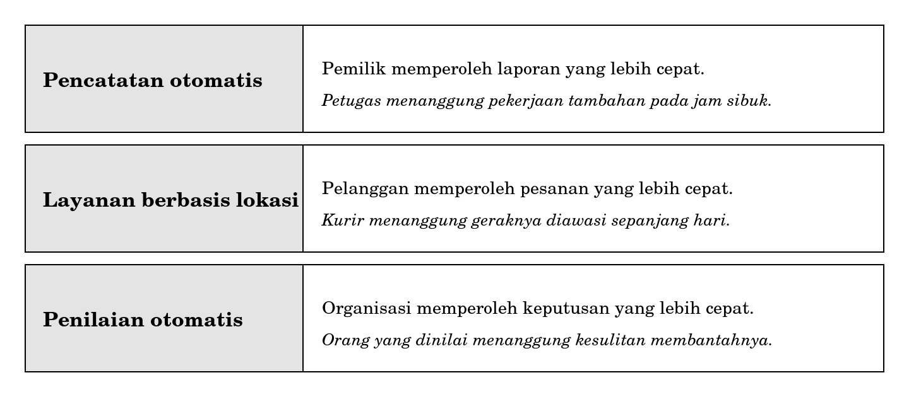
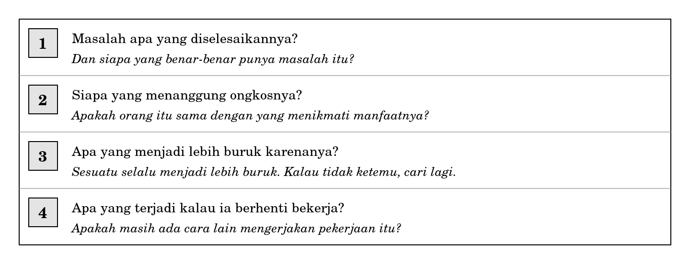

**BAGIAN V TANGGUNG JAWAB DAN ARAH KE DEPAN**

**Bab 12**

**Etika Profesi, Dampak Sosial, dan Tren Teknologi**

**Peta bab**

**Sub-CPMK yang diampu.** Mampu menjelaskan etika profesi, dampak sosial, dasar keamanan informasi, dan regulasi pelindungan data, serta menilai relevansi tren teknologi terkini bagi organisasi.

Bab 11 mengerjakan bagian keamanan dan regulasi. Bab ini mengerjakan bagian etika, dampak sosial, dan tren, dan sekaligus menutup buku.

Ketiga hal itu tampak berlainan dan sebenarnya satu. Semuanya dapat diperiksa dengan satu pertanyaan yang akan berjalan sepanjang bab ini:

|                                                                                  |
|----------------------------------------------------------------------------------|
| *Teknologi ini mengubah siapa mendapat apa, dan siapa yang menanggung biayanya?* |

Setelah membaca bab ini Anda akan mampu:

1.  menjelaskan apa yang membedakan tanggung jawab profesi dari tanggung jawab pekerjaan biasa;

2.  menelusuri sebuah kegagalan besar sampai ke keputusan tata kelola yang menyebabkannya;

3.  menyebutkan siapa yang diuntungkan dan siapa yang dibebani oleh sebuah penerapan teknologi;

4.  menilai klaim mengenai teknologi baru dengan empat pertanyaan;

5.  menyusun telaah singkat mengenai satu tren teknologi beserta dampaknya bagi sebuah organisasi.

**Bab prasyarat.** Bab 2 untuk gagasan sosio-teknis, Bab 10 untuk enterprise system dan keunggulan, Bab 11 untuk keamanan dan privasi.

**Kata kunci.** Etika profesi, tanggung jawab publik, dampak sosial, keberlanjutan, tren teknologi, telaah dampak.

**Yang akan Anda hasilkan.** Satu telaah tertulis mengenai sebuah tren teknologi dan dampaknya bagi organisasi tertentu, memuat siapa yang diuntungkan dan siapa yang dibebani.

**Yang tidak ada cadangannya**

Pada 17 Juni 2024, sebuah serangan berlangsung terhadap Pusat Data Nasional Sementara. Badan Siber dan Sandi Negara kemudian mengidentifikasinya sebagai ransomware Brain Cipher, yang merupakan varian dari LockBit 3.0. Lebih dari dua ratus instansi pemerintah terdampak, termasuk layanan keimigrasian yang membuat antrean menumpuk di bandar udara.

Penyerang meminta tebusan delapan juta dolar Amerika. Tebusan itu tidak dibayar.

Pada 27 Juni 2024, Kepala BSSN menyatakan di hadapan Dewan Perwakilan Rakyat bahwa data pada pusat data tersebut tidak memiliki cadangan.

Berhentilah pada kalimat terakhir itu.

Seluruh peristiwa tersebut bermula dari sebuah serangan yang bersifat teknis. Yang membuatnya menjadi bencana bukan serangannya. Ransomware menyandera data, dan organisasi yang memiliki cadangan dapat memulihkan diri dalam hitungan hari tanpa membayar apa pun. Yang mengubah gangguan menjadi kehilangan adalah ketiadaan cadangan, dan ketiadaan cadangan bukan kelemahan algoritma melainkan keputusan tata kelola.

Seseorang, pada suatu waktu, memutuskan bahwa pencadangan bukan prioritas. Mungkin karena anggarannya dipotong, mungkin karena tidak ada yang merasa memilikinya, mungkin karena tidak pernah ada yang bertanya. Keputusan itu tidak pernah tampak sebagai keputusan besar pada saat diambil.

Inilah sebabnya bab mengenai etika ditempatkan di sini dan bukan di bidang lain. Kegagalan terbesar dalam pekerjaan Anda kelak kemungkinan besar tidak berbentuk kode yang salah.

**12.1 Apa yang membedakan profesi**

Sebuah pekerjaan menjadi profesi ketika pemegangnya menanggung tanggung jawab yang melampaui kepentingan orang yang membayarnya.

Perbedaan itu mudah dipahami pada bidang kesehatan. Seorang dokter yang diminta pemilik perusahaan menyatakan seorang pekerja sehat padahal tidak, menghadapi persoalan yang jelas: ia digaji perusahaan, tetapi tanggung jawabnya kepada pekerja itu tidak hilang karenanya.

Pada bidang teknologi informasi, persoalan yang sama muncul dalam bentuk yang jauh lebih kabur, dan kekaburannya berasal dari jarak.

Orang yang menulis kode program biasanya tidak pernah bertemu orang yang terkena akibatnya. Seseorang menyusun aturan penolakan otomatis pada sebuah layanan, dan bertahun-tahun kemudian ada orang yang permohonannya ditolak tanpa penjelasan yang dapat dipahami. Keduanya tidak pernah berada dalam satu ruangan. Tidak ada seorang pun yang berniat jahat, dan akibatnya tetap terjadi.

|                                                                                                                                                                                                                             |
|-----------------------------------------------------------------------------------------------------------------------------------------------------------------------------------------------------------------------------|
| *Jarak antara orang yang membuat dan orang yang menanggung akibat adalah ciri khas persoalan etika di bidang teknologi informasi. Ia bukan alasan untuk lepas tangan, melainkan sebab mengapa persoalannya sulit disadari.* |

Dari sini muncul dua pertanyaan yang sudah diperkenalkan pada Bab 3 dan sekarang dapat dikerjakan sungguh-sungguh.

1.  Siapa yang terkena akibat pekerjaan saya, dan apakah saya pernah bertemu dengannya?

2.  Kalau pekerjaan saya keliru, siapa yang menanggungnya, dan apakah orang itu punya cara membantah?

Pertanyaan kedua bagiannya yang terakhir yang paling menentukan. Sebuah sistem yang keliru tetapi dapat dibantah menimbulkan kerepotan. Sebuah sistem yang keliru dan tidak dapat dibantah menimbulkan ketidakadilan.

**12.2 Tanggung jawab yang tidak dipegang siapa pun**

Kembali ke cerita pembuka. Pertanyaan yang berguna bukan siapa yang bersalah, melainkan bagaimana sebuah keputusan sebesar itu dapat diambil tanpa ada yang menyadarinya sebagai keputusan besar.

Anda sudah memiliki alat untuk menjawabnya, dan alat itu berasal dari Bab 6.

Pencadangan data adalah pekerjaan yang melintasi banyak bagian. Ia bukan milik bagian jaringan, bukan milik bagian aplikasi, bukan milik bagian anggaran, dan bukan milik satu instansi pengguna mana pun. Sesuatu yang melintasi semua bagian dan tidak ditunjuk pemiliknya akan menjadi milik semua orang, dan sesuatu yang menjadi milik semua orang pada praktiknya tidak dikerjakan siapa pun.

Perhatikan bahwa penjelasan ini tidak membebaskan siapa pun. Ia justru menunjuk tempat tanggung jawab seharusnya berada, yaitu pada orang yang berwenang menetapkan siapa memiliki apa. Menyatakan bahwa sebuah kegagalan bersifat struktural bukan cara untuk menutup pembicaraan, melainkan cara untuk membuka pembicaraan yang benar.

<table>
<colgroup>
<col style="width: 100%" />
</colgroup>
<tbody>
<tr class="odd">
<td>
<strong>Catatan mengenai kasus ini</strong>

Kronologi pada cerita pembuka disusun dari pernyataan resmi BSSN dan Kementerian Komunikasi dan Informatika serta pemberitaan media arus utama. Penyelidikan dan penilaian atas peristiwa tersebut berlangsung setelahnya, dan sebagian keterangan dapat berubah.

Buku ini memakai kasus tersebut sebagai bahan belajar mengenai tata kelola, bukan sebagai penilaian terhadap orang atau lembaga tertentu. Ketika Anda memakainya dalam diskusi kelas, pertahankan pembedaan yang sama.
</td>
</tr>
</tbody>
</table>

**12.3 Dampak sosial: siapa mendapat apa**

Setiap penerapan teknologi mengubah pembagian. Ada yang memperoleh sesuatu dan ada yang menanggung sesuatu, dan kedua pihak itu sering bukan orang yang sama.

**Gambar 12.2 Siapa memperoleh apa dan siapa menanggung apa**

Ketiga baris pada gambar itu punya bentuk yang sama. Yang memperoleh manfaat berada lebih tinggi dalam susunan organisasi daripada yang menanggung bebannya. Ini bukan kebetulan, melainkan akibat dari siapa yang biasanya memutuskan penerapan sebuah teknologi.

Menyadari pola ini tidak berarti menolak teknologi. Pencatatan otomatis memang berguna, dan laporan yang lebih cepat memang menolong. Yang dituntut hanyalah kejujuran dalam menyebutkan bebannya, sebab beban yang tidak disebutkan tidak akan pernah diringankan.

Bagi Anda sebagai calon perancang, ada satu kebiasaan yang layak dibangun. Ketika mengusulkan sesuatu, sebutkan tiga hal sekaligus: apa yang diperoleh, siapa yang memperolehnya, dan siapa yang menanggung ongkosnya. Usulan yang hanya menyebutkan bagian pertama bukan usulan yang jujur, meskipun seluruh isinya benar.

**12.3.1 Keberlanjutan**

Satu jenis beban yang hampir selalu terlewat adalah beban terhadap lingkungan, sebab ia tidak ditanggung oleh siapa pun yang hadir dalam ruang rapat.

Perangkat keras yang diganti setiap tiga tahun menjadi limbah elektronik. Layanan yang berjalan terus-menerus memakan tenaga listrik yang sebagian besar masih berasal dari bahan bakar fosil. Model kecerdasan artifisial yang besar menuntut tenaga dan air pendingin dalam jumlah yang jauh lebih besar daripada yang dibayangkan pemakainya.

Angka pastinya berbeda-beda menurut jenis perangkat, tempat, dan cara menghitungnya, dan angka yang beredar luas sering tidak dapat diverifikasi. Buku ini karena itu tidak mengutip satu pun. Yang perlu Anda bawa bukan angkanya, melainkan kesadaran bahwa kolom ongkos pada usulan Anda hampir selalu belum lengkap.

**12.4 Menilai klaim mengenai teknologi baru**

Sepanjang karier Anda, teknologi baru akan terus muncul dan selalu disertai klaim yang besar. Sebagian klaim itu benar, sebagian tidak, dan sebagian benar untuk organisasi tertentu dan keliru untuk organisasi lain.

Yang dibutuhkan bukan pengetahuan mengenai setiap teknologi, sebab itu mustahil. Yang dibutuhkan adalah empat pertanyaan yang dapat diajukan terhadap apa pun.

**Gambar 12.1 Empat pertanyaan untuk menilai klaim teknologi baru**

Pertanyaan ketiga adalah yang paling sering menghasilkan temuan dan paling sering dilewati. Setiap perubahan membuat sesuatu menjadi lebih buruk. Pencatatan otomatis membuat pencatatan lebih cepat dan membuat penyimpangan dari aturan menjadi lebih sulit, padahal penyimpangan itu kadang justru yang menyelamatkan pelanggan yang keadaannya tidak biasa.

Kalau setelah dipikirkan Anda tetap tidak menemukan apa pun yang menjadi lebih buruk, kemungkinan besar Anda belum cukup memikirkannya, bukan bahwa teknologinya sempurna.

Pertanyaan keempat menjadi semakin penting seiring bertambahnya ketergantungan. Cerita pembuka bab ini adalah jawaban atas pertanyaan keempat yang tidak pernah diajukan.

**12.5 Tiga tren dan dampaknya**

Bagian ini membahas tiga tren yang sedang menonjol pada saat naskah ini disusun. Pembahasannya sengaja tidak menjelaskan cara kerjanya, sebab itu lingkup mata kuliah lain. Yang dibahas hanya dampaknya bagi organisasi.

**12.5.1 Komputasi awan**

Yang berubah: organisasi tidak lagi memiliki perangkatnya sendiri, melainkan menyewa kemampuan komputasi dari pihak lain.

Yang diperoleh: ongkos di muka menjadi kecil, dan organisasi kecil dapat memakai kemampuan yang dahulu hanya terjangkau organisasi besar.

Yang menjadi lebih buruk: organisasi menjadi bergantung pada pihak yang tidak dikendalikannya, dan datanya berada di tempat orang lain. Pertanyaan mengenai cara mengambil kembali data ketika berhenti berlangganan, yang sudah Anda temui pada Bab 10, berlaku penuh di sini.

**12.5.2 Data dalam jumlah besar**

Yang berubah: menyimpan segalanya menjadi jauh lebih murah daripada memilih apa yang perlu disimpan.

Yang diperoleh: pola yang dahulu tidak terlihat menjadi dapat ditemukan, dan pertanyaan yang belum terpikirkan pada saat pengumpulan masih mungkin dijawab kemudian.

Yang menjadi lebih buruk: kebiasaan mengumpulkan tanpa tujuan yang jelas, yang bertentangan langsung dengan asas pembatasan tujuan pada Bab 11 dan dengan uji lalu apa pada Bab 8. Murahnya penyimpanan tidak mengubah kewajiban hukum dan tidak mengubah risiko kebocoran.

**12.5.3 Kecerdasan artifisial**

Yang berubah: sebagian keputusan yang dahulu diambil orang kini dapat diambil oleh perangkat lunak yang mempelajari pola dari data masa lalu.

Yang diperoleh: keputusan menjadi jauh lebih cepat dan jauh lebih murah, terutama untuk keputusan berulang dalam jumlah besar.

Yang menjadi lebih buruk: dua hal sekaligus. Pertama, keputusan menjadi sulit dibantah, sebab orang yang dinilai tidak memperoleh penjelasan yang dapat dipahaminya. Kedua, pola yang dipelajari berasal dari data masa lalu, sehingga ketidakadilan yang ada di masa lalu ikut dipelajari dan diulang dengan kecepatan yang jauh lebih tinggi.

Perhatikan bahwa keberatan kedua bukan keberatan teknis. Ia tidak dapat diselesaikan dengan model yang lebih besar atau data yang lebih banyak, sebab justru datanya yang menjadi sumber persoalan.

<table>
<colgroup>
<col style="width: 100%" />
</colgroup>
<tbody>
<tr class="odd">
<td>
<strong>Di balik layar: ongkos yang tidak muncul pada penawaran</strong>

Setiap penawaran teknologi memuat daftar harga, dan daftar itu hampir selalu tidak lengkap. Ada empat jenis ongkos yang jarang tercantum.

<strong>Ongkos belajar.</strong> Setiap orang yang harus memakainya kehilangan sebagian kemampuannya selama beberapa pekan pertama. Pada organisasi dengan lima puluh pemakai, jumlahnya besar dan tidak pernah dihitung.

<strong>Ongkos berhenti.</strong> Berapa mahal dan berapa lama untuk keluar apabila kelak tidak cocok. Ongkos ini biasanya baru diketahui pada saat hendak keluar, dan pada saat itu sudah terlambat menawarnya.

<strong>Ongkos pemeliharaan pengetahuan.</strong> Orang yang memahami sistem tersebut suatu saat akan pindah kerja. Kalau pengetahuannya tidak pernah dituliskan, organisasi akan membayar dua kali.

<strong>Ongkos yang ditanggung pihak lain.</strong> Limbah elektronik, tenaga listrik, dan waktu pemakai yang bukan pegawai organisasi tersebut. Ongkos ini tidak muncul dalam pembukuan mana pun, dan justru karena itu ia harus dituliskan secara sadar.

Menuliskan keempatnya tidak akan membuat Anda populer dalam rapat pengambilan keputusan. Tidak menuliskannya akan membuat Anda ikut bertanggung jawab atas keputusan yang diambil berdasarkan gambaran yang tidak lengkap.
</td>
</tr>
</tbody>
</table>

<table>
<colgroup>
<col style="width: 100%" />
</colgroup>
<tbody>
<tr class="odd">
<td>
<strong>Salah kaprah</strong>

<strong>“Etika itu urusan pribadi, bukan urusan teknis.”</strong> Sebagian besar persoalan etika di bidang ini berbentuk keputusan rancangan: data apa yang dikumpulkan, siapa yang dapat membantah, apa yang terjadi ketika sistem keliru. Ketiganya diputuskan oleh orang yang merancang, bukan oleh orang yang berkhotbah.

<strong>“Teknologi itu netral, yang menentukan pemakaiannya.”</strong> Pernyataan ini benar sebagian dan menyesatkan sebagian. Sebuah rancangan menentukan apa yang mudah dan apa yang sulit dilakukan dengannya, dan penentuan itu sudah merupakan pilihan. Formulir yang mewajibkan nomor induk kependudukan tidak netral terhadap orang yang tidak ingin memberikannya.

<strong>“Kalau semua orang melakukannya, berarti tidak apa-apa.”</strong> Sebagian besar praktik pengumpulan data yang berlebihan menyebar justru karena setiap organisasi meniru formulir organisasi lain. Kelaziman bukan dasar pemrosesan yang sah menurut UU PDP, dan bukan pembenaran menurut ukuran mana pun.
</td>
</tr>
</tbody>
</table>

**Studi kasus terpandu: penilaian otomatis pada seleksi asisten praktikum**

Sebuah program studi menerima lebih dari tiga ratus lamaran untuk tiga puluh posisi asisten praktikum setiap semester. Seleksinya memakan waktu berminggu-minggu. Seorang dosen mengusulkan penilaian otomatis yang mengurutkan pelamar berdasarkan nilai mata kuliah terkait, indeks prestasi, dan riwayat menjadi asisten sebelumnya.

Jalankan keempat pertanyaan pada Gambar 12.1.

**Pertanyaan 1 Masalah apa yang diselesaikannya**

Masalahnya nyata dan dapat disebutkan: waktu seleksi yang panjang dan beban kerja panitia. Pemilik masalah ini adalah panitia seleksi dan program studi, bukan pelamar.

Pembedaan itu perlu dicatat sejak awal. Pelamar tidak sedang mengeluhkan lamanya seleksi. Yang mereka keluhkan, kalau ditanya, kemungkinan besar hal lain.

**Pertanyaan 2 Siapa menanggung ongkosnya**

| **Pihak**                | **Yang diperoleh**                        | **Yang ditanggung**                            |
|--------------------------|-------------------------------------------|------------------------------------------------|
| Panitia seleksi          | Waktu seleksi jauh lebih singkat          | Waktu awal untuk menyusun aturannya            |
| Program studi            | Proses yang tampak lebih adil dan seragam | Tanggung jawab bila urutannya keliru           |
| Pelamar yang lolos       | Kepastian lebih cepat                     | Tidak ada yang berarti                         |
| Pelamar yang tidak lolos | Tidak ada                                 | Penolakan tanpa penjelasan yang dapat dibantah |

Baris terakhir adalah baris yang menentukan seluruh penilaian. Yang menanggung beban terbesar adalah pihak yang paling tidak berdaya dan paling tidak hadir dalam pengambilan keputusan.

**Pertanyaan 3 Apa yang menjadi lebih buruk**

1.  Mahasiswa yang nilainya biasa saja tetapi sangat baik dalam mengajar tidak akan pernah muncul di urutan atas, sebab kemampuan mengajar tidak ada dalam data yang dipakai. Sebelum ada penilaian otomatis, kemampuan itu masih mungkin tertangkap oleh dosen yang mengenalnya.

2.  Riwayat menjadi asisten sebelumnya memperkuat dirinya sendiri. Yang pernah menjadi asisten lebih mungkin terpilih lagi, sehingga mahasiswa yang belum pernah semakin sulit memulai. Ketidakadilan yang ada sebelumnya ikut dipelajari dan diperkuat.

3.  Penolakan menjadi sulit dibantah. Sebelumnya seorang pelamar dapat menemui panitia dan menjelaskan keadaannya. Sesudahnya, jawaban yang diterimanya adalah bahwa sistem menempatkannya di urutan ke seratus dua puluh.

**Pertanyaan 4 Kalau ia berhenti bekerja**

Kalau penilaian otomatis tidak dapat dipakai pada suatu semester, apakah panitia masih tahu cara menyeleksi secara manual? Setelah dua atau tiga semester, kemungkinan besar tidak, sebab orang yang dahulu mengerjakannya sudah lulus dan caranya tidak pernah dituliskan.

Ini ongkos pemeliharaan pengetahuan yang disebut pada kotak Di Balik Layar, muncul dalam bentuk yang sangat nyata.

**Kesimpulan dan usulan**

Penilaian saya: usulan itu layak diteruskan, dengan tiga syarat yang tidak boleh ditawar.

1.  **Urutan otomatis dipakai sebagai penyaring awal, bukan sebagai keputusan akhir.** Panitia tetap membaca seluruh berkas pada tahap kedua. Yang dihemat adalah tahap pertama, dan itu sudah cukup besar.

2.  **Alasan penolakan disampaikan dalam bentuk yang dapat dibantah.** Pelamar berhak mengetahui aspek mana yang menempatkannya di bawah, dan berhak mengajukan keterangan tambahan.

3.  **Riwayat menjadi asisten sebelumnya diberi bobot yang lebih kecil, atau dihapus sama sekali.** Tanpa ini, sistem akan memperkuat ketimpangan yang sudah ada, dan hasilnya akan terlihat semakin wajar dari tahun ke tahun justru karena angkanya konsisten.

Perhatikan bahwa ketiga syarat itu tidak menuntut kemampuan teknis tambahan. Ketiganya adalah keputusan rancangan yang diambil sebelum satu baris kode pun ditulis, dan justru karena itu ia mudah dilupakan.

**Kritik atas hasil sendiri**

1.  Penilaian ini mengandaikan bahwa seleksi manual yang berjalan sekarang lebih adil. Andaian itu belum diperiksa. Ada kemungkinan seleksi manual justru lebih dipengaruhi kedekatan pribadi, dan bila demikian, penilaian otomatis dengan ketiga syarat di atas mungkin lebih adil daripada keadaan sekarang.

2.  Syarat kedua menuntut penjelasan yang dapat dipahami pelamar. Menyusun penjelasan semacam itu tidak selalu mudah, dan pada sebagian jenis model bahkan sangat sulit. Menuliskan syarat itu tanpa memeriksa apakah ia dapat dipenuhi adalah bentuk kelalaian tersendiri.

**Penutup buku**

Buku ini dibuka dengan sebuah angka yang tidak berarti apa-apa, dan ditutup dengan sebuah keputusan yang tidak dapat diserahkan kepada siapa pun.

Di antara keduanya Anda mempelajari cara memandang sesuatu sebagai sistem, cara membongkarnya menjadi empat komponen, cara menilai kualitas dan nilai informasi, cara memetakan proses dan menurunkan kebutuhan informasi darinya, cara memilih jenis sistem yang sesuai, dan cara menimbang siapa yang diuntungkan dan siapa yang dibebani.

Tidak satu pun dari keterampilan itu menuntut Anda menulis kode program, dan tidak satu pun akan menjadi usang ketika bahasa pemrograman yang Anda pelajari kelak digantikan yang lain.

Pada tujuh semester berikutnya Anda akan belajar membuat. Yang diminta buku ini hanyalah satu kebiasaan yang dibawa serta: sebelum membuat, tanyakan lebih dahulu untuk siapa, untuk keputusan apa, dan siapa yang menanggung ongkosnya. Tiga pertanyaan itu tidak memakan waktu lebih dari beberapa menit, dan tidak jarang menghemat berbulan-bulan.

**Rangkuman**

- Sebuah pekerjaan menjadi profesi ketika pemegangnya menanggung tanggung jawab yang melampaui kepentingan orang yang membayarnya.

- Ciri khas persoalan etika di bidang ini adalah jarak antara orang yang membuat dan orang yang menanggung akibat.

- Sistem yang keliru tetapi dapat dibantah menimbulkan kerepotan. Sistem yang keliru dan tidak dapat dibantah menimbulkan ketidakadilan.

- Kegagalan besar sering berasal dari keputusan tata kelola, bukan dari kelemahan teknis.

- Setiap penerapan teknologi mengubah pembagian. Yang memperoleh manfaat dan yang menanggung beban sering bukan orang yang sama.

- Usulan yang hanya menyebutkan manfaatnya bukan usulan yang jujur, meskipun seluruh isinya benar.

- Empat pertanyaan untuk menilai klaim teknologi: masalah apa, siapa menanggung ongkos, apa yang menjadi lebih buruk, dan apa yang terjadi bila ia berhenti bekerja.

- Kalau Anda tidak menemukan apa pun yang menjadi lebih buruk, kemungkinan besar Anda belum cukup memikirkannya.

- Kecerdasan artifisial mempelajari pola dari data masa lalu, sehingga ketidakadilan masa lalu ikut dipelajari dan diulang lebih cepat.

- Empat ongkos yang jarang tercantum pada penawaran: ongkos belajar, ongkos berhenti, ongkos pemeliharaan pengetahuan, dan ongkos yang ditanggung pihak lain.

**Latihan**

Setiap soal ditandai dengan Sub-CPMK yang diukurnya.

**Tingkat A Memastikan Anda ingat**

1.  Apa yang membedakan profesi dari pekerjaan biasa, dan mengapa perbedaan itu kabur pada bidang teknologi informasi? \[Sub-CPMK-5\]

2.  Sebutkan empat pertanyaan untuk menilai klaim teknologi baru. \[Sub-CPMK-5\]

3.  Mengapa pertanyaan ketiga disebut paling sering menghasilkan temuan dan paling sering dilewati? \[Sub-CPMK-5\]

4.  Sebutkan empat jenis ongkos yang jarang tercantum pada penawaran teknologi. \[Sub-CPMK-5\]

5.  Mengapa keberatan mengenai kecerdasan artifisial yang mengulang ketidakadilan masa lalu disebut bukan keberatan teknis? \[Sub-CPMK-5\]

**Tingkat B Menerapkan**

1.  Pilih satu penerapan teknologi yang Anda pakai di kampus. Susun tabel seperti pada Pertanyaan 2 studi kasus, memuat pihak, yang diperoleh, dan yang ditanggung. Sertakan sekurang-kurangnya empat pihak. \[Sub-CPMK-5\]

2.  Untuk penerapan pada soal nomor 1, jawab pertanyaan ketiga pada Gambar 12.1. Kalau Anda tidak menemukan apa pun yang menjadi lebih buruk, tuliskan proses berpikir Anda dan mintalah pendapat satu orang lain sebelum menyimpulkan. \[Sub-CPMK-5\]

3.  Ambil satu berita mengenai teknologi baru dari media arus utama. Jalankan keempat pertanyaan pada Gambar 12.1 terhadap klaim yang dimuat berita tersebut, dan tandai bagian mana dari klaim itu yang tidak dapat Anda periksa. \[Sub-CPMK-5\]

**Tingkat C Menganalisis dan menilai**

1.  Susun telaah tertulis sepanjang dua halaman mengenai satu tren teknologi dan dampaknya bagi sebuah organisasi tertentu yang Anda pilih. Telaah harus memuat: apa yang berubah, siapa yang memperoleh manfaat, siapa yang menanggung beban, apa yang menjadi lebih buruk, dan apa yang terjadi bila teknologi itu berhenti bekerja. Sertakan pula pernyataan mengenai bagian mana dari telaah Anda yang berupa dugaan dan bagian mana yang dapat ditunjukkan sumbernya. \[Sub-CPMK-5\]

2.  Seorang teman berkata bahwa memikirkan dampak sosial bukan tugas seorang lulusan Teknik Informatika, melainkan tugas orang yang mengambil keputusan. Nilailah pendirian itu. Bagian mana yang masuk akal dan bagian mana yang tidak? Dalam jawaban Anda, jelaskan pula apa yang sebaiknya dilakukan seseorang yang benar-benar tidak punya kewenangan memutuskan, tetapi melihat sesuatu yang menurutnya keliru. Jawaban yang baik tidak berhenti pada seruan moral, melainkan menyebutkan tindakan yang benar-benar dapat dikerjakan seorang pegawai baru. \[Sub-CPMK-5\]

**Rujukan bab**

1.  Pernyataan resmi Badan Siber dan Sandi Negara dan Kementerian Komunikasi dan Informatika mengenai serangan terhadap Pusat Data Nasional Sementara, Juni 2024. Rujukan lengkap dicantumkan pada daftar pustaka gabungan.

2.  Undang-Undang Republik Indonesia Nomor 27 Tahun 2022 tentang Pelindungan Data Pribadi. Bagian mengenai asas pemrosesan data pribadi.

3.  ACM, IEEE-CS, dan AAAI. Computer Science Curricula 2023 (CS2023). Knowledge area Society, Ethics and Professionalism. https://csed.acm.org/

4.  The Joint ACM/AIS IS2020 Task Force. IS2020: A Competency Model for Undergraduate Programs in Information Systems. ACM dan AIS. Competency area Ethics, Use and Implications for Society.

5.  Laudon, K. C. dan Laudon, J. P. Management Information Systems: Managing the Digital Firm. Pearson, edisi terbaru. Bagian mengenai isu etika dan sosial dalam sistem informasi.

**Lampiran bab: daftar gambar dan catatan pemutakhiran**

Halaman ini tidak dicetak dalam buku.

| **No.** | **Judul**                                           | **Tinggi cetak** | **Status** |
|---------|-----------------------------------------------------|------------------|------------|
| 12.1    | Empat pertanyaan untuk menilai klaim teknologi baru | 1,8 inci         | Selesai    |
| 12.2    | Siapa memperoleh apa dan siapa menanggung apa       | 2,1 inci         | Selesai    |

**Yang wajib diperiksa sebelum tiap cetakan:** Subbab 12.5 mengenai tiga tren, sebab bagian inilah yang paling cepat kedaluwarsa dalam seluruh buku. Kronologi pada cerita pembuka juga perlu diperiksa terhadap perkembangan penyelidikan terakhir.
