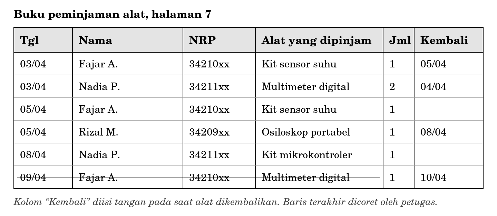
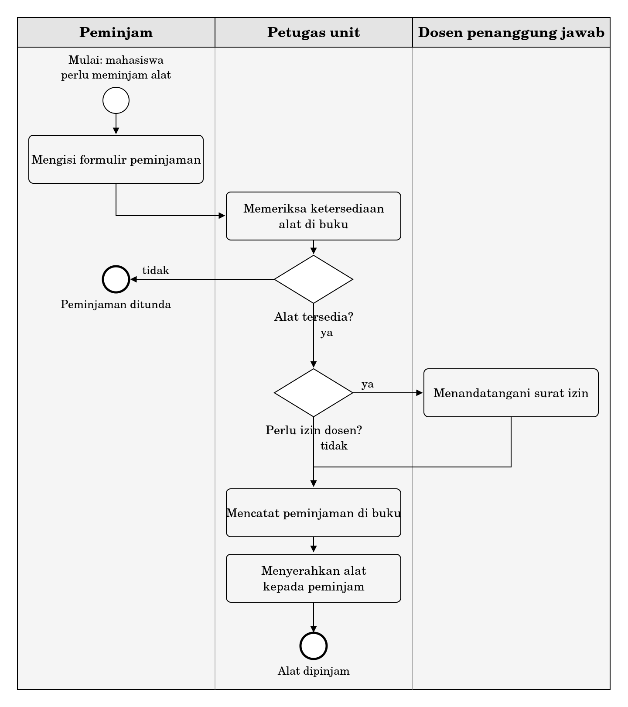
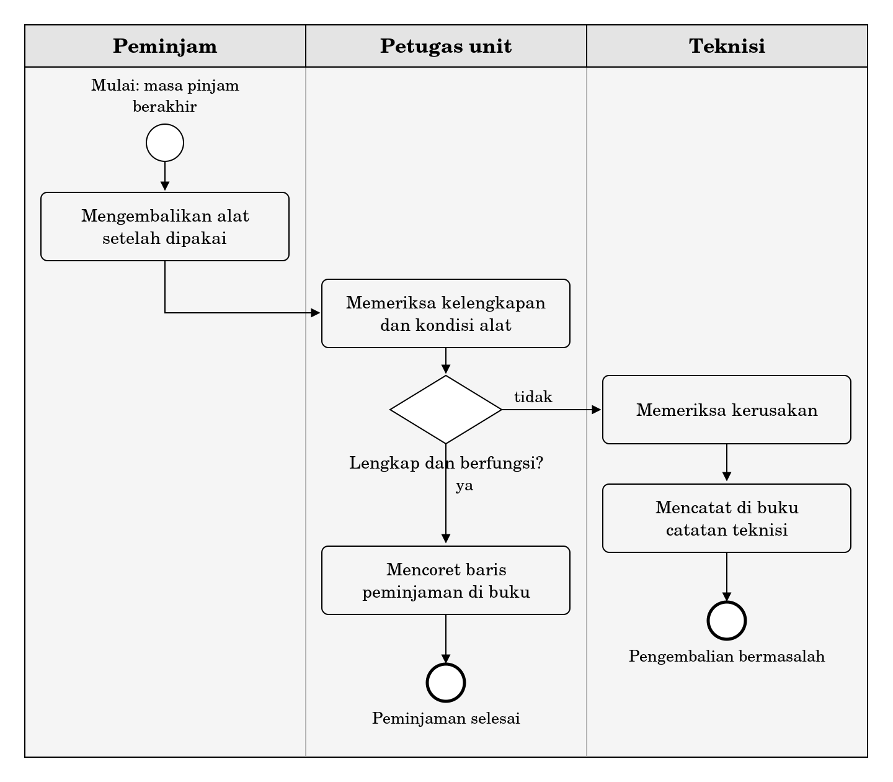

**LAMPIRAN BUKU AJAR DASAR SISTEM INFORMASI**

**Berkas Kasus Cadangan**

**Unit Layanan Peralatan Laboratorium**

*Untuk latihan tingkat C Bab 7 dan Bab 8 bagi mahasiswa yang tidak memperoleh akses lapangan*

**1 Untuk siapa berkas ini**

Latihan tingkat C pada Bab 7 dan Bab 8 mengharuskan Anda mengamati sebuah organisasi nyata dan mewawancarai orang di dalamnya. Sebagian mahasiswa tidak dapat mengerjakannya karena alasan yang berada di luar kendali mereka: usaha yang dituju menolak diamati, jadwal tidak memungkinkan, atau tempat tinggal terlalu jauh dari usaha mana pun yang bersedia.

Berkas ini menyediakan bahan pengganti. Isinya adalah satu organisasi fiktif yang disusun agar menyerupai kenyataan, lengkap dengan keterangan yang tidak sepenuhnya cocok antarnarasumber.

<table>
<colgroup>
<col style="width: 100%" />
</colgroup>
<tbody>
<tr class="odd">
<td>
<strong>Yang hilang ketika Anda memakai berkas ini</strong>

Berkas ini tidak dapat menggantikan pengamatan langsung, dan Anda perlu menyadarinya.

Di lapangan, keterangan datang dalam bentuk yang tidak tertata. Narasumber menjawab tidak berurutan, melompat, mengoreksi diri sendiri, dan kadang menjawab pertanyaan yang tidak Anda ajukan. Sebagian besar keterampilan yang dilatih pada latihan tingkat C justru terletak pada kemampuan menghadapi keadaan itu.

Berkas ini menirukan sebagian saja. Keterangan sudah dirapikan menjadi paragraf, dan Anda tidak dapat mengajukan pertanyaan yang tidak sempat terpikirkan oleh penyusunnya. Karena itu, kalau Anda masih punya kemungkinan untuk turun ke lapangan, kerjakanlah yang itu.
</td>
</tr>
</tbody>
</table>

**2 Cara memakai**

Ada dua jalur. Pastikan Anda mengetahui jalur mana yang sedang Anda kerjakan sebelum membuka bagian mana pun.

| **Jalur** | **Untuk**               | **Bagian yang dipakai** | **Bagian yang tidak boleh dibuka** |
|-----------|-------------------------|-------------------------|------------------------------------|
| A         | Latihan tingkat C Bab 7 | Bagian 3, 4, 5, 7       | Bagian 6 dan 9                     |
| B         | Latihan tingkat C Bab 8 | Bagian 3, 4, 5, 6, 7, 8 | Bagian 9                           |

**Peringatan untuk jalur A.** Bagian 6 memuat model proses yang sudah jadi. Membukanya sebelum Anda menggambar model sendiri akan menghapus seluruh nilai latihan Bab 7. Tidak ada yang bisa memeriksa apakah Anda membukanya, dan justru karena itu keputusannya ada pada Anda sendiri.

**Cara memakai Bagian 7.** Bagian 7 berisi jawaban atas pertanyaan susulan. Aturannya: tuliskan dahulu pertanyaan yang ingin Anda ajukan, baru cari jawabannya di sana. Jangan membaca Bagian 7 dari atas ke bawah seperti membaca daftar. Pertanyaan yang tidak terpikirkan oleh Anda seharusnya tetap tidak terjawab, sebagaimana yang terjadi di lapangan.

**Catatan mengenai angka.** Seluruh nama, angka, dan kejadian dalam berkas ini fiktif. Organisasi ini tidak merujuk pada unit mana pun yang benar-benar ada.

**3 Latar organisasi**

Unit Layanan Peralatan adalah bagian dari sebuah program studi teknik pada perguruan tinggi vokasi. Tugasnya meminjamkan peralatan praktikum kepada mahasiswa yang sedang mengerjakan tugas mata kuliah, proyek kelompok, dan proyek akhir.

| **Keterangan**               | **Angka**                                        |
|------------------------------|--------------------------------------------------|
| Penanggung jawab unit        | 1 orang (Bu Ratna)                               |
| Teknisi                      | 1 orang (Mas Dedi)                               |
| Pembantu paruh waktu         | 2 mahasiswa, bergantian                          |
| Jumlah alat                  | 340 unit, terdiri atas 62 jenis                  |
| Peminjaman pada masa sibuk   | Sekitar 25 per hari                              |
| Peminjaman pada masa longgar | Sekitar 6 per hari                               |
| Masa pinjam baku             | 3 hari, dapat diperpanjang dengan datang kembali |
| Alat kategori khusus         | 12 jenis, memerlukan izin dosen penanggung jawab |
| Jam layanan                  | Senin sampai Jumat, pukul 08.00 sampai 15.00     |

Unit ini tidak memakai perangkat lunak apa pun. Seluruh pencatatan dilakukan pada dua buku tulis: buku peminjaman yang dipegang penanggung jawab unit, dan buku catatan teknisi yang dipegang teknisi.

**4 Keterangan narasumber**

Tiga orang diwawancarai pada waktu yang berbeda. Keterangan berikut sudah dirapikan menjadi paragraf, tetapi isinya tidak diubah.

**4.1 Bu Ratna, penanggung jawab unit**

“Alurnya sederhana. Mahasiswa datang, mengisi formulir, lalu saya periksa dulu alatnya ada atau tidak. Memeriksanya di buku peminjaman. Saya lihat baris yang belum ada tanggal kembalinya. Kalau tidak ada yang sedang meminjam, berarti alatnya tersedia.

Untuk alat tertentu, yang harganya mahal, harus ada izin dosen penanggung jawab. Osiloskop, kamera termal, alat ukur presisi, dan beberapa lainnya. Mahasiswa membawa surat, dosen menandatangani, baru alatnya saya serahkan. Itu aturannya dan sudah berjalan lama.

Kalau alat dikembalikan, saya periksa kelengkapannya. Kalau lengkap dan tidak ada masalah, saya isi kolom kembali lalu saya coret barisnya sebagai tanda sudah selesai. Kalau ada yang rusak, saya panggil Mas Dedi. Semua kerusakan dicatat oleh Mas Dedi di buku catatan teknisi, jadi semuanya ada rekamnya.

Yang sering menyulitkan itu masa sibuk menjelang tenggat proyek akhir. Kadang antre sampai ke luar ruangan. Tetapi pencatatannya tetap jalan, tidak pernah ada yang terlewat.”

**4.2 Mas Dedi, teknisi**

“Yang saya catat itu yang perlu diperbaiki. Kalau hanya kabel yang hilang atau adaptor tertinggal, saya ganti saja dari cadangan, tidak saya catat. Kalau semuanya dicatat, sehari bisa lima entri, dan itu bukan kerusakan namanya, hanya kelengkapan.

Soal izin dosen, sebenarnya sering juga langsung diberikan. Kalau dosennya sedang tidak ada dan mahasiswanya sudah mendekati tenggat, Bu Ratna memberikan dulu, tanda tangannya menyusul. Kadang menyusulnya ya sudah, tidak jadi. Tidak ada yang menagih.

Kerusakan yang berulang itu ada. Kit sensor suhu, kabelnya sering putus di bagian sambungan. Tetapi saya tidak tahu itu karena dipakai kasar atau memang barangnya kurang bagus. Tidak pernah dihitung, jadi tidak ada dasarnya kalau mau bilang apa-apa ke pimpinan.”

**4.3 Fajar, mahasiswa semester empat**

“Saya pernah meminjam kit sensor suhu dua kali dalam satu minggu. Yang kedua itu kabelnya sudah agak longgar sejak awal, tetapi saya tidak melapor karena sedang buru-buru.

Waktu mengembalikan, dicek sebentar, lalu sudah. Saya tidak tahu apakah ada catatannya atau tidak.

Yang paling merepotkan itu kalau di buku tertulis alatnya masih dipinjam padahal sebenarnya sudah dikembalikan, hanya belum ditulis tanggal kembalinya. Saya pernah disuruh pulang, padahal alatnya ada di rak. Besoknya saya datang lagi, ternyata memang ada.”

<table>
<colgroup>
<col style="width: 100%" />
</colgroup>
<tbody>
<tr class="odd">
<td>
<strong>Perhatian</strong>

Ketiga keterangan di atas tidak sepenuhnya cocok satu sama lain. Ketidakcocokan itu disengaja dan merupakan bagian dari bahan latihan.

Tugas Anda bukan menentukan siapa yang berbohong. Ketiganya berkata jujur menurut apa yang mereka lihat dari tempat masing-masing. Tugas Anda adalah menemukan di mana letak perbedaannya dan menafsirkan apa arti perbedaan itu bagi proses dan bagi datanya.
</td>
</tr>
</tbody>
</table>

**5 Bukti dokumen**

Berikut salinan satu halaman buku peminjaman. Isinya diambil dari minggu pertama bulan April.

**Gambar C.1 Salinan satu halaman buku peminjaman alat**

Buku catatan teknisi tidak disalin di sini. Bentuknya buku tulis biasa dengan empat kolom: tanggal, nama alat, jenis kerusakan, dan tindakan yang dilakukan. Tidak ada kolom untuk nama peminjam.

Formulir peminjaman juga tidak disalin. Isinya nama, nomor induk mahasiswa, mata kuliah, alat yang dipinjam, tanggal peminjaman, dan tanda tangan. Formulir disimpan dalam map bulanan.

**6 Model proses siap pakai**

**Bagian ini hanya untuk jalur B.** Jika Anda sedang mengerjakan latihan Bab 7, tutup halaman ini dan kembalilah ke Bagian 4.

Dua model berikut menggambarkan proses peminjaman dan proses pengembalian. Keduanya dipisahkan karena satu model gabungan akan melebihi satu halaman, sesuai rambu pada Subbab 7.6.

<table>
<colgroup>
<col style="width: 100%" />
</colgroup>
<tbody>
<tr class="odd">
<td>
<strong>Sebelum memakai model ini</strong>

Model ini disusun berdasarkan keterangan Bu Ratna selaku penanggung jawab unit. Itu berarti model ini menggambarkan proses menurut satu sudut pandang saja.

Sebelum memakainya sebagai dasar penurunan kebutuhan informasi, bandingkan dengan keterangan Mas Dedi pada Subbab 4.2 dan keterangan Fajar pada Subbab 4.3. Kalau Anda menemukan bagian yang tidak sesuai, catat temuan itu. Temuan semacam itu bernilai lebih tinggi daripada tabel kebutuhan informasi yang rapi.
</td>
</tr>
</tbody>
</table>

**Gambar C.2 Proses peminjaman alat menurut keterangan penanggung jawab unit**

**Gambar C.3 Proses pengembalian alat menurut keterangan penanggung jawab unit**

**7 Lembar tanya jawab susulan**

Tuliskan dahulu pertanyaan yang ingin Anda ajukan, baru carilah jawabannya di daftar ini. Jangan membaca daftar ini dari atas ke bawah.

Sebagian pertanyaan tidak terjawab dengan jelas. Itu bukan kekurangan berkas ini, melainkan keadaan yang memang lazim terjadi ketika Anda mewawancarai orang yang tidak pernah menghitung sesuatu.

| **Kalau Anda menanyakan**                                                  | **Jawabannya**                                                                |
|----------------------------------------------------------------------------|-------------------------------------------------------------------------------|
| Berapa lama pemeriksaan kelengkapan pada saat pengembalian                 | Sekitar satu sampai dua menit untuk kit, lebih cepat untuk alat tunggal       |
| Apakah formulir peminjaman disimpan                                        | Disimpan dalam map bulanan, tetapi tidak pernah dibuka kembali                |
| Apakah tanggal rencana pengembalian dicatat                                | Tidak. Masa pinjam dianggap tiga hari, tetapi tidak dituliskan di mana pun    |
| Bagaimana petugas mengetahui alat sudah kembali                            | Dari kolom “Kembali” yang diisi tangan dan dari barisnya yang dicoret         |
| Apakah pengisian kolom “Kembali” dan pencoretan selalu dilakukan bersamaan | Tidak selalu. Pada masa sibuk kolom diisi belakangan, dan kadang terlewat     |
| Apa isi buku catatan teknisi                                               | Tanggal, nama alat, jenis kerusakan, tindakan. Tidak ada nama peminjam        |
| Berapa banyak entri buku catatan teknisi dalam sebulan                     | Sekitar delapan sampai dua belas                                              |
| Apakah ada daftar alat kategori khusus                                     | Ada, ditempel di dinding, terakhir diperbarui dua tahun lalu                  |
| Berapa kali surat izin dosen tidak jadi ditandatangani                     | Narasumber tidak menjawab jelas                                               |
| Apakah pernah ada alat yang hilang sama sekali                             | Pernah, dua kali dalam tiga tahun terakhir, keduanya diganti oleh peminjam    |
| Apakah mahasiswa dapat memeriksa ketersediaan alat sebelum datang          | Tidak. Harus datang langsung ke unit                                          |
| Berapa sering mahasiswa datang lalu pulang karena alat tidak tersedia      | Narasumber tidak menjawab jelas, hanya menyebut “lumayan sering”              |
| Apakah ada catatan mengenai keluhan mahasiswa                              | Tidak ada                                                                     |
| Apakah unit pernah mengganti jenis alat karena sering rusak                | Pernah dipertimbangkan, tetapi tidak ada dasar angkanya sehingga tidak jadi   |
| Siapa yang memutuskan pembelian alat baru                                  | Ketua program studi, berdasarkan usulan penanggung jawab unit, setahun sekali |

**8 Keluhan yang berulang**

Daftar berikut dikumpulkan dari percakapan dengan mahasiswa yang sering meminjam. Tidak ada angka yang menyertainya, sebab keluhan memang tidak pernah dicatat.

Bagian ini terutama berguna untuk latihan tingkat C Bab 8 nomor 1, yang meminta Anda menemukan keputusan yang seharusnya diambil tetapi tidak pernah bisa diambil.

1.  Alat yang menurut buku sedang dipinjam ternyata sudah ada di rak, sehingga mahasiswa disuruh pulang tanpa alasan yang sebenarnya.

2.  Mahasiswa menunggu lama karena dosen penanggung jawab tidak berada di tempat, padahal alat yang diminta sudah tersedia.

3.  Kit yang diterima ternyata tidak lengkap, tetapi tidak jelas siapa yang terakhir memakainya dan sejak kapan kelengkapan itu hilang.

4.  Jenis alat tertentu rusak berulang kali, tetapi tidak ada yang mengetahui apakah penyebabnya cara pemakaian atau mutu barangnya.

5.  Pada masa menjelang tenggat proyek akhir, antrean panjang dan pencatatan tertinggal, sehingga hari-hari berikutnya menjadi kacau.

**9 Catatan untuk dosen**

*Bagian ini tidak dibagikan kepada mahasiswa.*

**9.1 Keterbatasan jalur cadangan**

Berkas ini menghapus komponen yang paling sulit dinilai sekaligus paling berharga dari latihan tingkat C, yaitu kemampuan mahasiswa memperoleh keterangan dari orang yang tidak berkewajiban membantunya. Kemampuan itu tidak dapat dilatih dari kertas.

Karena itu, saran saya, jalur cadangan diberikan hanya kepada mahasiswa yang benar-benar tidak memperoleh akses, bukan sebagai pilihan bebas. Kalau ditawarkan sebagai pilihan, sebagian besar kelas akan memilihnya, dan tugas lapangan pada Bab 7 dan Bab 8 kehilangan artinya sama sekali.

**9.2 Penyesuaian rubrik**

Butir penilaian mengenai kualitas penggalian data tidak dapat dinilai pada jalur cadangan. Bobotnya perlu dialihkan, bukan dihapus.

| **Butir penilaian**                                   | **Jalur lapangan** | **Jalur cadangan** |
|-------------------------------------------------------|--------------------|--------------------|
| Kualitas penggalian data di lapangan                  | 25 persen          | Tidak dinilai      |
| Ketepatan model proses atau tabel kebutuhan informasi | 40 persen          | 40 persen          |
| Ketajaman analisis ketidakcocokan keterangan          | 15 persen          | 40 persen          |
| Kejujuran menyatakan batas dan penyederhanaan         | 20 persen          | 20 persen          |

Kenaikan bobot pada butir ketiga disengaja. Karena mahasiswa jalur cadangan menerima keterangan dalam bentuk yang sudah rapi, satu-satunya kesulitan yang tersisa bagi mereka adalah membaca ketidakcocokan antarnarasumber. Di situlah penilaian harus dipusatkan.

**9.3 Tiga temuan yang seharusnya ditemukan**

Berkas ini dirancang agar memuat tiga temuan. Mahasiswa yang menemukan ketiganya layak memperoleh nilai penuh pada butir analisis.

1.  **Ketersediaan alat ditentukan dari data yang tidak dapat dipercaya.** Petugas memeriksa ketersediaan dengan melihat baris yang belum ada tanggal kembalinya. Padahal kolom itu diisi belakangan pada masa sibuk dan kadang terlewat, sebagaimana diakui pada lembar tanya jawab butir kelima dan dikeluhkan Fajar. Selain itu tanggal rencana pengembalian tidak pernah dicatat, sehingga tidak ada dasar untuk memperkirakan kapan alat akan kembali. Ini contoh keadaan “terjadi tetapi tidak dicatat” sekaligus persoalan ketepatan waktu pada Bab 4.

2.  **Kerusakan tidak dapat dihubungkan dengan pemakaian.** Kerusakan dicatat pada buku terpisah tanpa nama peminjam, dan kelengkapan yang hilang tidak dicatat sama sekali karena teknisi menggantinya dari cadangan. Akibatnya pertanyaan mengenai jenis alat yang sering rusak tidak dapat dijawab, dan keputusan penggantian jenis alat tidak pernah diambil. Lihat lembar tanya jawab butir keempat belas. Ini contoh keputusan yang tidak pernah diambil pada Subbab 8.2.1.

3.  **Model dari penanggung jawab menggambarkan proses yang diinginkan.** Bu Ratna menyatakan izin dosen selalu ada sebelum alat diserahkan. Mas Dedi menyatakan pada praktiknya alat sering diserahkan lebih dahulu dan tanda tangan menyusul, kadang tidak jadi. Gambar C.2 karena itu keliru pada bagian tersebut. Ini persis Kesalahan 6 pada Bab 7, dan sengaja ditanam agar mahasiswa jalur cadangan tetap berhadapan dengan kesalahan itu meskipun tidak turun ke lapangan.

Temuan ketiga adalah yang paling jarang ditemukan. Mahasiswa cenderung memperlakukan model yang sudah jadi sebagai kebenaran, terutama karena model itu diberikan oleh buku. Kalau seluruh kelas menerima Gambar C.2 tanpa mempersoalkannya, itu sendiri bahan pembahasan yang baik.

**9.4 Pemakaian ulang**

Berkas ini dapat dipakai kembali pada Bab 9 sebagai bahan pembahasan sistem pemrosesan transaksi, khususnya mengenai perbedaan antara mencoret dan membatalkan. Pencoretan baris pada buku peminjaman menghapus keterangan bahwa peminjaman itu pernah terjadi, dan akibatnya sejajar dengan pencoretan pesanan pada Laundry Nusa yang dibahas di kotak Di Balik Layar Bab 8.
