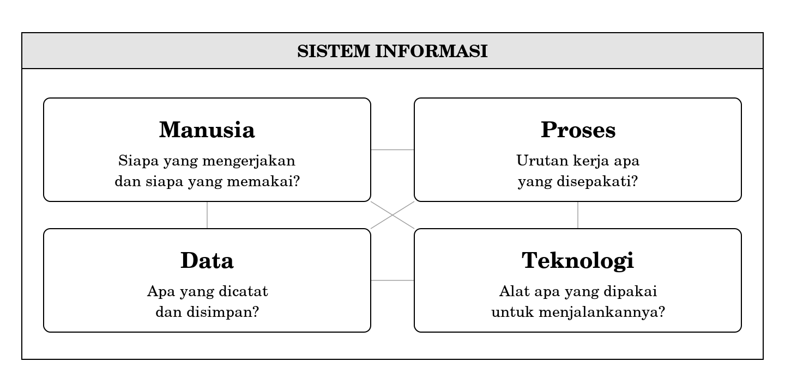
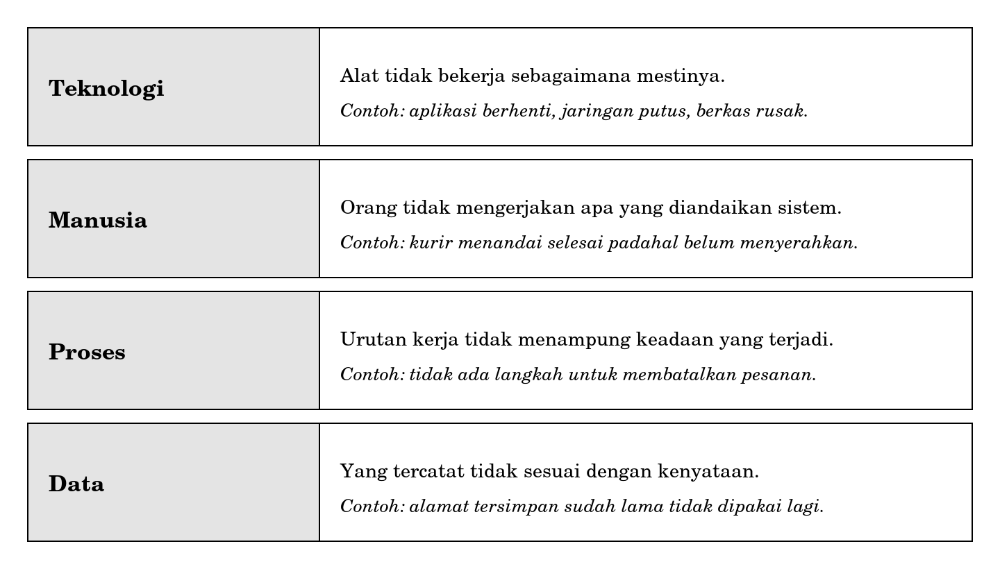
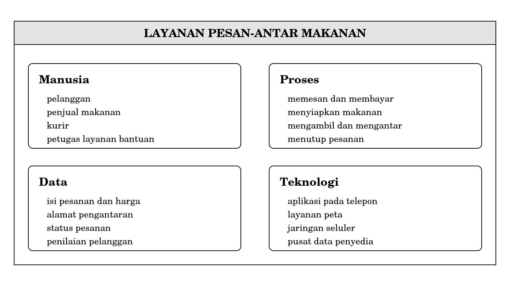

**PART I UNDERSTANDING INFORMATION SYSTEMS**

**Chapter 2**

**The Anatomy of an Information System**

# **Chapter map**

**Sub-CPMK addressed.** Able to explain the concepts of system, data, and information, the components of an information system, and the roles and professions in the field of information systems.

Chapter 1 introduced the system as a way of looking. This chapter dissects what is inside. If Chapter 1 taught you how to draw a boundary around something, this chapter teaches what you find once that boundary is drawn.

After reading this chapter you will be able to:

1.  name the four components of an information system and explain the role of each;

2.  explain why the four components stand as equals;

3.  explain what a socio-technical system means, and what follows from it for how you view failure;

4.  take apart a digital service you use every day into its four components;

5.  point to the component most responsible for a failure, with reasons.

**Prerequisite chapter.** Chapter 1, on the meaning of a system, the system boundary, and the difference between data and information.

**Keywords.** Components of an information system, people, process, data, technology, socio-technical system, safeguard, weak point.

**What you will produce.** One worksheet taking a service apart into four components, with its weak point identified and the reason for that identification.

# **The app works, the order never arrives**

You order food through an app at half past twelve. Everything runs smoothly on screen. The order is received. Payment succeeds. A courier is assigned, their name appears complete with photo and vehicle number. A dot on the map moves toward the restaurant, pauses, then moves toward your lodging.

At ten past one, the status changes to "Order completed." The map disappears. The screen thanks you and asks you to give a star rating.

The food never arrives.

You contact the help desk. After a wait, the answer comes: according to the system's records, the order was handed over at ten past one.

Pause for a moment and notice one thing. Not a single line of code went wrong in this story. The app worked exactly as designed. The payment was recorded correctly. The map showed the correct location. The database stored what it was supposed to store. Every technical part ran perfectly, and your order is still lost.

If every technical part is correct but the outcome is wrong, then there is another part of the system you have not yet accounted for. This chapter is about those parts.

# **2.1 The four components**

| *An information system is made up of four components: people, process, data, and technology. All four must be present. If one is missing, what you are facing is not an information system.* |
|-----------------------------------------------------------------------------------------------------------------------------------------------------------------------------------------------|

The easiest way to recognise the four components is through the question each one answers.

**Figure 2.1 The four components of an information system**

**People** answer the question *who*. Who does the work, who uses the result, and who bears the consequences if the result is wrong. These three roles are often held by different people, and that difference is what makes many systems hard to fix.

**Process** answers the question *how*. What sequence of work is agreed upon, who does what first, and what is done when things do not go as usual. A process is not always written down. Most processes live as habits that are never discussed.

**Data** answers the question *what is recorded*. Note that the question is not what happened, but what is recorded. The difference between the two is the subject of Chapter 8, and is important enough to be aware of from now.

**Technology** answers the question *with what tools*. Software, hardware, networks, and everything used to run the three preceding components. Note the order: technology is named last not because it is unimportant, but because it serves the other three components, not the other way around.

The order of listing in this book is also not an order of importance. People are named first purely because that is the component most often forgotten by those with a technical background.

# **2.2 Why the four are equals**

The statement that the four components are equals sounds like polite filler. It is not. The statement has a consequence that can be tested.

An information system works only if its four components agree. Correct data does not help if no one reads it. A tidy process does not help if the person running it does not understand why a step exists. Sophisticated technology does not help if the data entering it was already wrong from the start. Each component can undo the work of the other three.

For Informatics Engineering students, the technology component almost always feels the most important. There are two reasonable causes. First, it is what you will study over the next eight semesters, so it is natural that it feels the most real. Second, a technology failure is the easiest to see. When the app stops, everyone knows something is broken.

Precisely because it is easy to see, a technology failure is the one fixed fastest. What is expensive is not the failure that shows, but the failure that no one feels they own. The lost order in the opening story is of the second kind. No party feels they did anything wrong, and so no one feels the need to fix anything.

# **2.3 The socio-technical system**

| *A socio-technical system is a system whose technical part and human part cannot be designed separately, because a change to one always changes the other.* |
|-------------------------------------------------------------------------------------------------------------------------------------------------------------|

The term comes from organisational study and has long been used in the field of information systems. Its content is simple but its consequences reach far.

Take an example you will meet again in Chapter 8. An organisation adds one mandatory field to a form that staff must fill in. On the technical side, the change is tiny: one new column in the database, one input box on the screen. On the human side, the change means every clerk must now pause and think about something they did not have to think about before — dozens of times a day.

If the clerk considers the field unreasonable, they will fill it in carelessly so the form can be saved. The result is a field that is always filled and almost always wrong. A small technical change produces large data damage, and no software test can catch it.

From here comes a consequence you need to carry through your whole degree: the question "is the system correct" cannot be answered by testing the software alone. Testing checks whether the software behaves as designed. It does not check whether the design matches the work people actually do.

There is a second, more personal consequence. One day, your work will not be judged by whether the code runs, but by whether other people's work becomes better because of it. The difference between those two measures is the distance between a programmer and someone trusted to design a system.

# **2.4 Four ways a system fails**

Because there are four components, there are four basic ways an information system fails.

**Figure 2.2 The four ways an information system fails**

In reality, failure rarely stands alone. What usually happens is that one component fails, and then the other three do not hold it back. This idea of holding back needs a name of its own, because it will be used many times.

| *A safeguard is the part of the system that prevents one component's failure from becoming a failure of the whole system.* |
|---------------------------------------------------------------------------------------------------------------------------|

Return to the lost order. The failure began in the people component: someone marked the order as completed although they had not handed it over. Failures of that kind will always exist, because people cannot be guaranteed. The right question is not how to prevent it, but what holds it back.

On that service, it turned out nothing held it back. The process demanded no proof from the receiving party. The data recorded only that a button was pressed, not that anything changed hands. The technology worked perfectly, and that is exactly what made things worse, because a tidy record gives the impression that everything went right.

Some delivery services add a safeguard in the form of a four-digit code the customer must give before the courier can close the order. Notice what the safeguard actually changes. Not the technology, but the process. The technology merely carries out that process change.

# **2.5 Taking a service apart**

This section gives a procedure you can repeat for any service. Four steps, done in order.

## **Step 1 Set the service and its boundary**

Use the boundary-drawing method from Chapter 1. State in a complete sentence what is inside and what is outside. A food-delivery service, for instance, covers ordering through to hand-over, but does not cover how the restaurant cooks the food.

## **Step 2 List the people**

Write down everyone who touches the service, and distinguish three roles: **who uses**, **who does the work**, **who bears the consequences if something goes wrong**. The third role is the one most often missed, yet it is precisely that role which decides whether a problem gets fixed or left alone.

## **Step 3 List the process**

Write the sequence of work as sentences, not yet as a diagram. Drawing a process is the work of Chapter 7 and demands tools you do not yet have. For now, four to eight sentences are enough.

## **Step 4 List the data and the technology**

For data, ask what is recorded and persists after the event has passed. For technology, name the tools by function, not by brand. Write "map service," not the name of a particular map product. Product names change; functions last longer.

The result of these four steps, for the service in the opening story, looks like the following.

**Figure 2.3 The result of taking the food-delivery service apart**

Only after the decomposition is complete can the weak point be identified. The way to do it is with one question asked of each component: if this component fails, what holds it back? The component with no safeguard is the weak point of that system.

# **2.6 What is not covered here**

Several things that seem to belong to the anatomy of an information system are deliberately not covered in this chapter.

| **Topic**                                     | **Where it belongs**            | **Reason**                                                                        |
|-----------------------------------------------|---------------------------------|-----------------------------------------------------------------------------------|
| Hardware and computer architecture            | Fundamentals of Computer Systems | Here technology is viewed only by its function, not by how it works               |
| Programming languages and building apps       | Programming Concepts            | This chapter trains a way of looking, not a way of building                       |
| Interface design and user experience          | User Experience Design          | Demands tools not yet available this semester                                     |
| Database design                               | Databases                       | Here data is viewed as what is recorded, not how it is stored                     |

This limit is not because those topics are less important. Most of them will take up far more of your time than this course. The limit is set because this chapter trains a single skill — seeing something as a system made of four components — and that skill becomes blurred if mixed with how to build.

<table>
<colgroup>
<col style="width: 100%" />
</colgroup>
<thead>
<tr class="header">
<th>
<strong>Behind the scenes: what happens when the "order completed" button is pressed</strong>

From the system's side, far less happens than the customer imagines.

The system knows nothing about the food. It does not know whether a plastic bag changed hands, whether the lodging door opened, or whether anyone was there. All it knows is that a button was pressed at a certain time, by a certain account, from a certain set of coordinates.

Those three facts look convincing. The time and coordinates are right, the account is correct, and it was indeed near the destination. The trouble is that none of the three proves the food was handed over. All that is proven is that someone was near the address and pressed a button.

It is the gap between "button pressed" and "food received" that a safeguard must fill. A four-digit code, a signature, or a hand-over photo are ways of filling that gap. All of them add work for the courier, and that is why not every service uses them.

Keep this observation. In Chapter 7 you will draw a process like this, and in Chapter 8 you will ask what data needs to be recorded so a dispute like this one can be settled.
</th>
</tr>
</thead>
<tbody>
</tbody>
</table>

<table>
<colgroup>
<col style="width: 100%" />
</colgroup>
<thead>
<tr class="header">
<th>
<strong>Common misconceptions</strong>

<strong>"An information system is an application."</strong> An application is part of the technology component, and only part. An information system can run with no application at all. A notebook, a working agreement, and the people who run it already satisfy all four components.

<strong>"If the software has been tested, the system is correct."</strong> Testing checks whether the software behaves as designed. It does not check whether the design matches the actual work. Two different things, and the second cannot be checked from behind a desk.

<strong>"People are the weak component, so their role should be reduced."</strong> People indeed cannot be guaranteed. They are also the only component that can recognise a situation the designer never anticipated. Reducing the human role without adding another safeguard moves the location of failure, it does not remove it.
</th>
</tr>
</thead>
<tbody>
</tbody>
</table>

# **Guided case study: QR-code payment at the canteen**

This section runs the four steps of Section 2.5 from beginning to end, using a service you almost certainly use every week.

## **Narrative**

The campus canteen puts a sheet of paper with a QR code on every seller's table. The buyer scans the code with the payment app on their phone, types in the amount to pay themselves, presses pay, then shows the seller a screen reading "Payment successful." The seller glances at it, nods, and the buyer leaves.

At break time, the queue is long and the seller serves several buyers at once while cooking.

## **Step 1 Boundary**

**Included:** from the buyer scanning the code to the seller accepting that payment is received. **Not included:** providing the food, and the transfer of money from the payment provider to the seller's account.

## **Step 2 People**

| **Role**              | **Who**                                             |
|-----------------------|-----------------------------------------------------|
| Uses                  | Buyer                                               |
| Does the work         | Buyer types the amount, seller checks the screen    |
| Bears the consequences| Seller, if the amount received turns out to be short |

Note the third row. The person who bears the consequences of the error is not the person who does the most decisive work. The buyer types the amount; the seller bears the cost. An imbalance of this kind is a strong clue that there is a weak point nearby.

## **Step 3 Process**

- The buyer scans the QR code on the seller's table.

- The buyer types in the amount to pay themselves.

- The buyer presses pay and enters their password.

- The buyer shows the seller a screen reading "successful."

- The seller glances at the screen and lets the buyer go.

## **Step 4 Data and technology**

**Data:** the payment amount, the payment time, the sender's name, the transaction reference number. All of it is recorded on the payment provider's system, and the seller can view it through the app on their own phone.

**Technology:** the printed QR code, the payment app on the buyer's phone, the merchant app on the seller's phone, the mobile network, the payment provider's system.

## **Identifying the weak point**

Ask the safeguard question of every component.

| **Component** | **If it fails**                                      | **What holds it back**                               |
|---------------|------------------------------------------------------|------------------------------------------------------|
| Technology    | Network drops, payment not sent                      | Present. The app reports the failure directly        |
| Data          | The recorded amount is wrong                          | Present. Transaction history is stored and checkable |
| People        | The buyer types an amount smaller than it should be  | None                                                 |
| Process       | The seller checks nothing but the buyer's screen     | None                                                 |

The weak point is clear: two components with no safeguard, and the two reinforce each other. The screen the buyer shows comes from the buyer's own phone, so the seller is really checking information provided by the party who gains the most if that information is wrong.

Note also that the data actually exists. Transaction history is stored in full in the merchant app. What does not exist is a step in the process that asks the seller to open it. This is a pattern that will recur throughout the book: data that is available but not used is the same as data that does not exist.

## **A proposed fix and its cost**

The cheapest fix is not a technology fix. The seller need only check the incoming notification on their own phone, not the buyer's screen. No new device has to be bought and no software has to be built.

There is still a cost, and it must be stated. The seller has to hold the phone while cooking, and at break time that slows the queue by a few seconds for each buyer. A few seconds times a hundred buyers becomes a real problem for the seller, even though it sounds small to a designer.

## **A critique of my own result**

The analysis above contains at least two weaknesses that need to be stated.

1.  This analysis assumes a buyer who intends to cheat. Most likely, the great majority of amount errors are unintentional — pressing the wrong digit, or misremembering the price. The two causes call for different safeguards, and telling them apart requires data that no one collects.

2.  This analysis does not count how often the incident actually occurs. Without a number, there is no basis for judging whether the fix is worth its cost. Producing such a number is the work of Chapter 8.

Stating these two weaknesses is not a sign of weak work. An analysis that hides its assumptions is far more dangerous than one that states them, because a reader will assume the result is more certain than it really is.

# **Summary**

- An information system is made of 4 components: people, process, data, and technology. All four must be present.

- The four components stand as equals, in the sense that each can undo the work of the other three.

- Technology feels the most important because its failure is the easiest to see. Precisely for that reason, it is fixed fastest.

- A socio-technical system is one whose technical part and human part cannot be designed separately.

- The question of whether the system is correct cannot be answered by testing the software alone.

- There are four basic ways a system fails, one for each component. Failure rarely stands alone.

- A safeguard is the part of the system that prevents one component's failure from becoming a failure of the whole system.

- The weak point of a system is the component whose failure nothing holds back.

- Data that is available but not used is the same as data that does not exist.

# **Exercises**

Each item is marked with the Sub-CPMK it measures.

## **Level A Making sure you remember**

1.  Name the four components of an information system, along with the question each component answers. \[Sub-CPMK-1\]

2.  Explain what is meant by a socio-technical system, in your own words. \[Sub-CPMK-1\]

3.  What is meant by a safeguard, and how do you find the weak point of a system? \[Sub-CPMK-1\]

4.  Why does this book state that data which is available but unused is the same as data that does not exist? \[Sub-CPMK-1\]

5.  Name three things that appear to belong to the anatomy of an information system but are deliberately not covered in this chapter, with reasons. \[Sub-CPMK-1\]

## **Level B Applying**

1.  Take the tuition-payment service at your campus apart into its 4 components, using the 4 steps in Section 2.5. \[Sub-CPMK-1\]

2.  For each component in your answer to question 1, write one way that component can fail. If you cannot think of any, say so and explain why. \[Sub-CPMK-1\]

3.  Look at Figure 2.3. Add one item to each box that you think was missed, and explain why that item needs to be there. \[Sub-CPMK-1\]

## **Level C Analysing and evaluating**

1.  Choose one digital service you use at least 3 times a week. Take it apart into 4 components, then ask the safeguard question of each component. Point to one weak point and defend your choice. If you think the service has no weak point, say so and be ready with your reasons, because a statement like that is rarely true. \[Sub-CPMK-1\]

2.  A designer proposes that the courier be allowed to close an order only after the customer states a four-digit code. A courier rejects the proposal, arguing that some customers do not open the door, some ask for the order to be left at the front, and others do not answer the phone. Assess both positions. Which component does the proposal benefit, and which does it burden? Take a stance and defend it. \[Sub-CPMK-1\]

# **Chapter references**

These references are specific to this chapter. The combined bibliography is at the end of the book.

1.  Alter, S. (2013). "Work System Theory: Overview of Core Concepts, Extensions, and Challenges for the Future." *Journal of the Association for Information Systems,* 14(2). The primary source for the socio-technical perspective used in this chapter.

2.  Laudon, K. C. and Laudon, J. P. *Management Information Systems: Managing the Digital Firm.* Pearson, latest edition. The part on the organisational, management, and technology dimensions of information systems.

3.  Bourgeois, D. *Information Systems for Business and Beyond.* Open textbook. The chapter on the components of an information system.
